# 剖析 Nvidia Blackwell —— Tensor Core、PTX 指令、SASS、Floorsweep、良率

> **副标题：** 微基准测试、tcgen05、2SM MMA、UMMA、TMA、LDGSTS、UBLKCP、Speed of Light、分布式共享内存（DSMEM）、GPC Floorsweep、SM 良率
>
> 作者：[Kimbo Chen](https://substack.com/@kimbobachen) 和 [Dylan Patel](https://substack.com/@semianalysis) · 2026 年 3 月 31 日 · **付费**
>
> 来源：<https://newsletter.semianalysis.com/p/dissecting-nvidia-blackwell-tensor>
>
> ⚠️ **这是一篇 SemiAnalysis 付费文章，只能抓取到免费预览部分。** 文章在「Tensor Core 吞吐/延迟/在途指令数」章节之后进入付费内容（CUTLASS 实战用例、floorplan、PTX/SASS 深入分析、floorsweep 与良率）。付费部分**未**包含在下文中。

Nvidia 的数据中心 Blackwell GPU（SM100）代表了一代之内最大的 GPU 微架构变化之一，然而却没有详细的白皮书。在本文之前，尚不存在面向 AI 负载、针对 UMMA 和 TMA 等 PTX 与 SASS 指令的公开数据中心 Blackwell 架构微基准测试研究。

在我们深入的 [Nvidia Tensor Core 演进：从 Volta 到 Blackwell](https://newsletter.semianalysis.com/p/nvidia-tensor-core-evolution-from-volta-to-blackwell) 一文之后，SemiAnalysis 又花了数月工程时间深入 Blackwell 架构、测量原始 PTX 指令性能，以确立切实可达的性能上界，并将其与理论峰值对比。我们这样做是为了发现单元级和指令级的硬件吞吐与延迟极限，从 ML 系统和 kernel 开发的视角提供一份有用的刻画。我们聚焦深度学习负载配置，例如对流行深度学习库 FlashInfer 所用的异步内存拷贝设置进行基准测试。

我们把 Blackwell 微架构级基准测试仓库开源在 [这里](https://github.com/SemiAnalysisAI/microbench-blackwell)。如果觉得有用，请给个 star。

## 致谢

感谢 Nebius 和 Verda 提供 B200 节点用于微基准测试。它们的 B200 节点启用了正确的硬件计数器，使 NCU profiling 成为可能。对于所用云厂商未启用 NCU 的用户，GPU Mode 的 Mark Saroufim 给出了 [一个变通方法](https://x.com/marksaroufim/status/2018739807363674373)。我们还要感谢 [Dissecting the NVIDIA Hopper Architecture through Microbenchmarking and Multiple Level Analysis](https://github.com/HPMLL/NVIDIA-Hopper-Benchmark) 和 [tcgen05 for dummies](https://github.com/gau-nernst/learn-cuda/tree/main/02e_matmul_sm100) 的作者，我们的代码基于他们的工作。

最后，感谢所有审阅者和外部合作者：

* Kilian Haefeli —— Cohere
* Benjamin Spector —— Flappy Airplanes 与 Stanford
* Neil Movva —— Sail Research
* Orian Leitersdorf —— Decart AI
* Hardik Bishnoi —— Arcee AI
* 以及众多匿名审阅者

## 后续工作

本文是探索 AI 加速器底层汇编与 kernel 代码系列的第一篇。在后续篇章中，我们将扩展这项工作，对更多 Blackwell 和 Blackwell Ultra 的 PTX 指令做基准测试，包括 EXP2 和 TensorMap 更新延迟。此外，我们已有明确计划对 TPU Pallas kernel、Trainium NKI kernel 以及 AMD CDNA4 汇编做基准测试。尤其是 AMD CDNA4，由于 [许多指令已有良好文档](https://www.amd.com/content/dam/amd/en/documents/instinct-tech-docs/instruction-set-architectures/amd-instinct-cdna4-instruction-set-architecture.pdf)，近期就可着手。

如果你想参与底层基准测试、ClusterMAX、推理模拟器或其他有意思的技术工作，欢迎加入。请把简历发送至 letsgo@semianalysis.com，并附上 5 条要点展示你出色的工程能力。

## Blackwell 特性

从 Hopper 到 Blackwell，NVIDIA 对架构做了若干增量改进，并改动了 MMA 相关指令的 PTX 抽象。我们在 [NVIDIA Tensor Core 演进](https://newsletter.semianalysis.com/i/174558646/blackwell) 一文中涵盖了其中大部分。主要的显著变化有：

* 引入 **tensor memory（TMEM）** 来存放 MMA 累加器。线程不再隐式地拥有 MMA 运算的结果；取而代之的是，TMEM 由软件在 MMA 作用域上显式管理。
* `tcgen05` 操作现在由单个线程代表整个 CTA 发起，而非像前几代那样在 warp 或 warpgroup 作用域发起。这体现在 CuTe MMA atom 上：Blackwell 现在使用 [`ThrID = Layout<_1>`](https://github.com/NVIDIA/cutlass/blob/main/include/cute/atom/mma_traits_sm100.hpp#L1045)，而不是 [Hopper warpgroup 作用域 MMA](https://github.com/NVIDIA/cutlass/blob/main/include/cute/atom/mma_traits_sm90_gmma.hpp#L491) 中的 `ThrID = Layout<_128>`。
* 支持跨一对协作 CTA 的 TPC 作用域 TMA 和 MMA，在 PTX 中暴露为 `cta_group::2`、在 SASS 中为 `2CTA`：组成一个 TPC 的两个 SM 可以在共享操作数上执行 `tcgen05.mma`，通过降低每 CTA 的 SMEM 带宽需求，获得更高运算强度的 MMA 指令。后文我们会证明，这种操作数共享对于用满可用 MMA 吞吐是必要的。
* 原生支持带 micro-scaling 的亚字节（sub-byte）数据类型。
* [Cluster Launch Control（CLC）](https://docs.nvidia.com/cutlass/latest/media/docs/cpp/blackwell_cluster_launch_control.html) 作为持久化 CTA kernel 中动态工作调度的硬件支持（后续文章覆盖）。
* [Programmatic dependent launch（PDL）](https://docs.nvidia.com/cuda/cuda-programming-guide/04-special-topics/programmatic-dependent-launch.html) 在 Hopper 中引入，用于隐藏背靠背 kernel 的启动与初始化延迟（后续文章覆盖）。

## Cluster、GPC 与 Floorsweeping

自 Hopper 起，Nvidia 数据中心 GPU 就支持一个可选特性，它有好几个名字——「thread block cluster」「CTA cluster」「cooperative grid array（CGA）」——都指同一个东西。cluster 是 CTA 的逻辑分组，其形状和大小可以按 kernel 静态或动态指定。cluster 以若干有用的方式对编程模型可见，其中之一允许向同一 cluster 内的多个 CTA 做 multicast 加载；我们稍后在 TMA multicast 部分讨论这一点。

重要的是，一个 cluster 内的 CTA 保证会被共同调度（co-schedule）到同一个 GPC 上。这在「每 SM 一个 CTA」的持久化 CTA 风格 Blackwell kernel 中有一个重要后果：如果 cluster 大小不能整除一个 GPC 内的 SM 数量，部分 SM 就会被闲置。这种行为会让不了解这个文档稀少的 GPC 概念的 kernel 作者困惑——他们在启用 cluster 的情况下天真地启动数量等于 SM 数的持久化 CTA，结果导致部分 CTA 被串行执行。

每个 GPC 中被「让出（yielded）」的 SM 数量不是固定的，同一芯片上不同 GPC 之间不相同，甚至同一封装内不同 die 之间都可能不对称。半导体制造会产生缺陷，而这些缺陷可能落在芯片的任何位置。因此，Nvidia 必须以某种方式设计芯片，使得这些被让出后剩余的单元仍能以相对统一的方式暴露给软件。

我们让 Claude 写了一个工具，通过启动各种大小的 cluster、并用 PTX `%%smid` 记录哪些 SM 出现在同一 GPC 中，来逆向工程 SM 到 GPC 的映射。结果是一份 TPC 归入 GPC 的逻辑分组清单。这份清单比 Hopper/Blackwell 中的 8 个 GPC 要长，因为有些 TPC 似乎独占了自己的一个逻辑 GPC，从不与任何其他 TPC 共同调度。

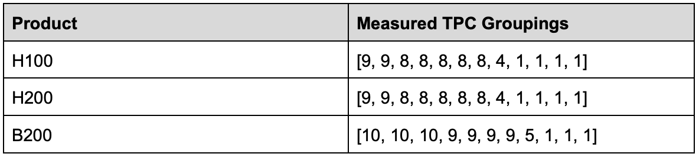

到了 SM100，NVIDIA 为这个量化（quantization）问题提供了解决方案，使 kernel 既能享受更大 cluster 的好处、又能用满所有可用 SM。kernel 可以用两个 cluster 大小来启动：一个 **首选 cluster 大小（preferred）** 和一个 **回退 cluster 大小（fallback）**。一般来说，要用满整个 GPU，回退 cluster 的大小应为 2 或 1。

参考资料：

* [Cluster API](https://docs.nvidia.com/cuda/cuda-programming-guide/03-advanced/advanced-host-programming.html#launching-with-clusters-using-cudalaunchkernelex)
* [Cooperative groups API](https://docs.nvidia.com/cuda/cuda-programming-guide/04-special-topics/cooperative-groups.html)
* `CU_LAUNCH_ATTRIBUTE_PREFERRED_CLUSTER_DIMENSION`
* [CUTLASS Example 73](https://github.com/NVIDIA/cutlass/blob/main/examples/73_blackwell_gemm_preferred_cluster/blackwell_gemm_preferred_cluster.cu)

### 逻辑 GPC vs. 物理 GPC

上面给出的 TPC 归入 GPC 的分组是*逻辑*分组。它们代表软件视角下的 GPC，不含任何关于每个 GPC 中 20 个实际物理 SM 里哪些被启用、或每个物理 GPC 位于两个 die 上何处的信息。实际上，逻辑配置相同的 B200 芯片，其每个 GPC 中被良率保留下来的物理 SM 未必完全相同。这可能成为软件视角下看起来相同的 GPU 之间性能不确定性的一个潜在来源。此外，SM 归入 GPC 的逻辑分组，并不能告诉我们哪个 GPC 位于 B200 封装的两个 die 中的哪一个上。

为了发现更多关于 SM 物理布局的信息，我们让每个 SM 遍历一个填满 L2 cache 的指针追逐（pointer-chase）数组，测量每次加载的延迟。对于每个地址，我们把每个 SM 观察到的延迟与其他每个 SM 观察到的延迟作比较，从而得到一个 SM↔SM 距离矩阵。X、Y 轴均为 SM ID。

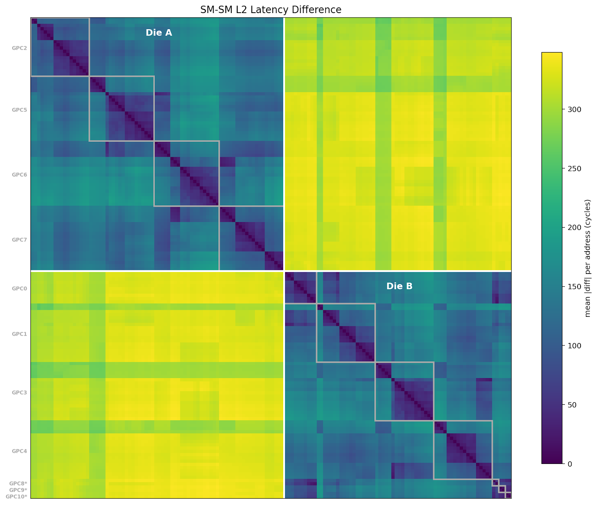

我们可以看到两组清晰的 SM，它们到 L2 的平均距离相差 >300 个周期；这必定是跨 die（die-to-die）的开销。我们还用上一节识别出的逻辑 GPC 分组给 SM 打了标签；有趣的是，那些单独成组的（singleton）TPC 彼此靠得很近，并且在此基准测试中与 GPC0 相关性很好，因此可以猜测这些 TPC 物理上位于 GPC0。

基于这些信息，我们可以细化每个 GPC 被保留的 TPC 清单，不过 5+3 仍只是猜测。

**Die A**：[10, 10, 10, 9]

**Die B**：[9, 9, 9, 5+3]

此外，虽然方式有些迂回，我们可以得出跨 die 的延迟代价大约为 300 个周期。这在观察基准测试中单个 SM 的延迟分布时也很明显（其中还包含大量 L2 拥塞）：

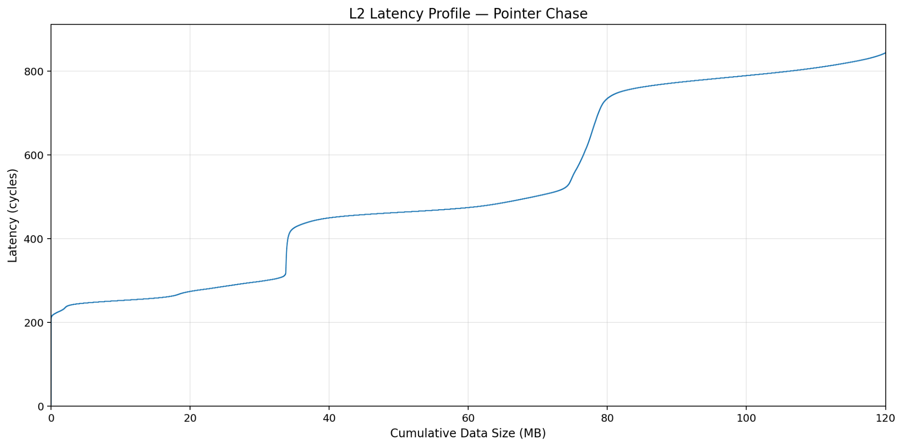

感谢 Decart AI 的 Orian 提供的基准测试灵感。

## 内存子系统

本节讨论内存子系统：在计算单元之间搬运数据的硬件单元。内存拷贝指令是使用内存子系统的操作，较新的世代提供了异步拷贝指令（关于异步化的演进，请阅读 [上一篇文章](https://newsletter.semianalysis.com/i/174558646/asynchronous-execution)）。这里我们聚焦异步拷贝指令的两个变体：**LDGSTS** 和 **TMA**（Tensor Memory Accelerator）。

### 异步拷贝（Async Copy）

异步拷贝（PTX：`cp.async`，SASS：`LDGSTS`）在 Ampere 世代引入，该指令把数据从全局内存异步搬运到共享内存。异步拷贝是非阻塞的，允许内存加载与计算重叠。它还直接写入共享内存而不经过寄存器，降低了寄存器压力。

参考 FlashInfer 的多头注意力（MHA）kernel，我们用如下配置对异步拷贝做基准测试：

* 每 SM 的 CTA 数：1、2、3、4
* stage 数：1、2、4
* 每 CTA 线程数：64、128、256
* 加载大小：4B、8B、16B

我们绘制吞吐相对于每 SM 在途字节数（bytes-in-flight，即并发内存加载指令正在加载的总字节数）的曲线。

尽管不同加载大小在相同在途字节数下收敛到相近的吞吐，我们还是更偏好 16 字节加载。16 字节加载在相近在途字节数下能取得略高的吞吐，同时占用更少的执行资源。例如，在 32 KiB 在途时，8B 加载用 4 个 stage，而 16B 加载只用 2 个 stage。这节省了 2 个内存 barrier 对象的内存空间，并降低了指令发射压力。

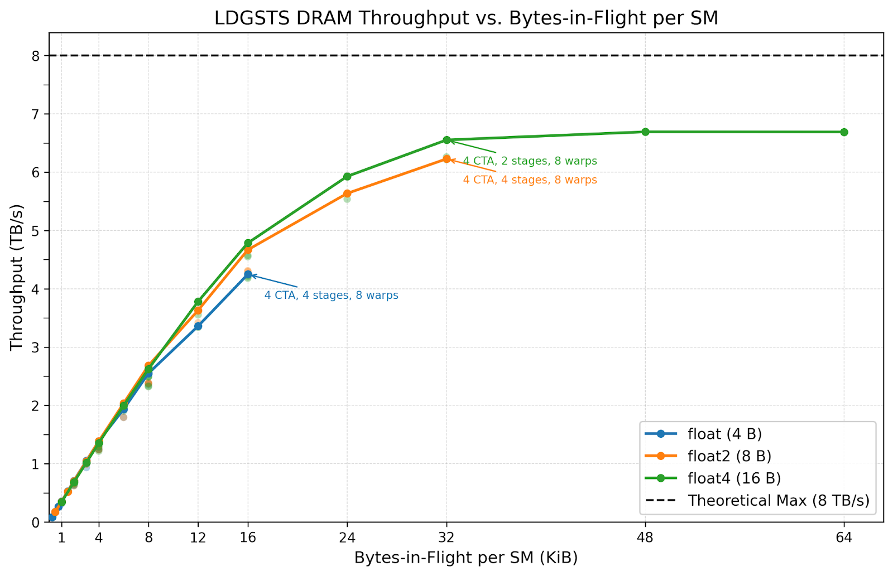

总体上，我们看到 `LDGSTS` 的内存吞吐在 32 KiB 在途时饱和于约 6.6 TB/s。

我们还对多隐注意力（MLA）kernel 所用的配置空间做了基准测试：

* 每 SM 1 个 CTA
* 16B 加载
* 每 CTA 线程数：64、128、256
* stage 数：4、8、12、16

实验表明，增加 stage 数可在更高在途字节数下取得更高吞吐，而增加每 CTA 线程数在所有配置下都能严格提升性能。有趣的是，MLA 使用 2 个 warp 和 12 个 stage，落在约 2.2 TB/s。我们认为这是因为 softmax warp 需要最多的寄存器，而增加 warp 数会降低每线程的寄存器分配。

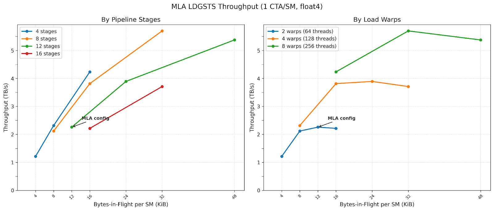

我们对同一组配置测量了延迟。可以看到 `LDGSTS` 的基线延迟约为 600 纳秒，并在 8 KiB 在途之后几乎翻倍。这是因为要让 `LDGSTS` 达到高在途字节数，我们需要用大量线程，导致大量 warp 因 MIO（内存输入输出）throttle 而 stall。

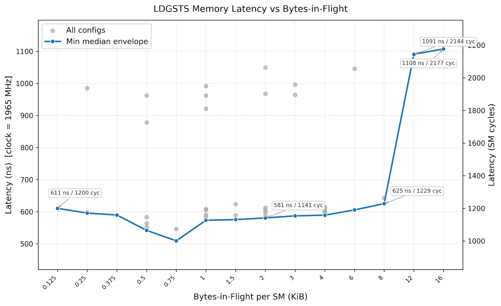

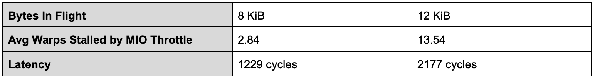

### Tensor Memory Accelerator（TMA）

TMA（PTX：`cp.async.bulk.tensor`，SASS：`UTMALDG`）是 Hopper 世代引入的异步数据拷贝引擎，专门用于把大量数据从全局内存搬运到共享内存。单个线程即可发起 TMA，完成地址生成、内存 swizzling 和越界处理，从而腾出其他线程去执行独立工作。这里我们对 2D tensor 版本（`cp.async.bulk.tensor.2d`）做基准测试，以代表典型的 TMA 用法。

参考 FlashInfer 注意力 kernel，我们对 TMA 做基准测试：每 SM 只分配一个 CTA，但用每 CTA 中 1 到 4 个 warp 各一个线程来发射不同 box 大小的 TMA 指令。下图展示了每个在途字节数下的最佳吞吐。

我们用如下配置对 TMA 做基准测试：

* 每 SM 的 CTA 数：1
* 每 CTA 线程数：128（4 个 warp）
* TMA box 维度：从 32×8 增大到 128×128 的 2D 形状

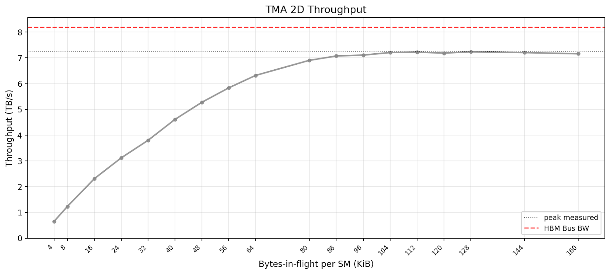

峰值吞吐比 `LDGSTS` 到达得晚得多。

### 异步拷贝 vs. TMA 对比

像 FlashInfer 这样的深度学习 kernel 库同时使用 TMA 和异步拷贝来加载数据。TMA 和异步拷贝有不同的性能特征：TMA 适合访问模式规则的大块加载，但延迟较高；异步拷贝能处理不规则的内存访问模式，但有大小限制。我们说明在何种条件下该选哪一个。这里我们对 FlashInfer 在 MHA 和 MLA kernel 中所用的配置做基准测试。

从吞吐看，在小于 32 字节在途时异步拷贝略胜 TMA，但此后 TMA 追上来，并能持续扩展到 128 KiB。从延迟看，在 12 KiB 在途之前异步拷贝的延迟略低于 TMA，但此后 TMA 延迟大幅上升。

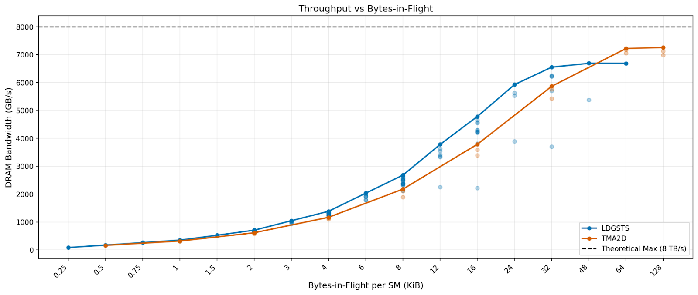

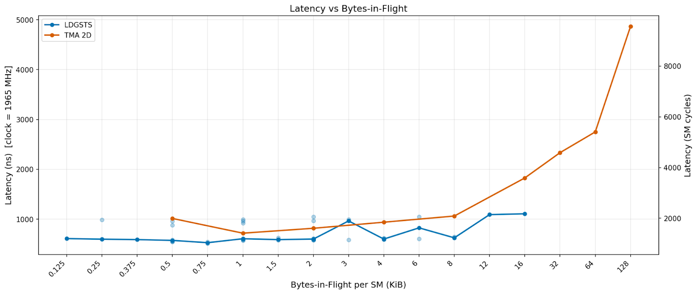

实际上，Blackwell MLA kernel 用异步拷贝来动态加载 page，而其 MHA kernel 只用 TMA。FlashInfer 的大部分 Blackwell MHA kernel 由 TRT-LLM 贡献，因此我们只能通过分析二进制来推测这些 kernel 做了什么。我们发现，与 Hopper 类似，所有 Blackwell TRT-LLM kernel 都使用 TMA。我们怀疑对于动态 page 加载，这些 kernel 沿用了 Hopper kernel 的做法——使用 4D TMA，以 page 索引作为最后一维，并在需要时索引进 `TensorMap` 对象。为了解这些 kernel 的确切机制，我们呼吁 NVIDIA 开源 FlashInfer 的 TRT-LLM kernel，以造福社区。

### TMA Multicast

TMA 支持 multicast 模式：单次加载即可把数据拷贝到由 CTA mask 指定的多个 SM 的共享内存。multicast 常用于类 GEMM 模式，其中输入 tile 在处理不同输出 tile 的 SM 之间共享。例如，multicast 对激活函数 SwiGLU 很有用——它使用两个 GEMM 共享一个输入矩阵的双 GEMM 模式。主要好处是减少 HBM 加载，从而降低有效带宽占用。它还能显著减少 L2 流量，因为多个 CTA 对共享数据的请求会被合并为一个请求。

据 NCU，负责服务 TMA multicast 请求的单元叫做 **L2 Request Coalescer（LRC）**：

> L2 Request Coalescer（LRC）处理进入 L2 的请求，并在转发到 L2 cache 之前尝试合并读请求。它还服务来自 SM 的程序化 multicast 请求，并支持写压缩。

听起来硬件可能会提供某种 multicast 行为，即使没有显式请求——类似 miss status holding register（MSHR）。我们通过运行同一个 TMA multicast 基准来测试这一点，只不过不是由一个 CTA 发起 multicast 加载，而是让所有 CTA 各自向同一份数据发起独立的 TMA 加载。

这里我们比较三种情况：

1. 每个 SM 加载不同数据（基线）
2. TMA multicast（显式）—— 每个 cluster 中一个 CTA 向其 cluster 内所有 CTA 发起 multicast 加载
3. TMA multicast（隐式）—— 每个 cluster 中所有 CTA 各自向同一份数据发起普通 TMA 加载

TMA multicast 允许以高得多的加载带宽来填充 SMEM 缓冲区，即使数据尚不在 L2 中。对于已知的流量模式，显式 TMA multicast 指令能完美消除 L2 流量，达到理想的「每 SMEM 字节 1 / cluster\_size 的 L2 字节」。我们还观察到，对这个简单基准，显式和隐式两种情况下我们取得了几乎相同的 SMEM 填充吞吐。然而可以看到 LRC 并不完美；隐式情况下 L2 收到的流量略多，尤其是随着总量增大时。

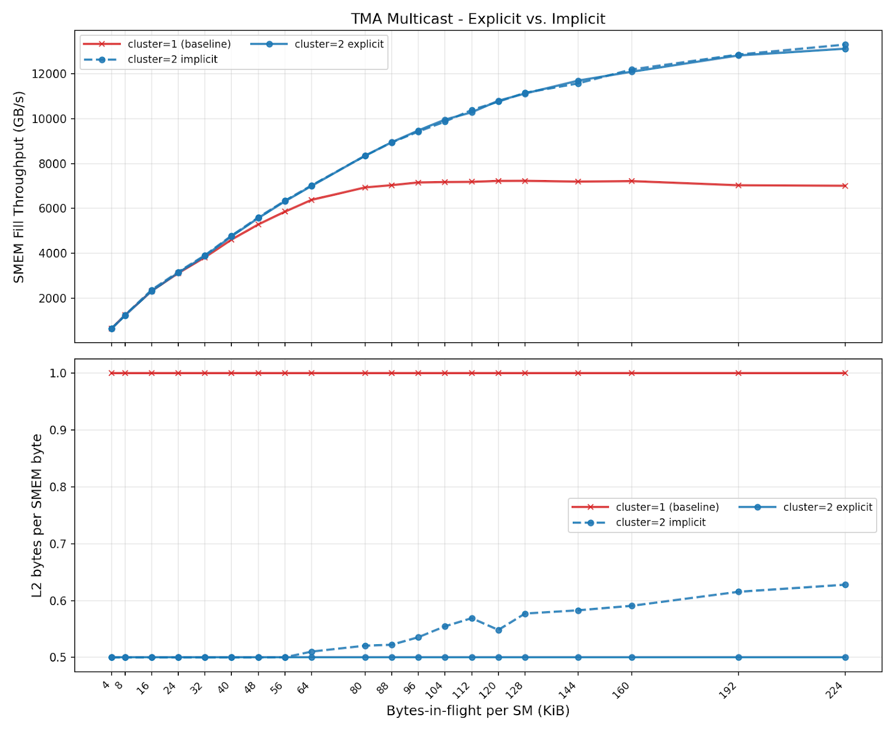

就有效内存吞吐而言，隐式 multicast 与显式表现相当。但在 L2 cache 流量削减方面，隐式 multicast 在超过 64 字节在途后就失去了效果。

### DSMEM vs. SMEM

NVIDIA 在 Hopper 架构中引入了分布式共享内存（DSMEM）。DSMEM 允许一个 cluster 内的 CTA 访问彼此的共享内存。这对诸如 CTA 间归约（inter-CTA reduction）之类的模式很有用。通过 DSMEM 读取对端 CTA 内存的吞吐，显著低于 SMEM 的每时钟周期 128 字节。

我们尝试了几种不同的 PTX 模式来与 DSMEM 交互。为 DSMEM 与 SMEM 编写代码时的一个重要区别是：DSMEM 加载像全局加载一样被打包成包（packetized），因此最优访问模式与本地 SMEM 中为避免 bank conflict 而采用的交错访问完全不同，反而更像对 GMEM 中连续位置的典型合并（coalesced）访问。此外，我们观察到：要为本地 SMEM 拿到完整的 128 B/cycle，必须使用不带 `::cluster` 的 `ld.shared`。这是我们写基准时踩过的坑——当时我们对本地和远端 SMEM 地址一律用了 `ld.shared::cluster`。用 `ld.shared` 时编译器发射 `LDS`，而 `ld.shared::cluster` 发射的是通用的 `LD`，后者似乎无法为本地 SMEM 达到峰值吞吐。我们也很难用 `ld.shared::cluster` 进一步提升实测吞吐，只有在改用 `cp.async.bulk`（PTX）/ `UBLKCP`（SASS）来让每条指令搬运更大数据量之后，才通过 DSMEM 取得了略高的吞吐。

我们用每种 PTX 模式所达到的峰值吞吐如下，以每时钟周期字节数（B/clk）表示，以便与已知的 SM 本地 SMEM 最大可达值对齐。

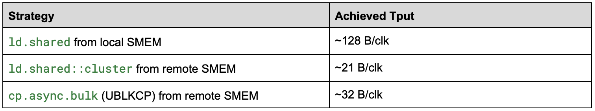

## 第 5 代 Tensor Core MMA

MMA 指令是执行矩阵乘法的核心操作。从 Hopper 到 Blackwell，MMA 性能对形状（shape）的依赖越来越强。这里我们研究这一现象，扫过不同形状和数据类型来量化性能差异。

Blackwell 带来了 **2SM MMA**——一种新型 MMA 指令（`.cta_group::2`），其中一对 CTA 协作地跨 2 个 SM 执行一次 MMA 运算。具体来说，输入矩阵 A 被复制，而矩阵 B 和 D 被切分（shard）到 2 个 SM 上，且这对 CTA 能访问彼此的共享内存。这使得更大的 MMA 形状成为可能。我们研究 2SM MMA 表现为弱扩展（weak scaling）、强扩展（strong scaling），还是两者兼有。

我们用下面的配置空间对 MMA 性能做基准测试：

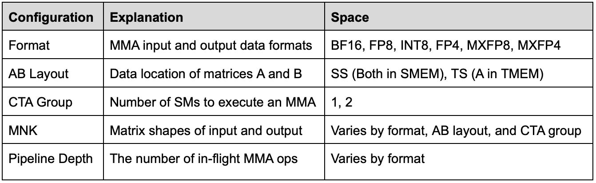

### 吞吐

NVIDIA 为不同输入数据类型声称了特定的吞吐性能，这里我们展示它对每个（格式 + CTA group）的声称值，并与最大可达吞吐对比。我们表明，UMMA 对所有格式和 CTA group 都能达到近峰值吞吐，即便在协作开销可能令人担忧的 2SM 版本上也是如此。

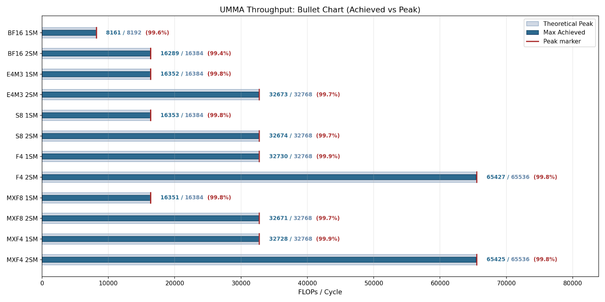

对于 1SM MMA，在所有 N 尺寸上，我们看到较小的 M=64 最多达到理论峰值吞吐的 50%，而较大的 M=128 接近 100%。这证实了 M=64 只用了一半的数据通路（datapath）。对于 2SM MMA，我们看到 M=128 的吞吐在 N=64 时从峰值的 90% 起步，在其他所有 N 尺寸上接近 100%。M128N64 的吞吐一定受限于另一个硬件单元，如 TMEM、L2、SMEM 等。与此同时，M=256 在所有配置下都维持近 100% 的峰值吞吐——这是因为 M=256 相当于每 SM M=128，能用满整个数据通路。我们注意到，位宽相同的数据类型之间吞吐相同，且 micro-scaling 数据类型几乎没有开销。

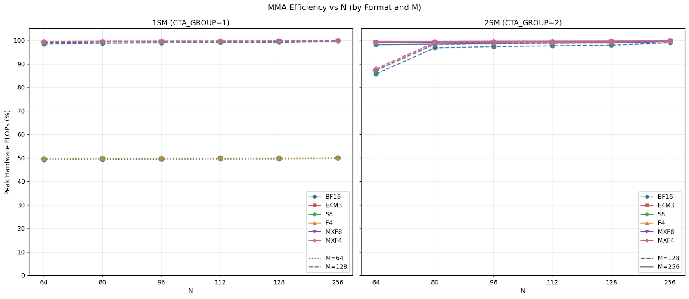

MMA 支持两种不同的 AB 布局：两个输入矩阵都存在 SMEM（SS），以及矩阵 A 存在 TMEM、矩阵 B 存在 SMEM（TS）。我们观察到，对于 M=128，ABLayout=TS 达到近峰值吞吐，而 ABLayout=SS 在较小 N 尺寸下表现欠佳，到 N=128 时追平。

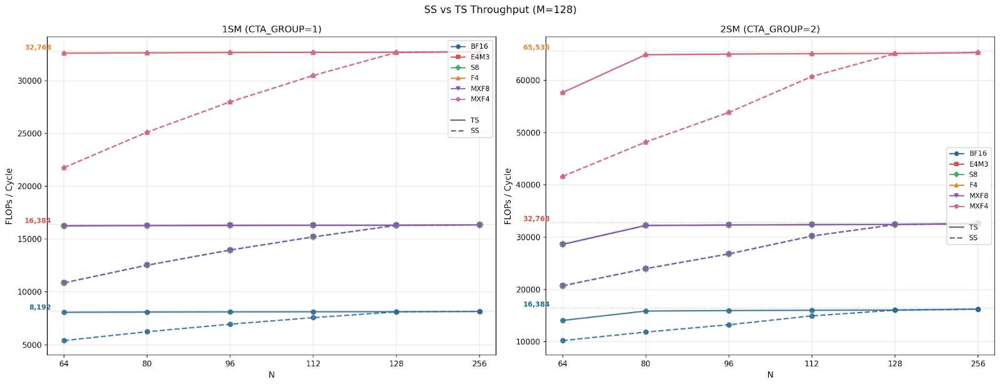

我们可以证明，这是因为在 SS 模式下、N<128 时，指令本身受 SMEM 带宽限制。例如，对 FP16 我们知道硬件每 SM 每周期能做 8192 个 MMA FLOP，而 SMEM 带宽为 128 B/cycle（每 SM）。于是对 M=128 N=64 K=16，有：

```
A_bytes = 2*M*K = 4096; B_bytes = 2*N*K = 2048;
FLOPs = 2*M*N*K = 262144
SMEM Cycles = (A_bytes + B_bytes) / (128 B/clk) = 48 cycles
Math Cycles = FLOPs / (16384 FLOPs/clk) = 32 cycles
```

我们对递增的 N 计算这些值，发现从 N=128 的指令开始，我们才终于受数学（Math）限制。

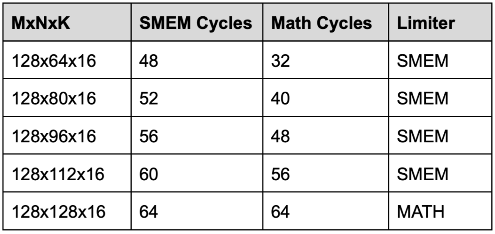

其他数据类型同理——两个操作数都在 SMEM 的 MMA 指令，在 N<128 时受 SMEM 限制。

为进一步说明这一点，我们绘制了 FP8 1SM MMA 所有形状的 roofline。可以清晰看到 N<256 处于内存受限区，且斜率大致为 128 字节/周期，即 SMEM 带宽。

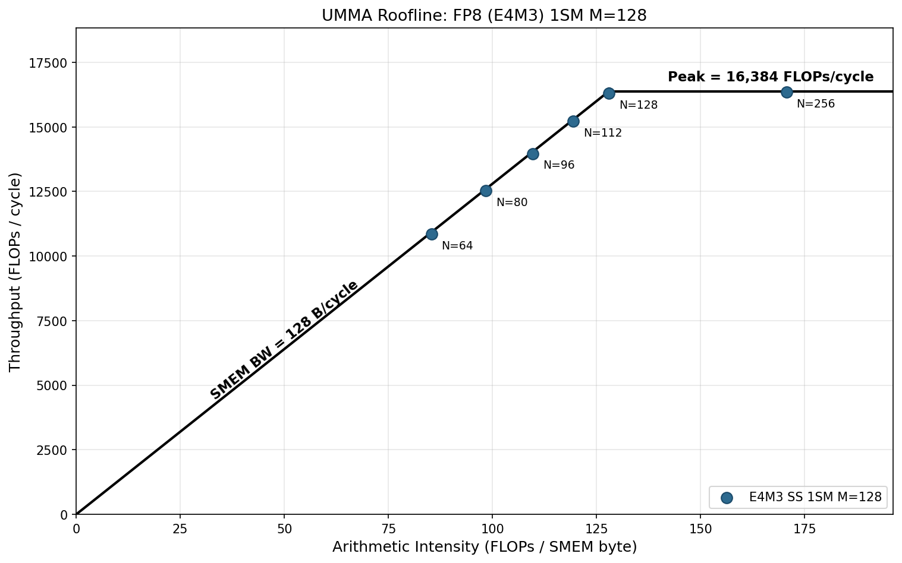

2SM MMA 在所有格式和形状上都实现了完美的弱扩展：使用 2 倍于 1SM MMA 的计算资源时达到 2× 加速。在 ABLayout=SS 的较小形状上，我们观察到超过 2× 的加速——这同样是因为在 SS 模式、N<128 时指令受 SMEM 限制，而 2SM 版本把操作数 B 切分到两个 SM 之间。

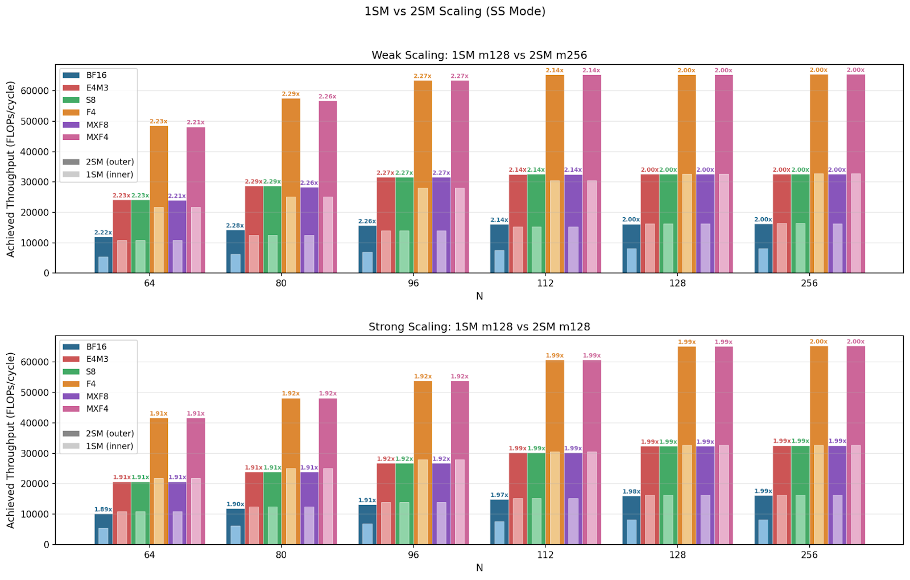

*SS 模式：因受 SMEM 限制，N<128 时加速超过 2×*

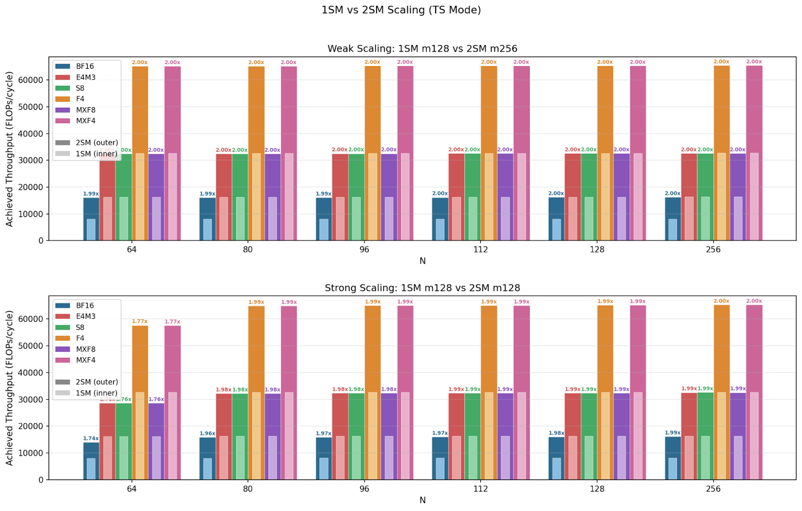

*TS 模式：近乎完美的 2× 加速*

这些实验表明：对于给定的 SMEM tile 大小，你应始终使用可用的最大指令形状，以获得最大吞吐。

### 延迟

我们对单条 MMA 指令的延迟做了基准测试，比较结果如下。在所有配置下，我们看到延迟从 N=64 到 128 线性增加，而 N=256 处的尖峰很可能源于从 128 到 256 的跳变。就单个 CTA group 的 MMA 而言，1SM MMA 的 M=64 和 M=128 在各 N 尺寸上延迟相近；而在 2SM MMA 中，M=256 的延迟增长比 M=128 略快，这与我们的理论估计相符。比较数据类型，1SM 下差异很小，但 2SM MMA 下有明显分化。

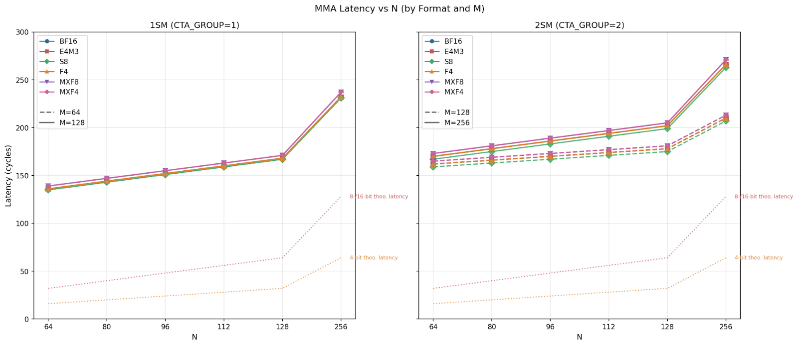

我们注意到一个虽小但一致的延迟排序模式：

> S8 < BF16 = E4M3 = F4 < MXF8 = MXF4

我们认为整数运算更省电导致 S8 最快，而 scale factor 计算给 MXF8 和 MXF4 引入了轻微开销。

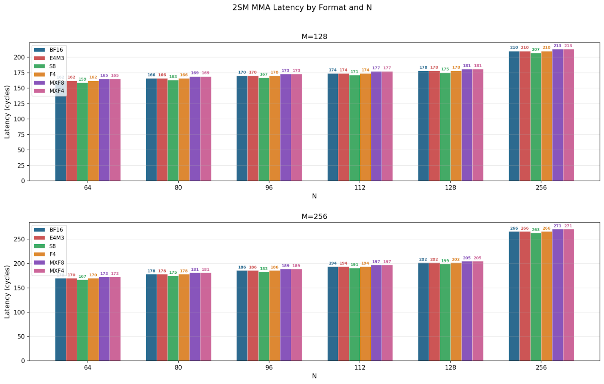

### 不同在途指令数下的吞吐

在我们的吞吐基准中，我们设置了很高的在途指令数（256 到 1024）来摊薄指令发射和 commit 等待开销。然而，kernel 通常只用 1 到 4 条在途 MMA 指令。我们对 1 到 10 条在途指令下的吞吐做了基准测试，并在此讨论吞吐的变化。

在所有配置下，我们看到相同的 N 和在途 MMA 数达到相近的 Speed-of-Light（SoL）百分比。值得注意的是，只有最大的 N 达到 90% SoL，而最小的 N 只达到约 70%。比较 1SM 和 2SM MMA，我们看到 1SM 比其 2SM 对应版本高出约 5% 的 SoL 吞吐。对于相同数据格式和 CTA group 的 MMA，较大 N 的吞吐总是高于较小 N。最后，我们观察到 4 条在途 MMA 的吞吐 SoL 百分比上限约为 78%–80%。

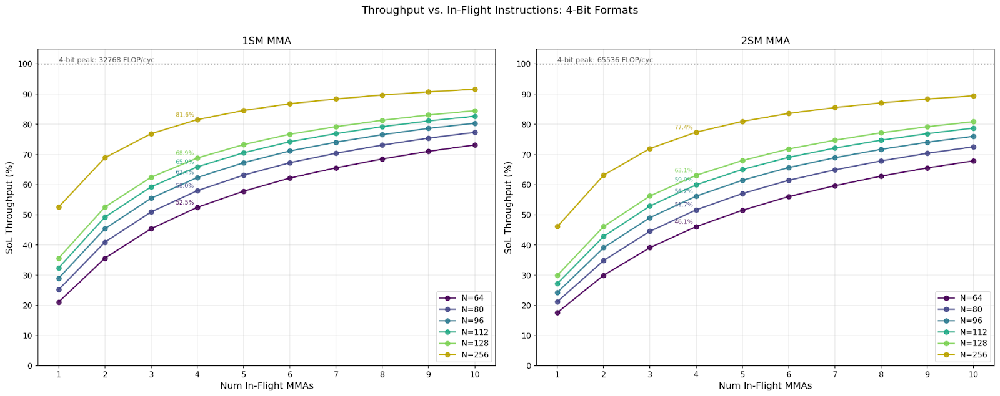

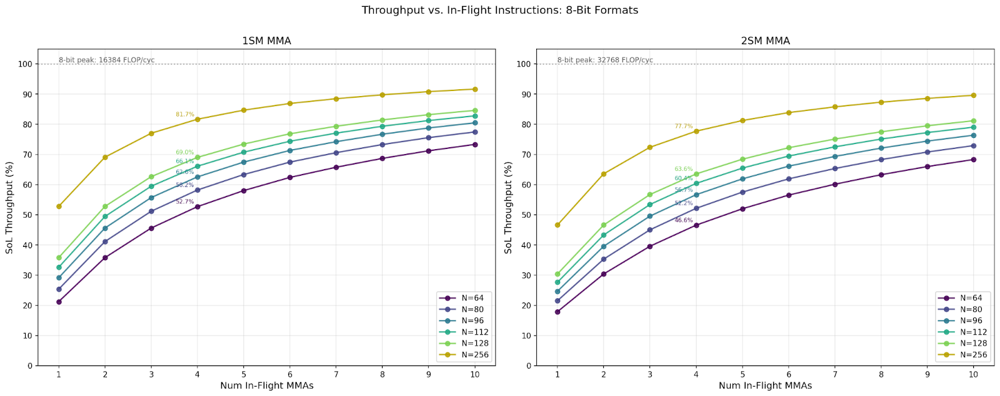

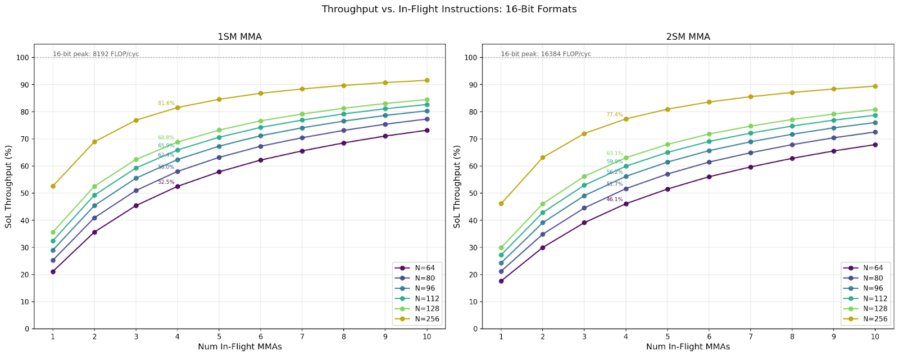

---

> **【付费墙】** 文章余下部分（「借助 kernel 编写库 CUTLASS 的实战用例……吞吐、multicast 与 floorplan」，以及 PTX/SASS 深入分析、floorsweep 与 SM 良率分析）属于付费订阅内容，无法抓取。
>
> 阅读完整文章：<https://newsletter.semianalysis.com/p/dissecting-nvidia-blackwell-tensor>
