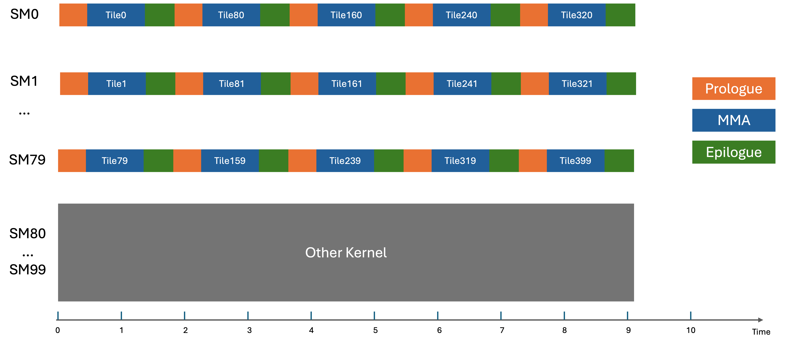
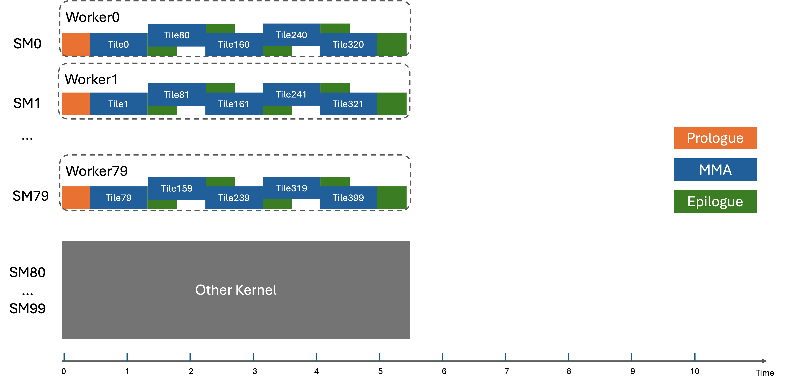

# Blackwell 集群启动控制（Cluster Launch Control）

> 来源：<https://docs.nvidia.com/cutlass/latest/media/docs/cpp/blackwell_cluster_launch_control.html>

## 概述

一个 GEMM 负载通常由三个阶段组成：前导（prologue）、主循环（mainloop）和收尾（epilogue）。当输出 tile 的数量远多于 SM 的数量时，每个 SM 会串行处理多个输出 tile，从而把前导和收尾的开销完全暴露出来。

考虑一个具有 `20x20x1` 个输出 tile 的 GEMM，运行在拥有 `100` 个 SM 的 GPU 上。此时另有一个 kernel 占用了 `20` 个 SM 的全部资源，因此只有 `80` 个 SM 可用。假设 cluster 形状为 `1x1x1`。下图展示了这样一个 kernel 的调度情况。



### 静态调度器（Static Scheduler）

CUTLASS 采用了一种称为**持久化 kernel（persistent kernels）**的软件技术。持久化 cluster（也称 Worker）可以在整个 kernel 执行期间常驻在 GPU 上并处理多个 tile，从而隐藏前导和收尾的开销。tile 调度器以零开销静态地确定下一个要处理的输出 tile。

然而，当部分 SM 的资源不可用时，静态调度器容易出现负载不均衡的问题。下图说明了这一问题。


### 带集群启动控制的动态调度器（Dynamic Scheduler with Cluster Launch Control）

持久化调度的一个根本性局限在于：该 kernel 实时可利用的 SM 数量是未知的。某些 SM 可能被其他 kernel 占用，其资源因而不可用。这使得在 SM 之间做负载均衡变得困难。

Blackwell 引入了集群启动控制（cluster launch control，CLC）来实现动态调度。（参见 <https://docs.nvidia.com/cuda/parallel-thread-execution>）。借助该特性，kernel 会启动一个网格（grid），其包含的线程块（threadblock）数量与 kernel 中要计算的输出 tile 数量相同——就像非持久化 kernel 那样。这里我们把 `ClcID` 定义为 GPU 上启动的三维网格中的一个坐标。

集群启动控制遵循以下规则：

1. 当有可用资源时，一个 `ClcID` 会作为 Worker 被启动。
2. 一个 `ClcID` 可以被现有的 Worker 通过 `clusterlaunchcontrol.try_cancel` 指令查询获取。
3. 每个 `ClcID` 都保证会被 (1) 或 (2) 中的一种方式处理。
4. 每个 Worker 使用 `{blockIdx.x, blockIdx.y, blockIdx.z}` 坐标作为要处理的第一个输出 tile，并使用 CLC 查询来处理后续的输出 tile。
5. `clusterlaunchcontrol.try_cancel` 指令要么返回一个带 `ClcID` 的成功信号，要么返回一个拒绝信号。拒绝最常见的原因是所有 `ClcID` 都已被处理完毕。
6. 集群启动控制以 cluster 为粒度工作。例如，一个 2x2 的持久化 Worker cluster 的一次查询会一次性消耗 2x2 个 `ClcID`。

下图展示了在集群启动控制下调度的情况。



## 编程模型（Programming Model）

### 伪代码

#### 非持久化 kernel

```cpp
// 非持久化 kernel
__device__ non_persistent_kernel(...) {
  setup_common_data_structures();
  dim3 workCoordinates = blockIdx;
  coordinate_specific_compute(workCoordinates);
}
```

#### 静态持久化 kernel

```cpp
// 静态持久化 kernel
__device__ static_persistent_kernel(...) {
  setup_common_data_structures(...);
  dim3 workCoordinates = blockIdx;
  bool isValidId;
  do {
    coordinate_specific_compute(workCoordinates);
    std::tie(isValidId, workCoordinates) = staticTileScheduler.fetch_next_work();
  } while (isValidId);
}
```

#### Blackwell 动态持久化 kernel

```cpp
// 动态持久化 kernel
__device__ clc_dynamic_persistent_kernel(...) {
  setup_common_data_structures(...);
  dim3 workCoordinates = blockIdx;
  dim3 newClcID;
  bool isValidId;
  do {
    coordinate_specific_compute(workCoordinates);
    std::tie(isValidId, newClcID) = clcTileScheduler.fetch_next_work();
    workCoordinates = newClcID;
  } while (isValidId);
}
```

### 集群启动控制流水线类（Cluster Launch Control Pipeline Class）

请参考 [集群启动控制流水线类](https://github.com/NVIDIA/cutlass/tree/main/include/cutlass/pipeline/sm100_pipeline.hpp) 中定义的 `PipelineCLCFetchAsync` 流水线类。集群启动控制查询可以被流水线化，并由一个具有生产者-消费者关系的异步流水线管理（参见 [pipeline](https://docs.nvidia.com/cutlass/latest/media/docs/cpp/pipeline.html) 文档）。生产者是 cluster 中第 0 个 CTA 的调度器 warp，消费者是所有需要 `ClcID` 的 warp。

为了正确地设置一个 CLC 流水线，我们需要确保参数被设为正确的值：

* `transaction_bytes` 为 `16`，因为 CLC 会返回一个 16 字节的响应并将其存储到指定的共享内存地址。
* `consumer_arv_count` 是 cluster 中所有消费者 warp 的线程总数。
* `producer_arv_count` 为 `1`，因为只有调度器 warp 中的一个线程会被选出来发起 `clusterlaunchcontrol.try_cancel`。
* `producer_blockid` 为 `0`，表示 cluster 中的第一个 CTA 是生产者。

### 动态 tile 调度器类（Dynamic tile scheduler class）

请参考 [sm100 动态持久化 tile 调度器](https://github.com/NVIDIA/cutlass/tree/main/include/cutlass/gemm/kernel/sm100_tile_scheduler.hpp) 中定义的 `PersistentTileSchedulerSm100` 类。

CLC 调度器类有两个重要方法。第一个是 `advance_to_next_work`，它由调度器 warp 中被选出的一个线程执行。它实际上会向 CLC 发出 CLC 查询。一次 CLC 查询的响应会被广播到 cluster 中所有 CTA 的同一共享内存地址。

另一个方法名为 `get_current_work`。它只是从由流水线状态索引的共享内存缓冲区中加载 CLC 响应。

CLC 流水线类和调度器类需要配合使用，以确保 CLC 特性的正确功能以及必要的同步。请参考 [集群启动控制流水线单元测试](https://github.com/NVIDIA/cutlass/tree/main/test/unit/pipeline/pipeline_cluster_launch_control_async_warp_specialized_blackwell.cu)。

## Blackwell warp 特化持久化 kernel（Warp-specialized Persistent Kernel）

现在，让我们来看看 CLC 特性是如何在我们的 [Blackwell 稠密 GEMM kernel](https://github.com/NVIDIA/cutlass/tree/main/include/cutlass/gemm/kernel/sm100_gemm_tma_warpspecialized.hpp) 中使用的。

这个特定的 warp 特化 kernel 具有如下的 warp 分工：

| Warp 角色 | Warp |
| --- | --- |
| MMA | 0 |
| Scheduler（调度器） | 1 |
| Mainloop Load（主循环加载） | 2 |
| Epilogue Load（收尾加载） | 3 |
| Epilogue（收尾） | 4, 5, 6, 7 |

调度器 warp 是 CLC 流水线的生产者。消费者是 MMA、主循环加载、收尾加载以及收尾 warp。此外，调度器 warp 还是它自己的消费者！这是因为它需要查询返回的 `success` 信息，以便在到达网格末尾（end-of-grid）时终止持久化循环。

CLC 流水线的深度为 3，以便重叠多个 wave 的 CLC 操作来隐藏延迟。第一个 `ClcID` 是预加载的 `blockIdx`，它不需要 CLC 查询，是完全静态的。

## 版权（Copyright）

Copyright (c) 2025 - 2026 NVIDIA CORPORATION & AFFILIATES. All rights reserved.
SPDX-License-Identifier: BSD-3-Clause
