# NVIDIA Blackwell GPU 上基于 Cluster Launch Control（CLC）的动态持久化 tile 调度

> 来源：<https://research.colfax-intl.com/dynamic-persistent-tile-scheduling-with-cluster-launch-control-clc-on-nvidia-blackwell-gpus/>
>
> 发布于 2026 年 5 月 9 日 · Colfax Research · 文章 / 博客 / 教程

### 动机

考虑矩阵乘法（GEMM）问题

$$C = AB,$$

其中 $A \in \mathbb{R}^{M\times K}$、$B \in \mathbb{R}^{K\times N}$、$C \in \mathbb{R}^{M\times N}$。C 的计算通过把问题形状 (M, N, K) 按某个 tile 形状 (bM, bN, bK) 切分来并行化，每个 bM × bN 的输出 tile 计算为

$$C^{[i,j]} = \sum_k A^{[i,k]} B^{[k,j]}.$$

每个 **work tile（工作块）** $C^{[i,j]}$ 都必须被分配给一个 CTA，或者由一个 CTA cluster 协作处理。这里需要区分算法和硬件执行模型中的三个概念：

* work tile 是算法层面的数据和计算任务；
* CTA（thread block）或 CTA cluster 是执行、协作与调度单位，并不是硬件处理器；
* SM 才是实际执行 CTA 的硬件单元。一个 CTA 的线程在一个 SM 上执行；同一 cluster 中的 CTA 会在同一个 GPC 内协同调度。

因此，**tile 调度（tile scheduling）** 问题是确定 work tile 如何分配给 CTA/cluster；CUDA 硬件调度器再决定这些 CTA/cluster 何时获得 SM 资源。程序通常不能提前指定某个 cluster 必须在哪一组 SM 上运行。

还要区分“提交到 kernel grid 中的逻辑 cluster 数量”和“某一时刻实际驻留的 cluster 数量”。逻辑 grid 可以远大于 GPU 的并发容量；超过容量的 cluster 尚未执行，也没有占用 SM。能够同时驻留多少 cluster 取决于 SM 数量、cluster shape、寄存器、shared memory 和线程数等资源。为了便于讨论，本文后面把同一时刻能够并发驻留的一批 CTA/cluster 称为一个 **wave（波次）**。

CUDA kernel 的 `gridDim` 始终按 CTA/thread block 计数，而不是按 cluster 计数。若 cluster shape 为 $(c_x,c_y,c_z)$，每个 cluster 包含 $c_xc_yc_z$ 个 CTA；当 grid 各维度都能按 cluster shape 完整分组时，逻辑 cluster 数为

$$
N_{\mathrm{cluster}}=
\frac{\mathrm{gridDim.x}}{c_x}
\frac{\mathrm{gridDim.y}}{c_y}
\frac{\mathrm{gridDim.z}}{c_z}.
$$

实际 launch 时 grid 必须满足完整 cluster 的对齐要求，本文后面的 CUTLASS 代码会把 grid 向上取整。一个 CTA 只在一个 SM 上执行，但一个 SM 在资源允许时可以同时驻留多个 CTA；同一 cluster 的所有 CTA 则必须在同一个 GPC 内协同驻留和调度。因此，“cluster grid 可以超过 SM 数量”在 CUDA 中完全合法；静态持久化通常只提交约一个 resident wave，是这种调度策略的选择，而不是 CUDA 对 grid 大小的限制。最大可支持的 cluster shape 和实际 occupancy 都依赖设备与 kernel 配置。

如果 cluster 含有多个 CTA，那么一个 cluster 级的工作分配实际上对应一组 CTA-level 输出 tile。除非需要区分这两个层次，下文仍简称为一个 work tile。

本文讨论 **Cluster Launch Control**（CLC），这是 NVIDIA Blackwell GPU 上一项由硬件支持的特性，用于实现高效的动态 tile 调度，尤其改善**负载均衡（load balancing）**。CLC 并不保证对所有问题都优于静态调度，具体选择仍然取决于 workload 和数据局部性。为了给出背景，我们先回顾几种常见的调度策略，以及 CLC 所要解决的这些策略的不足。接着我们逐行讲解在 CuTe DSL kernel 中使用 CLC 的实现细节，最后以一个 GEMM kernel 的性能对比收尾。

下面提到的 **descriptor setup** 是一个概括性说法。以 TMA tensor map descriptor 为例，它描述张量的基址、形状、步长和 swizzle 等信息；在规则的 dense GEMM 中，同一个 descriptor 往往可以服务多个输出 tile，每个 tile 只需使用不同坐标，并不一定要重写 descriptor。本节所说的固定启动成本还包括建立或加载 descriptor/iterator 视图、初始化 shared-memory barrier 和 pipeline state、划分各 warp 的角色以及其他只需为一个驻留 worker 做一次的公共准备。对于 grouped GEMM 或运行时形状变化的 kernel，切换问题时则可能需要选择或更新不同的 descriptor。

### 单 tile 调度（Single Tile Scheduling）

最朴素的选择是提交覆盖完整问题的 grid，并把每个 work tile 分配给唯一的一个逻辑 cluster。假设问题有 512 个 cluster-level work tile，而 GPU 最多并发驻留 74 个这种 cluster，那么 kernel grid 中有 512 个逻辑 cluster，但第一波最多只有 74 个真正开始执行，其余 cluster 在硬件调度队列中等待资源。

每个 cluster 只完成自己的一个 work tile。一次典型的执行过程如下：

1. cluster 获得 SM 资源，从 kernel 入口开始执行；
2. 各 CTA 建立 shared-memory 布局，初始化 mainloop/epilogue pipeline、mbarrier 和 warp-role state，并建立或加载所需的 descriptor/iterator 视图；
3. 根据 `blockIdx` 和 cluster 内 CTA rank 计算唯一的输出 tile 坐标，建立该 tile 的 A、B、C tensor slice；
4. producer warp 通过 TMA 等机制分阶段加载 A/B，consumer warp 沿 K 维执行 MMA mainloop；
5. 执行 epilogue，把 accumulator 变换并写回对应的 C tile；
6. 排空 pipeline，完成必要的 barrier/fence，随后整个 cluster 退出并释放资源。

某个 cluster 退出后，硬件调度器再从尚未启动的 cluster 中选择一个进行派发。新 cluster 会重新执行上述 1～6 步，包括其中的公共初始化。这里启动的是一个新的 cluster 实例，并不是刚退出的 cluster 继续处理下一个任务；这些派发都属于同一次 CUDA kernel launch，也不是 host 再次启动 kernel。等待中的 cluster 也没有预先绑定到某个 SM 的专属队列。

在理想化的并发容量为 74 的情况下，512 个 cluster 大约形成

$$
\left\lceil \frac{512}{74} \right\rceil = 7
$$

个 wave。最后一个 wave 通常无法填满全部 SM，这种由任务数量不能整除并发容量造成的尾部空闲称为 **wave quantization（波次量化）**。即使所有 tile 的耗时完全相同，它也会出现，因此它与“不同 tile 耗时不同”造成的负载不均衡不是同一个概念。

任何调度器都不能凭空创造并行工作。例如，只剩 26 个可并行 tile、硬件容量却是 74 个 cluster 时，其余资源必然空闲；CLC 也无法消除这种固有的 wave quantization。CLC 能改善的是由于 tile 耗时不同、静态任务分配不佳或实际 worker 数变化而造成的额外尾部拖延。

单 tile 调度的优点是硬件会自然地把尚未启动的 cluster 派发给先空闲的资源，所以对 tile 执行时间波动具有良好的负载均衡能力，也保留了为其他 kernel 让出资源的灵活性。缺点是每个 cluster 都要付出固定的初始化和退出开销，而这些开销只被摊销到单个 tile 上。此外，不同 cluster 之间无法直接把一个 tile 的 epilogue 与另一个 tile 的 mainloop 重叠。

### 静态持久化 tile 调度（Static Persistent Tile Scheduling）

另一方面，我们也可以选择采用持久化（persistent）的 tile 调度方案。这里我们简要回顾一下持久化 tile 调度的概念，更详细的阐述请读者参阅我们的[前一篇文章](https://research.colfax-intl.com/cutlass-tutorial-persistent-kernels-and-stream-k/)。

在静态持久化的设定下，我们不再为每个 work tile 分别提交一个 cluster，而是只启动一组 **worker cluster**。worker 数量通常取该 kernel 在空闲 GPU 上理论可同时驻留的 cluster 数量，并受问题总 tile 数量限制。这个理论值可以在 launch 前根据设备属性和 kernel 的资源占用计算；它是 occupancy 上限，并不保证 kernel 实际运行时所有 worker 都能立刻获得资源。例如，其他并发 kernel 可能占用部分 SM。

在单进程、单 stream、GPU 独占的常见基准测试中，同一 stream 的 kernel 按顺序执行，因而静态 scheduler 计算出的理论 occupancy 往往很接近真正得到的并发 worker 数。运行时资源不确定主要出现在允许 kernel overlap 的环境，例如多个 CUDA stream、CUDA Graph 的并行分支、框架或 NCCL 使用的内部 stream，以及通过 CUDA MPS 共享 GPU 的多个进程。多个 stream 只提供并发的可能，是否真的 overlap 仍取决于依赖关系和剩余资源；普通多进程若未使用 MPS，通常采用 context 分时而不是同时占据不同 SM。MIG 则预先划分可见硬件资源，不等同于这里的临时资源竞争。

一旦某个 worker cluster 开始运行，它就会“持久地（persist）”驻留在分配给它的硬件资源上，在 kernel 内部的循环中连续计算多个 work tile，直到自己的静态任务序列耗尽才退出。假设总共有 $T=512$ 个 work tile，并启动 $W=74$ 个 worker，那么编号为 $w$ 的 worker 可以处理

$$
w,\; w+W,\; w+2W,\; \dots < T.
$$

也就是说，worker 0 处理 tile 0、74、148……，worker 1 处理 tile 1、75、149……。此时 grid 中只有 74 个 worker cluster；其余 438 个 tile 只是任务编号，并不存在与它们一一对应、等待启动的 cluster 实例。

例如，给定 148 个 SM、cluster 大小为 2，并且这个 GEMM 的资源占用使每个 SM 同时只能承载一个相关 CTA，我们可以在空闲 GPU 上并发驻留 74 个 cluster。这里的 74 是这个特定配置的 occupancy 结果，不是“cluster 数量永远等于 SM 数除以 cluster size”的通用规则：如果一个 SM 可以同时驻留多个 CTA，并发 cluster 数也会相应变化。

单个静态 worker 的执行过程可以写成：

```text
执行一次公共初始化：
  建立 shared-memory storage、descriptor/iterator 视图
  初始化 mainloop/epilogue pipeline 和 barrier

tile_id = worker_id
while tile_id < num_tiles:
  把 tile_id 解码为 (m, n, batch/problem) 坐标
  更新本轮的 tensor slice、边界谓词和 accumulator
  执行 TMA load + K-loop MMA mainloop
  执行 epilogue/store
  推进或复用 pipeline state
  tile_id += num_workers

排空 pipeline 并退出 cluster
```

因此，静态持久化并没有省掉每个 tile 真正需要的 TMA load、MMA、epilogue、坐标计算和 accumulator 初始化。它省掉或摊薄的是“退出当前 cluster、派发新 cluster、从 kernel 入口重做公共初始化”的成本。具体 kernel 能复用多少 descriptor 或 pipeline 状态取决于实现；不能笼统理解为切换 tile 完全没有开销。

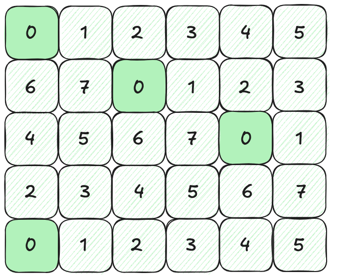

*图 1：GEMM 的输出 C 被切分成 5 × 6 的 work tile 网格，每个 tile 都由八个 cluster 之一来计算。每个 work tile 都标注了分配给它的 cluster 编号。分配给 cluster 0 的 work tile 被高亮显示。*

持久化 tile 调度的主要好处在于，流水线和部分状态可以在多个 tile 之间复用，固定初始化成本被多个 tile 摊销；kernel 还可以把一个 tile 的 epilogue 与下一个 tile 的 mainloop 重叠。切换 work tile 仍然需要更新 tile 坐标和 pipeline state，但不需要退出当前 cluster 再派发一个新的 cluster。

静态持久化的代价是任务所有权已经固定。即使某个 worker 提前完成自己的全部 tile，它也不能帮助仍在执行慢 tile 的 worker。如果 launch 前按理论 occupancy 选择了 74 个 worker，而运行时只有 50 个能够立刻驻留，那么其余 24 个 worker 及其静态任务序列只能等待；已经运行的 50 个 worker 不会接管它们的任务。正确性不受影响，因为等待中的 worker 最终仍会启动，但性能和资源利用率可能变差。

即使所有 worker 都成功驻留，不同 tile 的计算量也可能造成负载不均衡。例如，考虑一个 grouped GEMM，它计算一组 GEMM：

$$C_i = A_i B_i, \quad i = 0, 1, \dots, \texttt{num\_problems} - 1.$$

举个例子，我们可以考虑一个由四个问题组成的 grouped GEMM，其形状如下：

|  |  |
| --- | --- |
| 问题 0： | (256, 256, 128) |
| 问题 1： | (256, 256, 2048) |
| 问题 2： | (256, 256, 128) |
| 问题 3： | (256, 256, 2048) |

注意每个 GEMM 都有 M = N = 256，但缩并维度（contracting dimension）对某些问题较小（K = 128），对另一些问题较大（K = 2048）。考虑一个使用以下 tile 形状来计算该 grouped GEMM 的 kernel：

$$(\text{bM}, \text{bN}, \text{bK}) = (128, 128, 128).$$

如果 GPU 上有足够的可用资源来并发启动 8 个 cluster，我们可能会按下图所示把 work tile 分配给各 cluster。


*图 2：我们的 grouped GEMM 中的每个 work tile 都被分配给八个 cluster 之一。在静态持久化的情形下，分配方式是：把所有问题的 work tile 线性排序，然后每隔 8 个 work tile 分配给一个 cluster。*

乍看之下，这种分配似乎是完美均衡的，因为每个 cluster 恰好计算两个 work tile。然而，这些 work tile 所需的计算量因问题而异。来自问题 0 和问题 2 的 work tile 需要

$$2 * \text{bM} * \text{bN} * K = 2 * 2^7 * 2^7 * 2^7 = 2^{22} \text{ FLOPs},$$

而来自问题 1 和问题 3 的 work tile 需要

$$2 * \text{bM} * \text{bN} * K = 2 * 2^7 * 2^7 * 2^{11} = 2^{26} \text{ FLOPs}.$$

因此，如果我们看每个 cluster 所计算的 FLOP 数量，就会发现显著的负载不均衡：

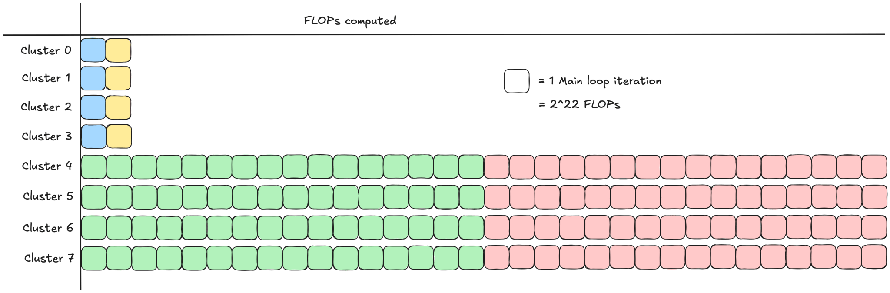

*图 3：静态持久化情形下每个 cluster 所完成工作量的示意（以计算的 FLOP 数量衡量）。*

这种不均衡促使我们转向动态持久化调度。

### 动态持久化 tile 调度（Dynamic Persistent Tile Scheduling）

动态持久化和静态持久化一样，也允许一个已经驻留的 worker cluster 连续处理多个 work tile。二者的关键区别并不是“是否处理多个 tile”，而是下一个 tile 的所有权何时决定：静态调度在执行前就为每个 worker 固定完整任务序列；动态调度只给出初始任务，之后由先完成当前 tile 的 worker 在运行时领取剩余任务。

这里“完成当前 tile”不等于 cluster 已经退出。worker 仍然处在 kernel 的 persistent loop 中，只有这样才能领取下一个 work；真正退出的 CTA/cluster 不能再执行 steal。

动态持久化是一种调度策略，并不规定唯一的 grid 形状。使用全局原子计数器的传统实现通常只启动与理论并发容量相当的 worker 数量，然后让它们从软件工作队列领取 tile；Blackwell CLC 实现则提交与 single-tile 调度相同的完整逻辑 grid，再让已经实际启动的 cluster 取消尚未启动的 cluster，并接管其坐标所代表的工作。后文将详细解释这一区别。

传统全局原子计数器实现中，一个 worker 每次领取新 work 通常要执行：对全局 counter 做 atomic fetch-and-increment、检查返回的 tile id 是否越界、把线性 id 解码成问题/tile 坐标，然后让 cluster 内所有参与者使用这个坐标开始下一轮计算。其主要额外成本是全局原子操作、cache/coherence 流量以及 kernel launch 前把 counter 清零。除此之外，它和静态持久化一样复用已驻留 cluster 的公共状态。

CLC 把“从全局 counter 取编号”替换成硬件取消协议：一个 scheduler thread 发出异步 `try_cancel`，用 transaction mbarrier 等待 16 字节响应，先通过 `query_cancel.is_canceled` 判断成功与否；成功时再通过 `query_cancel.get_first_ctaid` 解码被取消 cluster 的坐标，并把结果同步或 multicast 给 cluster 内需要它的 CTA/warp。各参与者根据 cluster 内 rank 修正坐标、建立新 tile 的 tensor slice，然后继续 mainloop 和 epilogue。如果取消失败，worker 不能继续发出新的 `try_cancel`，而是在排空已经取得的工作和 pipeline 后退出。

从概念上可以说“worker 完成当前 tile 后再领取下一个 tile”，但实际高性能实现通常由独立 scheduler warp 提前发出请求，并用一到多个 CLC pipeline stage 缓存结果，从而把调度延迟与当前 tile 的 mainloop/epilogue 重叠。预取过深会提前给某些 worker 囤积过多任务，反而削弱动态负载均衡。

动态调度主要处理两类不确定性：一是所有 worker 都已驻留，但不同 tile 的 K、序列长度或有效计算量不同；二是并发 kernel 等因素使实际驻留的 worker 数少于 launch 前的理论值。前者即使在单 stream、独占 GPU 上也会出现，例如 grouped GEMM 和变长 attention。相反，对于 tile 耗时一致、GPU 独占且数据局部性良好的规则 dense GEMM，静态持久化没有动态领取工作的同步成本，并可能具有更可预测的 cache locality，因此 CLC 不一定更快。

让我们看看动态分配如何避免前面例子中的负载不均衡。在一个合理的假设下——即 cluster 处理来自问题 0 或 2 的 tile 所需的时间，远小于处理来自问题 1 或 3 的 tile 所需的时间——work tile 到 cluster 的分配可能会呈现如下形态：

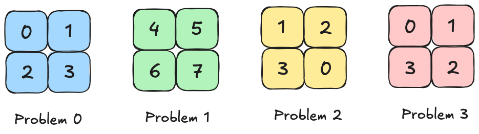

*图 4：我们的 grouped GEMM 中的每个 work tile 都被分配给八个 cluster 之一。在动态持久化的情形下，分配方式是：把所有问题的 work tile 线性排序，给每个 cluster 分配一个初始 work tile，然后允许各 cluster 在完成当前工作后再去获取新的 work tile。*

注意，除了初始分配之外，程序员无法控制哪些 work tile 由哪些 cluster 来计算。这些分配是在运行时根据各 cluster 完成其工作的先后顺序来决定的。我们看到，在这种情形下，各 cluster 计算的 FLOP 数量分布得更加均匀。

三种策略可以概括如下：

| 调度策略 | 提交的逻辑 cluster 数量 | 一个实际启动的 cluster 处理多少 work | 每次取得下一个 work 的调度操作 | 主要特点 |
| --- | --- | --- | --- | --- |
| 单 tile | 与完整问题的 cluster-level work 数量相当 | 一个 | cluster 内没有“下一个 work”；退出后由硬件派发新的 cluster，新 cluster 重新执行公共初始化 | 自然负载均衡和抢占灵活性较好，但每个 tile 都重复承担 cluster 初始化成本 |
| 静态持久化 | 通常取理论可并发驻留的 worker 数量 | 多个 | 对静态线性 id 加 `num_workers`，做坐标解码和有效性检查；无需全局原子或 CLC 请求 | 初始化成本被摊销，也便于跨 tile 重叠；但不能适应 tile 耗时差异或实际可用 SM 数量变化 |
| 动态持久化 | 传统原子实现通常只提交少量 worker；CLC 提交完整逻辑 grid | 多个 | 原子实现执行 fetch-and-increment；CLC 执行 `try_cancel`、mbarrier 等待、`query_cancel` 解码和 cluster 内广播/同步 | 兼顾持久化的摊销优势和动态负载均衡，但存在调度与同步开销，并可能改变 cache locality |

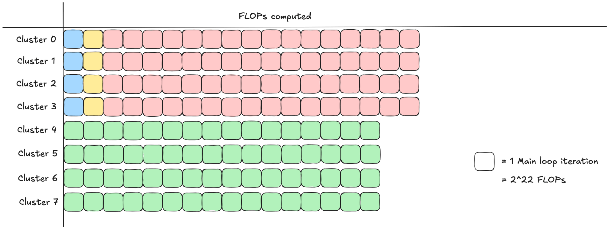

*图 5：动态持久化情形下每个 cluster 所完成工作量的示意（以计算的 FLOP 数量衡量）。*

这种改善后的负载均衡带来了更好的 kernel 性能。例如，我们可以对如下问题形状的 grouped GEMM 做基准测试：

|  |  |
| --- | --- |
| 问题 0： | (1024, 1024, 1024) |
| 问题 1： | (1024, 1024, K) |
| 问题 2： | (1024, 1024, 1024) |
| 问题 3： | (1024, 1024, K) |

在我们的 B200 上，让 K 取越来越大的值（B200 可并发支持 74 个形状为 (2, 1) 的 cluster）。静态与动态两种情形下的结果如下所示。


*图 6：高度负载不均衡的 grouped GEMM 在静态与动态调度下的性能。所测配置的操作数数据类型为 mxfp4、MMA tile 大小为 256 × 128，使用 2CTA MMA 指令。*

正如预期的那样，当 work tile 变得高度负载不均衡时，动态调度器显著优于静态调度器。

#### 动态持久化 tile 调度的标准实现

要实现动态持久化 tile 调度，我们需要保证两条性质：

1. 每个 tile 最终都会被某个 cluster 处理，且
2. 没有任何 tile 会被超过一个 cluster 处理。

一种标准策略是维护一个全局原子计数器，用它来追踪下一个尚未分配的 tile。当某个 cluster 需要取得新工作时，它对这个计数器执行原子的 fetch-and-increment（取值并自增），以此认领下一个 tile 索引。每个 cluster 会持续请求工作，直到返回的 tile 索引大于等于 tile 总数为止，从而保证性质 (1)。由于原子操作是可线性化的（linearizable），每个 cluster 都会拿到唯一的 tile 索引，从而保证性质 (2)。这一策略的一个实现例子见 [quack tile scheduler](https://github.com/Dao-AILab/quack/blob/d898157f6761759161c48af94be1332dfd00697e/quack/tile_scheduler.py#L393)。

尽管这种做法简单且与架构无关，它也并非没有缺点。所有 cluster 都必须反复对同一个全局计数器执行原子操作。这在 cluster 之间引入了一定程度的串行化，并且需要反复往返访问全局内存。此外，在每次 kernel 启动之前，还必须把这个全局计数器清零。

幸运的是，Blackwell 提供了一种由硬件支持的动态持久化调度实现，称为 **Cluster Launch Control**（CLC）。它在软件侧简化了动态持久化调度的实现，还带来了若干其他好处，我们会在本文余下部分逐一介绍。

## Blackwell 的 Cluster Launch Control（CLC）

CLC 是从 Blackwell 架构开始提供的、由硬件支持的动态持久化 tile 调度实现。它最初提交的启动网格与单 tile 调度器的网格完全相同，即由问题的 work tile 数量决定，而不是由 SM 数量或理论 occupancy 决定——参见后文讲解中对 `_compute_grid` 的讨论。

仍以 512 个 cluster-level work tile、最多并发驻留 74 个 cluster 为例：CLC 会在逻辑 grid 中提交 512 个 cluster，第一波最多只有 74 个实际开始执行，其余 cluster 仍处于尚未启动的状态。每个活跃 cluster 直接把自己的 `blockIdx` 作为初始 work 坐标，初始 work 不需要执行 CLC 查询。为了取得后续 work，它会保持在 persistent loop 中发出 `try_cancel`；概念上可以把这理解为完成当前 tile 后再领取下一个，而实际实现中的 scheduler warp 可以提前预取。如果请求成功，硬件会原子地取消某个尚未执行的 cluster 的未来启动，并返回该 cluster 中第一个 CTA 的 grid 坐标。活跃 cluster 随后用这个坐标计算被接管的 tile，再继续尝试取消和接管其他工作。

例如，为了说明流程，假设活跃的 cluster 0 得到了尚未启动的 cluster 74 的坐标：cluster 74 将永远不会真正开始执行，cluster 0 则在完成 tile 0 后继续计算 tile 74。这里没有杀死正在运行的 cluster，也不是 cluster 0 退出后重新启动；被取消的只是一个尚未产生执行副作用的未来派发。实际返回哪个可取消 cluster 由硬件在运行时决定，程序员不能依赖这个示例编号。

因此，第一波 cluster 最终可能会持久驻留并完成所有工作，而网格中的其他 cluster 可能永远不会真正启动。另一方面，CLC 还具备灵活性：它可以动态地允许某些 cluster 在尚未完成所有 tile 的情况下退出，之后再启动新的 cluster 来继续处理这个问题（参见“CLC 与并发 kernel 及抢占”一节）。我们先考察与 CLC 相关的 PTX 指令，然后逐行讲解 NVIDIA 的 [CLC CuTeDSL 示例](https://github.com/NVIDIA/cutlass/blob/ae6bccf341fb4410241f696ba06873023d5ce4ed/examples/python/CuTeDSL/cute/blackwell/kernel/dense_gemm/dense_gemm_persistent_dynamic.py)，最后报告一个对比 CLC、静态持久化调度和单 tile 调度的实验。

我们参考的资料包括以下几项：

* [PTX 文档](https://docs.nvidia.com/cuda/parallel-thread-execution/#parallel-synchronization-and-communication-instructions-clusterlaunchcontrol-try-cancel)
* [NVIDIA CUDA 编程指南第 4.12 节](https://docs.nvidia.com/cuda/cuda-programming-guide/04-special-topics/cluster-launch-control.html)
* [NVIDIA CUTLASS 文档](https://docs.nvidia.com/cutlass/latest/media/docs/cpp/blackwell_cluster_launch_control.html)

### PTX 指令 —— `try_cancel` 与 `query_cancel`

在 PTX 层面，用于实现 CLC 逻辑的主要有两组指令。第一组是 `clusterlaunchcontrol.try_cancel`，它发出一个原子请求，去取消一个尚未启动的 cluster，并在响应中获得一些经过编码的数据。随后可以用 `clusterlaunchcontrol.query_cancel` 来解码这些数据，判断取消是否成功；如果成功，就得到被取消 cluster 的 tile 坐标，以便“窃取”过来。

`clusterlaunchcontrol.try_cancel` 的语法如下：

```
clusterlaunchcontrol.try_cancel.async{.space}.completion_mechanism{.multicast::cluster::all}.b128 [addr], [mbar];

.completion_mechanism = { .mbarrier::complete_tx::bytes };
.space = { .shared::cta };
```

这条指令在很多方面都可以与 [TMA](https://research.colfax-intl.com/tutorial-hopper-tma/) 类比：

* 与 TMA 一样，应当只有一个线程发起 `try_cancel` 操作。不过，在 TMA multicast 中是每个参与的 CTA 有一个线程发出 TMA 指令，而对 `try_cancel` 而言应当是每个 cluster 只用一个线程。特别地，如果有多个线程提交 `try_cancel`，就会导致多个 cluster 被取消。
* 与 TMA 一样，这个操作会异步地把一些数据写入 SMEM（写到 `[addr]` 所指定的地址）。这些数据如果做 multicast，就必须 multicast 到 cluster 中的所有 CTA；而 TMA 则可以选择 cluster 的一个子集来做数据的 multicast（例如只发给 cluster 中同一行或同一列的 CTA）。
  * 对于包含多个 CTA 的非平凡（nontrivial）cluster，如果 `try_cancel` 不做 multicast，那么发起该指令的 warp 就需要先从 SMEM 读取响应数据块，计算出 tile 坐标信息，再把它写回 SMEM，以便 cluster 中其他 CTA 读取结果。在计算 work tile 信息比较复杂的情况下，这种做法可能更高效。
* 与 TMA 一样，我们使用一个事务屏障（transaction barrier）来追踪 `try_cancel` 操作的完成。不过，任何一次 `try_cancel` 操作都总是传输 16 字节。
* 作为一个 cluster 级别的操作，我们应当注意：在发出带 multicast 的 `try_cancel` 时，要确保 cluster 中没有任何其他 CTA 已经退出，以避免未定义行为。

`clusterlaunchcontrol.query_cancel` 的语法如下：

```
clusterlaunchcontrol.query_cancel.is_canceled.pred.b128 pred, try_cancel_response;

clusterlaunchcontrol.query_cancel.get_first_ctaid.v4.b32.b128 {xdim, ydim, zdim, _},  try_cancel_response;

clusterlaunchcontrol.query_cancel.get_first_ctaid{::dimension}.b32.b128 reg, try_cancel_response;

::dimension = { ::x, ::y, ::z };
```

我们按如下方式使用这些指令：

* 在观察到 `try_cancel` 完成之后，我们可以针对 `try_cancel` 指令返回的 16 字节数据发出 `query_cancel` 类指令。注意，PTX 文档将这些数据描述为“opaque（不透明的）”，编程指南则称其为“encoded（经过编码的）”，这意味着 `query_cancel` 是从这些数据中获取有用信息的唯一途径。
* `.is_canceled` 给出一个谓词（predicate），指示所请求的取消是否成功。注意，如果 `.is_canceled` 返回 false，那么再发出除 `.is_canceled` 之外的其他 `query_cancel` 指令会导致未定义行为，所以我们应当总是先从 `.is_canceled` 开始。
  * 进一步注意，如果某个 CTA 已经观察到某次 `try_cancel` 失败（即 `.is_canceled` 返回 false），那么再发出另一次 `try_cancel` 同样会导致未定义行为。因此，在观察到这种失败之后，该 CTA 就不能再使用 CLC，应当在耗尽其当前工作队列后退出。
  * `try_cancel` 失败通常并不表示出错，而是调度逻辑的一部分——最常见的失败原因是网格中已经没有剩余的 cluster 可供执行。
* `.get_first_ctaid` 可用于获取被取消 cluster 中第一个 CTA 的网格坐标：用 `.v4` 可获取坐标的全部三个维度（向量中第四个元素的内容未作规定），或用 `::dimension` 指定某个特定维度。

### CLC 实现讲解（CuTeDSL 示例）

Blackwell 的 CuTeDSL 示例 [dense_gemm_persistent_dynamic.py](https://github.com/NVIDIA/cutlass/blob/main/examples/python/CuTeDSL/cute/blackwell/kernel/dense_gemm/dense_gemm_persistent_dynamic.py) 实现了一个标准的 dense GEMM，其中 CLC 的 `try_cancel` 由每个 cluster 中的单个调度器 warp（scheduler warp）执行，而该 warp 与 cluster 中其他 warp 之间的通信则由一个 CLC pipeline 来处理。kernel 为每个 CTA 启动的 warp 的编号，可以在 `__init__` 方法中看到：

```python
self.epilogue_warp_id = (0, 1, 2, 3)
self.mma_warp_id = 4
self.tma_warp_id = 5
self.sched_warp_id = 6
```

首先，在 `__call__` 方法中，我们展示 kernel 启动参数所用的 grid 变量是如何通过 `_compute_grid` 确定的：

```python
def __call__(...):
    ...
    # 计算 grid 大小
    self.tile_sched_params, grid = self._compute_grid(
            c, self.cta_tile_shape_mnk, self.cluster_shape_mn
    )
    self.kernel(...).launch(
        grid=grid,
        block=[self.threads_per_cta, 1, 1],
        cluster=(*self.cluster_shape_mn, 1),
        stream=stream,
     )
```

```python
def _compute_grid(
    c: cute.Tensor,
    cta_tile_shape_mnk: Tuple[int, int, int],
        cluster_shape_mn: Tuple[int, int],
    ) -> Tuple[utils.ClcDynamicPersistentTileSchedulerParams, Tuple[int, int, int]]:
    """使用持久化 tile 调度器为输出张量 C 计算 grid 大小。
    :param c: 输出张量 C
    :param cta_tile_shape_mnk: CTA tile 的形状 (M, N, K)。
    :param cluster_shape_mn: 每个 cluster 在 M、N 维度上的形状。
    :return: 一个元组，包含：
        - tile_sched_params: 持久化 tile 调度器的参数。
        - grid: kernel 启动所用的 grid 形状。
    """
    c_shape = cute.slice_(cta_tile_shape_mnk, (None, None, 0))
    gc = cute.zipped_divide(c, tiler=c_shape)
    num_ctas_mnl = gc[(0, (None, None, None))].shape
    cluster_shape_mnl = (*cluster_shape_mn, 1)

    tile_sched_params = utils.ClcDynamicPersistentTileSchedulerParams(
        num_ctas_mnl, cluster_shape_mnl
    )
    # 会向上取整到整数个 cluster
    grid = utils.ClcDynamicPersistentTileScheduler.get_grid_shape(tile_sched_params)
    return tile_sched_params, grid
```

`cta_tile_shape_mnk` 在前面定义，它由 MMA tiler 推导得到，其方式统一地同时支持 1CTA 和 2CTA 两种 MMA 模式：

```python
self.cta_tile_shape_mnk = (
    self.mma_tiler[0] // cute.size(tiled_mma.thr_id.shape),
    self.mma_tiler[1],
    self.mma_tiler[2],
)
```

grid 的计算随后用 CTA tiler 对 C 做切分，得到一个初步的 grid 形状，再按 cluster 形状向上取整，以满足网格必须能被 cluster 整除的要求。这一计算与单 tile 调度器的计算完全相同，特别是它并不涉及 SM 的数量。

接下来，我们考察 CLC pipeline。与其他标准 GEMM pipeline 一起，CLC pipeline 在 kernel 调用的开头附近被创建。

```python
# 初始化 clc_pipeline（barrier）及其 states
clc_pipeline_producer_group = pipeline.CooperativeGroup(pipeline.Agent.Thread)
cluster_size = cute.size(self.cluster_shape_mn)
# 每个 CTA 有 4 个 epilogue warp + 1 个 MMA warp + 1 个 TMA warp
# 每个 cluster 有 1 个 scheduler warp
num_clc_consumer_threads = 32 * (
    1 + cluster_size * (1 + len(self.epilogue_warp_id) + 1)
)
clc_pipeline_consumer_group = pipeline.CooperativeGroup(
    pipeline.Agent.Thread, num_clc_consumer_threads
)
clc_pipeline = pipeline.PipelineClcFetchAsync.create(
    barrier_storage=storage.clc_mbar_ptr.data_ptr(),
    num_stages=self.num_clc_stage, # 本示例中为 1
    producer_group=clc_pipeline_producer_group,
    consumer_group=clc_pipeline_consumer_group,
    tx_count=self.num_clc_response_bytes, # 16
    cta_layout_vmnk=cluster_layout_vmnk,
    defer_sync=True,
)
```

我们来解释第 6-8 行中 `num_clc_consumer_threads` 是怎么算出来的。cluster 中所有 CTA 的 TMA、MMA 和 epilogue warp 都需要知道正确的 work tile 坐标（以及取消是否成功），才能知道该在哪里执行各自的任务，这就给出了 `cluster_size * (1 + len(self.epilogue_warp_id) + 1)`。scheduler warp 自身也是一个 consumer，因为它同样需要知道自己的取消请求是否失败——这将是它退出的信号，因此还需额外加 1。注意，由于所有 CTA 都启动相同数量的 warp，cluster 中非 leader 的 CTA 也会启动一个“scheduler” warp，但这些 warp 不做任何工作，既不是 CLC pipeline 的 consumer，也不是其 producer。cluster 中的 scheduler warp 是 CLC pipeline 唯一的 producer。

在创建 CLC pipeline 的代码稍上方，我们还能看到为 CLC 操作与通信所分配的共享内存。

```python
class SharedStorage:
    # ... （用于 TMA load、acc 和 TMEM 的 mbarrier 的存储）
    clc_mbar_ptr: cute.struct.MemRange[cutlass.Int64, 2] # 一个 empty、一个 full mbarrier（pipeline 只有一个 stage）
    clc_response: cute.struct.MemRange[cutlass.Int32, 4] # 每个 stage 共 16 字节，用于存储 try_cancel 的响应
```

接下来我们跳到由 scheduler warp 执行的代码块：

```python
if warp_idx == self.sched_warp_id and is_first_cta_in_cluster:

    clc_producer_state = pipeline.make_pipeline_state(
        pipeline.PipelineUserType.ProducerConsumer, self.num_clc_stage
    )

    while work_tile.is_valid_tile:
        clc_pipeline.producer_acquire(clc_producer_state)
        mbarrier_addr = clc_pipeline.producer_get_barrier(clc_producer_state)
        tile_sched.advance_to_next_work(mbarrier_addr) # 发出 try_cancel
        clc_producer_state.advance()

        # scheduler 在下方同时充当 consumer
        clc_pipeline.consumer_wait(clc_consumer_state)
        work_tile = tile_sched.get_current_work() # 发出 query_cancel
        clc_pipeline.consumer_release(clc_consumer_state)
        clc_consumer_state.advance()
    clc_pipeline.producer_tail(clc_producer_state)
```

* 如前所述，我们在第 1 行看到，只有每个 cluster 的第一个 CTA 才会执行这个代码块。
* 在第 3-5 行中，pipeline state 用 `PipelineUserType.ProducerConsumer` 定义，因此它以翻转（flipped）的相位比特（phase bit）开始，这样 scheduler 一开始就不会在 `producer_acquire` 处等待，可以立即开始获取 work tile。这与 `PipelineUserType.Producer` 的行为一致。

我们再更细致地看看工具文件 [sm100.py](https://github.com/NVIDIA/cutlass/blob/ae6bccf341fb4410241f696ba06873023d5ce4ed/python/CuTeDSL/cutlass/pipeline/sm100.py#L702) 中 `PipelineClcFetchAsync` 的 `producer_acquire` 方法：

```python
class PipelineClcFetchAsync:
     ...
     def producer_acquire(...):
         """
         Producer acquire 等待 empty buffer 并在 full barrier 上设置事务期望值。
        :param state: 指向当前 buffer stage 的 pipeline state
        :param try_acquire_token: 可选 token，用于跳过对 empty barrier 的等待
        """
        if_generate(
            try_acquire_token is None or try_acquire_token == 0,
            lambda: self.sync_object_empty.wait(...)
        if_generate(
            self.is_signalling_thread,
            lambda: self.sync_object_full.arrive(
                state.index, self.producer_mask, loc=loc, ip=ip
            ),...)
```

`is_signalling_thread` 和 `producer_mask` 是什么？答案可以在该类前面的代码中找到：

```python
class PipelineClcFetchAsync: …

    def _init_full_barrier_arrive_signal(cta_layout_vmnk: cute.Layout, tidx: Int32):
        """
        计算 producer barrier 的信号参数：根据线程 ID 返回目标 CTA 的 rank
        （0 到 cluster_size-1），以及一个布尔标志，指示该线程是否参与信号发送。
        """
        dst_rank = tidx % 32
        is_signalling_thread = dst_rank < cute.size(cta_layout_vmnk)
        return dst_rank, is_signalling_thread
    def create(...)
        consumer_mask = 0
        …
        (producer_mask, is_signalling_thread) = (
            PipelineClcFetchAsync._init_full_barrier_arrive_signal(
                cta_layout_vmnk, tidx
            )
        )
```

我们在第 9-10 行看到，scheduler warp 中前 cluster-size 个线程各自负责向 cluster 中不同的 CTA 发送信号（线程 `i` 向 cluster 中的 CTA `i` 发送信号）。另外注意，第 13 行的 `consumer_mask = 0` 使得所有 consumer 在 release 时都向 cluster 中的第一个 CTA 发送信号。

接下来，在 scheduler warp 中真正触发 `try_cancel` 的方法，是其代码块第 10 行的 `tile_sched.advance_to_next_work(mbarrier_addr)`；它会由选出的单个线程调用 `issue_clc_query`，最终归结为一个对应 PTX 指令 `clusterlaunchcontrol.try_cancel` 的操作。

我们接着看 scheduler warp 代码中的 consumer 部分——它同样会被所有其他 consumer warp（即 TMA、MMA 和 epilogue warp）执行。

```python
clc_pipeline.consumer_wait(clc_consumer_state)
work_tile = tile_sched.get_current_work() # 发出 query_cancel
clc_pipeline.consumer_release(clc_consumer_state)
clc_consumer_state.advance()
```

为了获取下一个 work tile 的信息，每个 consumer 都会调用 `get_current_work`，它本质上是 [work_tile_info_from_clc_response](https://github.com/NVIDIA/cutlass/blob/f74fea9ce35868d3ae9f8d1dce1969d7250d3f90/python/CuTeDSL/cutlass/utils/dynamic_persistent_tile_scheduler.py#L240) 的一层封装（两者都位于库文件 [dynamic_persistent_tile_scheduler.py](https://github.com/NVIDIA/cutlass/blob/f74fea9ce35868d3ae9f8d1dce1969d7250d3f90/python/CuTeDSL/cutlass/utils/dynamic_persistent_tile_scheduler.py) 中）。这里发生了一些有意思的逻辑，我们更仔细地看一下：

```python
def work_tile_info_from_clc_response(
    self, result_addr: cute.Pointer, *, loc=None, ip=None
) -> WorkTileInfo:
    """
    在 Python 中模拟解析 CLC 响应数据。
    result_addr: 16 字节的响应数据（模拟共享内存访问）
    """
    m_idx, n_idx, l_idx, vld = cute.arch.clc_response(result_addr, loc=loc, ip=ip)
    cute.arch.fence_proxy(
        "async.shared",
        space="cta",
    )
    cta_idx_in_cluster, cta_idy_in_cluster, _ = self.cta_id_in_cluster
    cur_tile_coord = (m_idx + cta_idx_in_cluster, n_idx + cta_idy_in_cluster, l_idx)
    return WorkTileInfo(cur_tile_coord, vld)
```

第 8 行是解码响应数据的地方（`clc_response` 归结为对应 PTX 指令 `clusterlaunchcontrol.query_cancel` 的操作）。由于从 `query_cancel` 获得的 CTA 坐标（在*网格中*的坐标）总是 cluster 中的第一个，我们需要用本 CTA 在*其 cluster 中*的坐标做偏移，才能正确得到它的 tile 坐标。

但我们要着重指出第 9-12 行使用了一个 shared 的 async proxy fence，这看起来不太寻常——在标准的 GEMM kernel 中（例如[这里](https://github.com/NVIDIA/cutlass/blob/cb37157db50d0528c4aea99feb37946ec278e3d9/examples/python/CuTeDSL/cute/blackwell/kernel/dense_gemm/dense_gemm.py#L1032)），这类 fence 只在 TMA store 之前出现，用来确保一次 generic-proxy 的 r2s（register-to-shared）写入已经完成，然后 async-proxy 的 TMA store 才去读取这些数据。而在这里，唯一相关的 async-proxy 操作是 `try_cancel` 把响应数据写入 SMEM，且这个 fence 是在响应数据被解码*之后*才调用的，因此这个 fence 实际上是在防止下一次迭代的 `try_cancel` 在当前迭代还没读完那块 SMEM 之前就把它覆盖掉。另外注意，在 `clc_response` 调用之前并没有 proxy fence——尽管 PTX 文档中没有明确提到，但很可能就像 TMA load 一样，在 `try_cancel` 的响应数据传输完成之后会隐式地执行一次 proxy fence。

### 多 stage 的 CLC pipeline

尽管本示例并不支持，但我们可以通过给 CLC pipeline 设置多个 stage，来允许排队缓存多于一个的 work tile（例如，[CUTLASS C++ kernel](https://github.com/NVIDIA/cutlass/blob/main/include/cutlass/gemm/kernel/sm100_gemm_tma_warpspecialized.hpp) 就是这么做的，深度为 3）。在某些情况下这可能有用，可以在某些 work tile 完成得极快时隐藏调度延迟（例如，在变长 attention 中，某些 work tile 甚至可能是空的）。

然而，让 CLC pipeline 过深会带来另一种担忧——我们可能会因为给不同 SM 排队了不等量的工作负载，而得到更差的动态负载均衡。事实上，stage 数量越大，CLC 就越像静态持久化调度。此外，对于波次（wave）很少且工作负载不均衡的问题，可能出现这样的情况：即使只有一个 stage，我们仍然希望阻止 scheduler warp 在 MMA mainloop 结束之前就去执行 `try_cancel`。例如，在本文前面描述的 grouped GEMM 例子中，如果让 scheduler 立即发出第一次 `try_cancel`，那么被分配了大 K 值 tile 的 cluster 可能会立即又领到另一个大 K 值的 tile，于是我们可能最终得到一个高度不均衡的工作负载分布，就跟静态持久化调度器一样。

### CLC 与并发 kernel 及抢占

根据编程指南，除了 kernel 已经没有尚未启动的 cluster 之外，`try_cancel` 失败的另一个原因，可能是在第一个 kernel 已经开始执行之后，又启动了第二个优先级更高的 kernel。在观察到 `try_cancel` 失败之后，第一个 kernel 的各 CTA 会退出，把 GPU 资源让给第二个 kernel 运行。然后，在优先级更高的 kernel 结束之后，如果第一个 kernel 尚未执行完它的整个网格，就会启动新的 cluster 来完成第一个 kernel 网格中剩下的部分。允许这种“抢占（pre-emption）”（这个术语来自 [CUDA 编程指南](https://docs.nvidia.com/cuda/cuda-programming-guide/04-special-topics/cluster-launch-control.html)）是 CLC 比静态持久化调度器更灵活的又一个体现——静态持久化调度器无法在 kernel 启动之后动态地重新分配资源。

### CLC 与静态持久化、单 tile 调度器的对比 —— 均衡工作负载

虽然 CLC 被宣传为在工作负载不均衡的情形下相比静态持久化调度器更有优势，但即便是在标准的 GEMM kernel 上，把 CLC 的性能与静态持久化和单 tile 调度做基准对比似乎也是值得的。

本节的实验在一台 B200 上完成，它有 148 个 SM，可配置成 74 个大小为 2 的 cluster。对于 CLC，我们使用了 NVIDIA 的 CuTeDSL 示例 [dense_gemm_persistent_dynamic.py](https://github.com/NVIDIA/cutlass/blob/ae6bccf341fb4410241f696ba06873023d5ce4ed/examples/python/CuTeDSL/cute/blackwell/kernel/dense_gemm/dense_gemm_persistent_dynamic.py)。对于静态持久化，我们使用了 [dense_gemm_persistent.py](https://github.com/NVIDIA/cutlass/blob/ae6bccf341fb4410241f696ba06873023d5ce4ed/examples/python/CuTeDSL/cute/blackwell/kernel/dense_gemm/dense_gemm_persistent.py)，它的代码除了调度器和 work tile 信息计算之外，与 `dense_gemm_persistent_dynamic.py` 大体相同。对于单 tile 逻辑，我们修改了 `dense_gemm_persistent_dynamic.py`，移除了其中的持久化调度逻辑（最接近的、开箱即用地实现单 tile 调度的示例文件似乎是 [dense_gemm.py](https://github.com/NVIDIA/cutlass/blob/ae6bccf341fb4410241f696ba06873023d5ce4ed/examples/python/CuTeDSL/cute/blackwell/kernel/dense_gemm/dense_gemm.py)，但它与其他 kernel 不太可比——例如它不使用 warp 专用化（warp-specialization），而其他 kernel 都用了）。我们使用了 batch size 为 1，以及如下配置：

```
ab_dtype: Float8E4M3FN, c_dtype: Float32, acc_dtype: Float32
a_major: k, b_major: k, c_major: n
mma_tiler_mn: (256, 256), cluster_shape_mn: (2, 1)
use_2cta_instrs: True, use_tma_store: True
Warmup iterations: 500
Iterations: 100
Skip reference checking: True
Use cold L2: True
```

我们对满足 M = N 的问题形状 (M, N, K) 做了基准测试：M、N 取从 1024 到 32768 的 2 的幂，以及这些值的 1.5 倍，K 取 [2048, 8192]。我们的结果如下图所示：

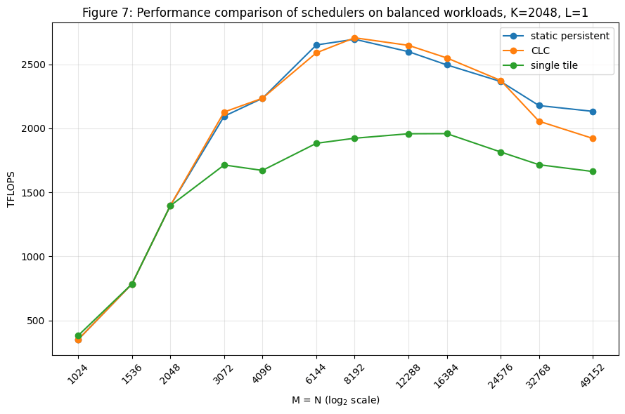

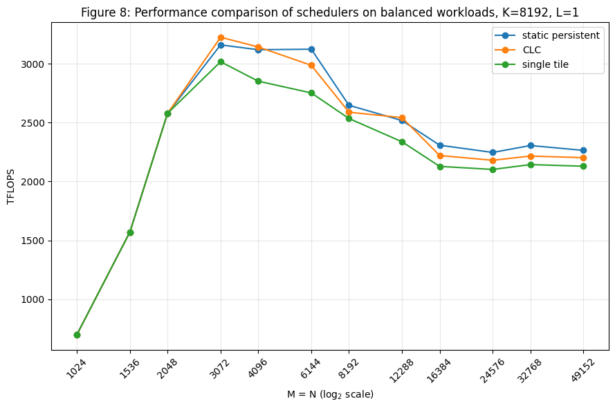

持久化调度器优于单 tile 调度的表现并不意外，因为它们能够把 epilogue 与 MMA mainloop 重叠。当 K 较小时，epilogue 在每个 work tile 运行时间中所占的比例相对更大；而当 K 较大时，epilogue 所占的运行时间比例要小得多，因此单 tile 调度在没有 epilogue 重叠的情况下，相对损失的效率反而更少。对于较小的问题形状，各调度器之间几乎没有差别，因为此时还不到一整波（wave）的 cluster。

然而，观察到的 CLC 与静态持久化之间的性能差异则显得更加扑朔迷离，尽管总体上 CLC 在较大的工作负载下似乎表现更差。为了更深入地理解，我们可以对比它们各自的 tensor pipe 吞吐图，这些图由 Nsight Compute 的 PM 采样得到。回顾一下，这类图给出的是吞吐随时间的时间线视图，其中 x 轴是经过的时间，y 轴是利用率百分比。对于问题形状 (16384, 16384, 2048)，CLC 的情况如下：

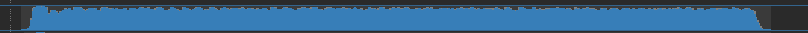

而静态持久化的情况如下：


第二张图中看到的 tensor pipe 使用率逐渐下降，说明有些 SM 比其他 SM 更早完成，并在 kernel 末尾变得空闲，因此与静态持久化相比，CLC 能够更好地利用整块 GPU。

另一方面，对于 (32768, 32768, 2048)，CLC 的 tensor pipe 吞吐看起来是这样的：

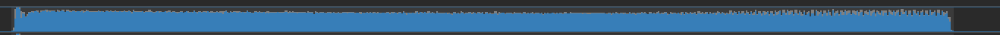

而静态持久化的情况如下：

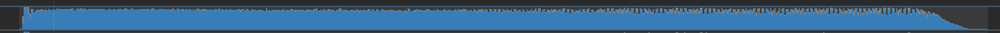

所以在这种情况下，不知为何，静态调度器的下降反而没那么严重，而 CLC 的 tensor pipe 吞吐则看起来持续偏低。有一个指标与这一观察（针对 (32768, 32768, 2048)）相关联：NCU 报告 CLC 的 L2 命中率仅为 35%，而静态持久化为 52%。造成这一差异的原因尚不清楚。注意，两个 kernel 都没有做 work tile swizzling，而对于问题形状 (16384, 16384, 2048)，NCU 显示两个 kernel 的 L2 命中率都在约 60%。

上述实验表明，即使对于均衡的工作负载，出于调优目的也应当同时保留静态调度和 CLC 两种方案。我们还要指出，这些示例 kernel 并不包含 work tile swizzling、blockscaling 或非平凡的 epilogue 等特性，而这些特性可能会改变对比分析的结论。

鉴于 CLC 的 tensor pipe 吞吐没有在 kernel 尾部随时间逐渐下降，我们还统计了每个 SM 所计算的 tile 数量。使用静态持久化调度器时，各 SM 计算的 tile 数量至多相差 1；但我们观察到，使用 CLC 时并非如此。例如，对于问题形状 (M, N, K) 为 (16384, 16384, 2048) 的情况，各 SM 处理了 54 到 59 个 tile，其频次（因为我们做的是 2CTA MMA，所以以 SM 对为单位）如下面的直方图所示：

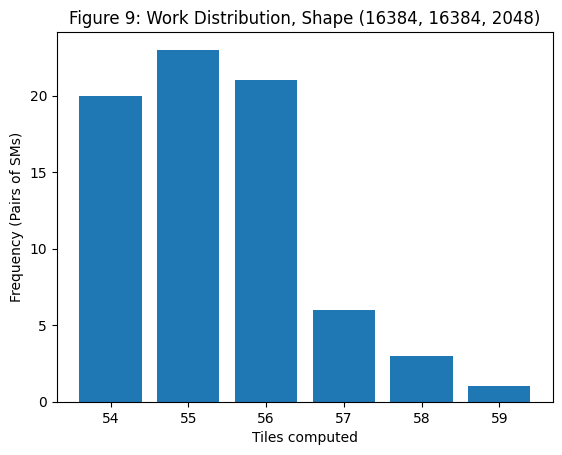

对于问题形状 (32768, 32768, 2048)，所计算 tile 数量的直方图则如下所示：

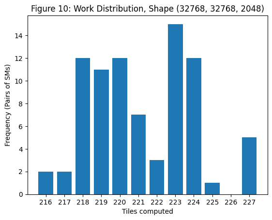

上面的直方图表明，出于某些原因（也许是硬件层面的，也许是其他原因），某些 SM 最终可能比其他 SM 多计算多达 5% 的 tile。因此，强制所有 SM 计算（几乎）完全相同数量的 tile，即便是均衡的，也可能略微欠优。

关于 attention（而非 GEMM）场景下的另一个工作分布直方图示例，我们请读者参阅这个[给 FlashAttention-4 添加 CLC 的 PR](https://github.com/Dao-AILab/flash-attention/pull/2218)。

### 结论

在本文中，我们探讨了 CLC——Blackwell GPU 上引入的、由硬件支持的动态持久化调度实现。CLC 兼具单 tile 调度和静态持久化调度这两种更传统范式的优点。我们考察了 CLC 所需的底层 PTX 指令 `try_cancel` 和 `query_cancel`，然后以示例 `dense_gemm_persistent_dynamic.py` 为例，逐行讲解了一个 CuTeDSL 实现——其中每个 cluster 用单个 scheduler warp 去尝试窃取 work tile，并用一个 CLC pipeline 将结果传达给其他 warp。对于不均衡的工作负载，CLC 明显比静态持久化更高效；但我们也探讨了：即便对于均衡的工作负载，CLC 与静态持久化调度之间仍然存在细微差别，二者似乎都算不上明显的赢家。
