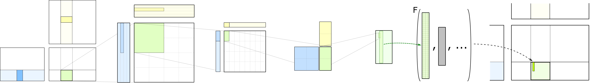
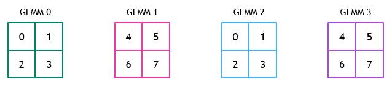
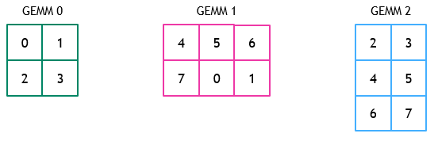
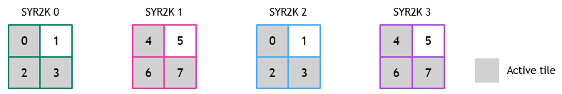
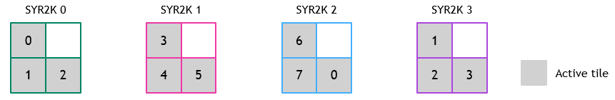
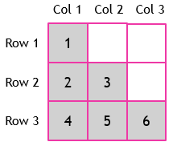
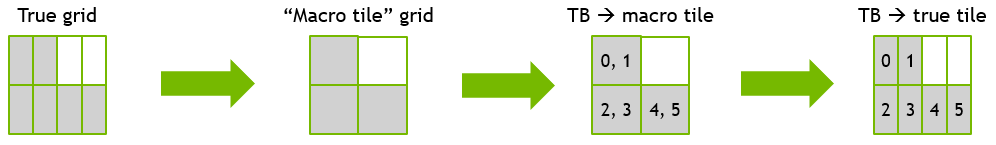

# 分组 Kernel 调度器（Grouped Kernel Schedulers）

> 来源：<https://docs.nvidia.com/cutlass/latest/media/docs/cpp/grouped_scheduler.html>



CUTLASS 的分组 kernel（grouped kernel）是一种持久化 kernel，它在单次 CUDA kernel 启动中同时执行多个问题（例如多个 GEMM、SYR2K）。

与 CUTLASS 中传统的 GEMM 不同——传统 GEMM 启动的 threadblock 数量等于该 GEMM 中的 tile 数量——CUTLASS 分组 kernel 通常启动的 threadblock 数量少于组内所有问题的 tile 总数。随后，每个 threadblock 负责计算该组内多个问题中的一个或多个 tile。分组 kernel 的**调度器（scheduler）**（在代码中称为 **problem visitor**）负责给每个 threadblock 分配它在组内要计算的 tile 序列。

本文档介绍分组 kernel 调度器的功能背景，并描述针对分组 kernel 调度器的各种优化。

**大纲**

* [分组 Kernel 调度器简介](#分组-kernel-调度器简介)
* [分组 GEMM 调度器](#分组-gemm-调度器)
* [分组 Rank2K 调度器](#分组-rank2k-调度器)
* [调度器模式](#调度器模式)
* [通过排序问题改善负载均衡](#通过排序问题改善负载均衡)

## 分组 Kernel 调度器简介

给定一组问题规模和一个 threadblock 网格，调度器的任务是把组内各问题的 tile 分配给 threadblock。分组 kernel 中的 threadblock 会持久地循环执行：向调度器查询下一个要计算的 tile，并为该 tile 执行 kernel 级别的操作（例如 MMA 和 epilogue）。用伪代码表示如下：

```cpp
ProblemVisitor problem_visitor;

while (problem_visitor.next_tile()) {
    //
    // 从调度器获取下一个 tile 的索引
    //

    //
    // 计算 MMA 和 epilogue
    //

    // 通知调度器当前 tile 已处理完毕
    problem_visitor.advance(gridDim.x);
}
```

分组 kernel 调度器的核心功能在于 `next_tile()` 方法，它决定调用它的 threadblock 接下来应计算组内的哪个 tile（如果还有的话）。

## 分组 GEMM 调度器

分组 GEMM 使用的调度器以轮询（round-robin）方式把组内的 tile 分配给 threadblock。

举个例子，考虑一个由四个 GEMM 组成的组，每个 GEMM 都是 2x2 的 tile 网格。假设启动了 8 个 threadblock。下图展示了组内每个 GEMM 中每个 tile 所分配到的 threadblock ID。



对于 tile 数量不相同的问题，类似的映射如下所示：



### 为给定 block 计算调度

分组 GEMM 中的每个 threadblock 都通过调用上面描述的 `next_tile()` 方法来计算自己的调度。

为此，threadblock 的 `ProblemVisitor` 维护一个 `thread_idx` 成员，它被初始化为 `blockIdx.x`，并在每计算一个 tile 后递增 `gridDim.x`（分组 kernel 的启动配置中只使用 x 维度）。调度器随后必须弄清 `tile_idx` 属于组内哪个 GEMM，以及它对应该问题内的哪个 tile。

1. **确定 `tile_idx` 映射到哪个 GEMM：** 调度器从最近访问过的 GEMM 开始遍历各个 GEMM，把每个 GEMM 内的 tile 数量累加到一个运行变量 `problem_tile_start` 上，以此确定 `tile_idx` 属于哪个 GEMM。当满足 `problem_tile_start <= tile_idx < problem_tile_start + tiles_in_problem` 时，调度器就找到了该 tile 所属的正确问题。
2. **确定 `tile_idx` 映射到 GEMM 内的哪个 tile：** 一旦定位到 `tile_idx` 所映射的 GEMM，本 block 应计算的该 GEMM 内的具体 tile 就由 `tile_idx - problem_tile_start` 给出。随后执行简单的光栅化（rasterization），把这个一维 tile ID 映射到该 GEMM 中要计算的 tile 的二维坐标。

关于如何加速这一搜索过程，我们在 [调度器模式](#调度器模式) 中说明。

## 分组 Rank2K 调度器

上一节描述了分组 GEMM kernel 所用调度器的工作方式。虽然该调度器足以正确实现分组 Rank2K 操作（即 SYR2K 和 HER2K），但它会带来显著的低效。

接下来我们描述这些低效之处，以及 CUTLASS 分组 Rank2K 调度器如何克服它们。

### 分组 GEMM 调度器用于分组 Rank2K 问题时的低效

分组 GEMM 调度器假设组内每个 GEMM 的每个 tile 最终都会影响问题的输出。但对于 Rank2K 问题而言并非如此——其矩阵 C 是上三角或下三角的。因此，对这类问题使用默认的分组 GEMM 调度器，会导致 threadblock 频繁被分配到会提前退出的 tile（例如被分配到一个下三角问题的上三角部分的 tile）。这进一步导致 threadblock 之间的负载不均衡，因为分组 GEMM 调度器给所有 threadblock 分配的 tile 数量几乎相同，而不管其中真正有效的 tile 有多少。

考虑一个由四个 SYR2K 问题组成的组的例子，每个问题的矩阵 C 都是 2x2 的 tile 网格。每个问题的矩阵 C 都是下三角的，用阴影 tile 表示。假设启动 8 个 threadblock 来计算这个分组问题。默认的分组 GEMM 调度器会按以下顺序把 threadblock 分配给 tile：



在这种情况下，threadblock 1 和 5 会持续被分配到无效 tile。在组内问题规模各异的场景中，我们观察到这仍然会导致显著的负载不均衡。

### 针对三角形问题特化调度器

我们希望设计一种调度器，能够为使用三角形输出矩阵的 kernel 更高效地把 threadblock 映射到有效 tile。理想情况下，该调度器应只把 threadblock 分配到下三角问题的下三角部分内的那些 tile（上三角问题反之亦然）。

沿用上面的例子，这样一个调度器给出的 threadblock 到 tile 的分配结果可能是：



要实现这种调度，需要把 threadblock ID 映射到 tile 坐标 `(i, j)`。

我们用一个 3x3 网格的下三角矩阵来说明。我们先在假设行、tile 和 threadblock ID 都是从 1 开始编号（one-indexed）的前提下计算行、列索引，然后减 1 转换为从 0 开始编号（zero-indexed）的版本。我们的推导很大程度上借鉴了 [这里](https://stackoverflow.com/a/40954159) 描述的映射方法。



#### 给定 threadblock ID `t` 计算行 `i`

对于给定的行 i，该行中所有的 threadblock ID t 都满足：

```
t <= 1 + 2 + 3 + ... + (i-1) + i
```

右侧的闭式表达式为 `i(i+1)/2`。据此，我们可以由 `t` 解出 `i`：

```
t  <= i(i+1)/2
2t <= i^2 + i
2t <= i^2 + i + 0.25 - 0.25
2t + 0.25 <= i^2 + i + 0.25
2t + 0.25 <= (i + 0.5)^2
sqrt(2t + 0.25) - 0.5 <= i
```

为处理小数值，我们令：

```
i = ceil(sqrt(2t + 0.25) - 0.5)
```

为把它转换为从 0 开始编号的行，并配合从 0 开始编号的 `t`，我们执行：

```
i = ceil(sqrt(2(t+1) + 0.25) - 0.5) - 1
  = ceil(sqrt(2t + 2.25) - 0.5) - 1
```

#### 给定 threadblock ID `t` 和行 `i` 计算列 `j`

对于给定的行 `i`，该行中所有的 threadblock ID `t` 还满足：

```
    t > 1 + 2 + 3 + ... + (i-2) + (i-1)
--> t > i(i-1)/2
```

同一行内的 threadblock ID 是连续的，因此，对于从 1 开始编号的 threadblock ID `t` 和行 `i`，从 1 开始编号的列 ID 为：

```
j = t - (i(i-1)/2)
```

从 0 开始编号的版本变为：

```
j = (t+1) - (i(i+1)/2) -1
  = t - (i(i+1)/2)
```

#### 处理非正方形网格

尽管 Rank2K 问题整体的输出问题规模一定是正方形的，但由于使用了非正方形的 threadblock 形状，计算时所用的网格可能不是正方形。例如，用 64x32 的 threadblock 形状处理输出规模为 128x128 的问题，会得到 2x4 的 tile 网格。

处理这种情况的方法是：注意到输出可以看作由 2x2 个「宏 tile（macro tile）」组成的正方形网格，每个宏 tile 内含 2 个「真实 tile（true tile）」。因此，我们可以先用上面的公式把 threadblock ID 映射到它的「宏 tile」，再把它映射到其「宏 tile」内的「真实 tile」。在 2x4 网格的例子中，这种映射如下所示：



从 0 开始编号的 threadblock ID `t` 按如下方式映射到其「宏 tile ID」`t_macro`：

```
t_macro = t // r
```

其中 `r` 是网格最大维度与最小维度之比（即上例中 `r = 4 / 2 = 2`）。

用 `t_macro` 和上面的计算方法找出正方形矩阵中的行和列，得到 `i_macro` 和 `j_macro`（从 0 开始编号）。从 `(i_macro, j_macro) --> (i, j)` 的映射就是：

```
if (ThreadblockShape::M > ThreadblockShape::N):
    r = ThreadblockShape::M / ThreadblockShape::N
    i = i_macro
    j = (j_macro * r) + (t % r)
elif (ThreadblockShape::M < ThreadblockShape::N):
    r = ThreadblockShape::N / ThreadblockShape::M
    i = (i_macro * r) + (t % r)
    j = j_macro
else:
    i = i_macro
    j = j_macro
```

#### 处理网格维度之间不成整数倍的情况

尽管 threadblock 形状的 M 和 N 通常互为整数倍，但某个问题的网格维度之比可能与 threadblock 的维度之比不同。例如，用 64x32 的 threadblock 形状处理规模为 132x132 的问题，会得到 3x5 的 tile 网格。此时，每个「宏 tile」内的「真实 tile」数量不是整数。

出现这种情况时，我们只需对网格较大的维度进行填充（pad），使每个「宏 tile」内含整数个「真实 tile」。因此，上例中的 3x5 网格会被当作 3x6 网格处理。每个 tile 的行、列位置按上面的方法计算。任何映射到超出问题范围或上/下三角部分之外 tile（例如 (2, 5)）的 threadblock，将从该问题中提前退出，并可继续处理组内的下一个问题。

#### 处理上三角矩阵

对于上三角矩阵，唯一需要的修改是在上面的计算中交换 `i_macro` 和 `j_macro`。

## 调度器模式

分组 kernel 调度器提供两种不同的模式来为一个 block 寻找下一个要计算的 tile。这些技术由 [`cutlass::gemm::kernel::GroupScheduleMode`](https://github.com/NVIDIA/cutlass/tree/main/include/cutlass/gemm/kernel/grouped_problem_visitor.h) 枚举控制。下面我们更详细地描述每种模式。

### `GroupScheduleMode::kDeviceOnly`（默认）

该调度器模式在设备端（device）完成所有调度工作。它通过让每个线程「拥有」一个不同的问题、并判断 `tile_idx` 是否落在该问题的范围内，从而并行化对 `tile_idx` 所映射问题的搜索。

`GroupScheduleMode::kDeviceOnly` 以 warp 为单位（warp-wide）执行这种并行化。warp 中的每个线程加载由其 lane id 索引的一个问题规模，并计算该问题的 tile 数量。使用一次 warp 范围的前缀和（prefix sum）来找出该 warp 正在处理的那组问题的起始 tile。前缀和结束后，每个线程都持有组内一个唯一问题的起始 tile 索引和 tile 计数。

只要 `tile_idx` 仍落在该 warp 当前所持问题的范围内，每个线程就检查 `tile_idx` 是否落在自己当前问题的范围内。随后，匹配到的问题索引及其起始 tile 会被广播给 warp 中的所有线程。

### 在主机端预计算调度：`GroupScheduleMode::kHostPrecompute`

该调度器试图通过在主机端（host）预先计算每个 block 将要访问的问题序列，来减少在设备端执行的调度工作量。如上所述，要把 `tile_idx` 映射到某个问题内要计算的具体 tile，所需的只是问题 ID 以及该问题的起始 tile（在组内所有 tile 中的位置）。因此，该调度器为每个 block 计算的每个 tile 预先计算其问题索引和问题起始 tile。

单个 block 的调度被表示为一个由 `(problem_idx, problem_starting_tile)` 元组组成的数组，每个 block 对应一个这样的数组。这些数组在主机端生成，然后拷贝到设备端。这种表示针对「每个 block 在每个问题上最多计算一个 tile」的情况做了优化。当某个 block 在组内某个问题上计算多个 tile 时，上述表示会产生重复条目，因而不是最优的（例如，对于在起始 tile 索引为 20 的问题 3 上计算两个 tile 的 block，会得到 `[(3, 20), (3, 20)]`）。我们选择采用上述表示，是因为分组 kernel 本身通常在问题规模较小时最有益，因此每个 block 在每个问题上最多计算一个 tile。

### 我应该使用哪种调度器模式？

在决定使用哪种调度模式时，考虑以下问题：

#### 在我的应用中，作为分组 kernel 输入的参数（例如 ptrA、lda）是如何设置的？

如果这些参数是由设备上运行的前一个 kernel 设置的（而不是由主机设置），你很可能想用 `kDeviceOnly`，因为这样可以尽量减少额外的主机-设备通信。

#### 在我的应用中，主机端工作能否与其他设备 kernel 重叠？

例如，如果分组 GEMM 被用作神经网络的第 N 层，那么分组 GEMM 的主机端预计算有可能与第 N-1 层的设备端工作重叠。这种情况下 `kHostPrecompute` 很可能很合适。

#### 我的组内问题的计算密集程度如何？

`kHostPrecompute` 与 `kDeviceOnly` 之间的性能差异，在计算密集度较低的分组 kernel 上最为明显——此时调度所花的时间占分组 kernel 运行时间的相当大一部分。直观上，随着组内问题的计算密集度下降，MMA 操作所消耗的运行时间占比会变小，从而调度逻辑所消耗的运行时间占比变大。

由于调度模式只影响分组 kernel 的调度逻辑，因此可以预期 `kHostPrecompute` 对计算密集度较低的组带来的收益最大。

## 通过排序问题改善负载均衡

分组 kernel 调度器给参与分组 kernel 的每个 block 分配几乎相等数量的 tile。组内每个 tile 都有相同的 M 和 N 维度。然而，每个 tile 的 K 维度取决于其所属问题的 K 维度，因此不同 tile 可能有不同的 K 维度。于是，tile 的 K 维度在决定计算一个给定 tile 需要多长时间方面起着重要作用。

### K 维度不均衡带来的潜在问题

为确保计算负载在各个 block 之间均衡分配，重要的是让每个 block 所计算的所有 tile 的 K 维度之和与其他 block 相近；如果某个 block 计算的大 K 值 tile 远多于其他 block，它可能比其他 block 花更长时间。

例如，考虑以下这组 GEMM：

```
0 1152x768x128
1 1152x768x1024
2 768x1152x128
3 768x1152x1024
```

如果使用 128x128 的 tile 尺寸，那么每个问题都会有 54 个 tile。因此，整个组共有 216 个 tile。

假设这个分组 GEMM 运行在拥有 108 个 SM 的 GA100 上。假设在该分组 GEMM 参数下的占用率（occupancy）为 1——一个 SM 上同一时刻只能有一个 threadblock 活跃。因此，分组 GEMM 将以 108 个持久化 threadblock 运行，每个 threadblock 计算 (256 / 108) = 2 个 tile。

在分组 GEMM 调度器采用的 tile 到 threadblock 的轮询分配下，本 GEMM 中 tile 到 threadblock 的分配如下：

```
Threadblock 0-53:     来自问题 0 的 128x128x128  尺寸 tile
Threadblock 54-107:   来自问题 1 的 128x128x1024 尺寸 tile
Threadblock 0-53:     来自问题 2 的 128x128x128  尺寸 tile
Threadblock 54-107:   来自问题 3 的 128x128x1024 尺寸 tile
```

按此分配，threadblock 54-107 所做的工作远多于 threadblock 0-53，因为它们计算的是两个 K 维度为 1024 的 tile，而 threadblock 0-53 计算的是两个 K 维度仅为 128 的 tile。

由于这种不均衡的分配，threadblock 54-107 的运行时间将显著长于 threadblock 0-53，使得 threadblock 0-53 在很大一部分时间里处于空闲状态。

显然，对本例更好的 tile 到 threadblock 分配方式应当是：让所有 threadblock 都计算一个 K 维度为 1024 的 tile 和一个 K 维度为 128 的 tile。这样能更好地均衡各 threadblock 之间的工作负载。

### 通过排序问题来减少不均衡的可能性

减少负载不均衡的一个简单方法，是按 K 维度降序对组内的问题进行排序。这有助于改善负载均衡，因为组内的 tile 是按顺序以轮询方式分配给各 block 的，于是每个 block 接下来总会被分配到当前可用的 K 维度最大的 tile。

对于上面描述的例子，在执行分组 GEMM 之前先对问题规模排序，可以让该分组 GEMM 在 GA100 上、在两种调度模式下的运行时间各改善约 30%。

为便于以这种方式对组及其相关元数据进行排序，设备级（device-level）分组 kernel 提供了 `sort_problems()` 方法。其使用示例可参见 [分组 GEMM 示例](https://github.com/NVIDIA/cutlass/tree/main/examples/24_gemm_grouped/gemm_grouped.cu)。

最后，尽管排序问题在某些场景下会有帮助，但并不保证一定能提升性能。在某些情况下，由于影响 GEMM 性能的其他相互冲突的因素，排序问题反而可能使性能下降。我们建议对你的分组 kernel 分别在排序和不排序两种情况下做性能剖析（profiling），看看它在你的场景中是否有帮助。

## 版权（Copyright）

Copyright (c) 2017 - 2026 NVIDIA CORPORATION & AFFILIATES. All rights reserved.
SPDX-License-Identifier: BSD-3-Clause
