# TurboQuant：具有近最优 distortion rate 的在线向量量化

Amir Zandieh

Google Research

zandieh@google.com

Majid Daliri

纽约大学

daliri.majid@nyu.edu

Majid Hadian

Google DeepMind

majidh@google.com

Vahab Mirrokni

Google Research

mirrokni@google.com

# 摘要

VQ 是一个植根于 Shannon source coding 理论的问题，其目标是在最小化高维欧氏向量几何结构失真的同时对其进行量化。我们提出 TurboQuant，同时解决 MSE 和内积失真问题，克服了现有方法无法达到最优 distortion rate 的局限性。我们的 data-oblivious 算法适用于在线应用场景，在所有 bit-width 和维度下均能达到近最优 distortion rate（仅差一个小常数因子）。TurboQuant 通过 random rotation 输入向量，在各坐标上诱导出集中的 Beta distribution，并利用高维空间中不同坐标的近独立性，对每个坐标独立应用最优 scalar quantizer。认识到 MSE 最优 quantizer 会在内积估计中引入偏差，我们提出了一种 two-stage 方法：先应用 MSE quantizer，再对 residual 应用 1-bit Quantized JL（QJL）变换，从而得到无偏的内积 quantizer。我们还提供了任意向量 quantizer 所能达到的最优 distortion rate 的 information-theoretic lower bound 的形式化证明，表明 TurboQuant 与这些下界非常接近，仅相差一个小常数（≈ 2.7）因子。实验结果验证了我们的理论发现：在 KV cache quantization 中，以每通道 3.5 bit 实现绝对质量中立，以每通道 2.5 bit 实现边际质量损失。此外，在 nearest neighbor search 任务中，我们的方法在 recall 上优于现有 Product Quantization (PQ) 技术，同时将 indexing time 降低至几乎为零。

# 1 引言

欧氏空间中的 VQ 对于在众多计算领域高效处理高维向量至关重要，涵盖从训练和部署大规模 AI 与深度学习模型，到为搜索/检索系统提供支持的 vector databases。其核心目标是通过量化来压缩高维向量——将浮点坐标值转换为低 bit-width 整数——同时最小化失真，失真通过 MSE 或内积误差等指标来衡量。通过保留这些属性，可以快速响应内积查询，具有最小延迟，并减少计算和通信资源消耗。

该问题的根源可追溯到 Shannon 关于 source coding 理论的奠基性工作 [48, 49]，该工作确立了 block source codes（即向量 quantizer）所能达到的最小失真由 Shannon distortion-rate function 定义，该函数由信源的统计特性和所选 distortion measure（如 MSE）决定。如今，VQ 在 AI、深度学习和搜索系统等基础计算领域发挥着关键作用。

VQ 的一个关键应用是 AI 模型的部署，包括 LLM [5, 18, 7, 52]。由于 LLM 的能力在很大程度上依赖于其模型规模和 context length [34]，服务这些模型需要大量内存并增加 inference latency。这种延迟主要归因于 accelerator 上 HBM 与 SRAM 之间，或 distributed clusters 之间的 communication bottlenecks。通过压缩或量化模型 weights 和 activations，我们可以有效缓解这些瓶颈，从而显著降低 inference costs。activations 与 weights 之间的内积运算是深度学习模型的核心。因此，模型量化方案致力于在准确保留内积的同时压缩 weights 和/或 activation vectors。

基于解码器的 Transformer 模型 [54] 提供了另一个引人注目的应用场景。这些模型必须在 KV cache 中存储先前生成 token 的 key/value (KV) embeddings，其大小随模型规模（层数和 attention heads 数）和 context length 线性增长。这种扩展在内存使用和计算速度方面是一个重大瓶颈，尤其对于 long-context 模型。因此，在不损害精度的情况下减小 KV cache 大小至关重要。在此背景下，保留这些 embedding vectors 的欧氏结构——其内积和距离——对于维持模型性能至关重要。VQ 是解决这一挑战的最合适框架，提供了一种在保留高维 embeddings 本质几何属性的同时对其进行压缩的鲁棒方法。

此外，高维空间中基于内积或余弦相似度的 nearest neighbor (NN) search [1, 27] 是 vector databases [4, 2, 3] 的基石。这些数据库是 retrieval-augmented generation [23, 19] 和 information retrieval [35, 46] 的基础。VQ（又称 Product Quantization，PQ）在这些应用中发挥着关键作用。它能够高效压缩 database vectors，优化内存使用，并以低延迟、高精度估计与 query vector 的内积，从而实现快速精准的 nearest neighbor search。

现有 VQ 算法存在一个权衡：要么缺乏 accelerator（vectorization）兼容性且计算缓慢，不适合 KV cache quantization 等实时 AI 应用；要么相对于 bit-width 的失真界不够优化。我们的目标是引入一种解决这些局限性的算法。具体而言，我们设计了 TurboQuant：一种轻量级、能够在线应用（对 KV cache quantization 等场景至关重要）且对 accelerator 高度友好的算法——这是现代 AI 工作负载的关键属性。

TurboQuant 的核心是一个 two-stage 过程。首先，我们开发一个在 MSE 方面具有最优 distortion rate 的向量 quantizer。随后，我们对 residual 应用 1-bit quantizer，从而得到无偏且低失真的内积 quantizer。我们证明了针对 MSE 优化的 quantizer 不能为内积提供无偏估计，而我们的 two-stage 解决方案有效弥补了这一差距。我们的 MSE 最优 quantizer 首先对 $d$ 维输入向量进行 random rotation。观察到 rotated vector 的每个坐标服从 Beta distribution 这一关键事实，我们通过求解 continuous k-means 问题为每个坐标设计最优 Lloyd-Max quantizer [42, 43]。该方法给出最优 MSE distortion bound 并最小化 residual 的 L2 范数。为了获得内积的无偏低失真 quantizer，我们将 quantizer 与最近提出的 Quantized Johnson-Lindenstrauss（QJL）变换 [62] 组合，后者将 residual vector 的每个坐标量化为单个 bit。我们的算法为 MSE 和内积提供了可证明的最优 distortion bounds，在 bit-width 依赖性方面相比现有方法实现了指数级改进。

## 1.1 问题定义

形式上，我们的目标是设计一个 quantization map $Q : \mathbb{R}^d \to \{0,1\}^B$，将 $d$ 维向量转换为 $B$ bit 的二进制串。若设 $B = b \cdot d$（$b \geq 0$），该 quantizer 的 bit-width 为 $b$，表示用于编码 $\mathbb{R}^d$ 中每个实值坐标的平均 bit 数。关键地，我们需要一个逆映射 $Q^{-1} : \{0,1\}^B \to \mathbb{R}^d$ 执行 dequantization，从 quantized representation 中近似重建原始向量。当然，由于 $Q$ 不是 bijection，这种变换本质上是有损的。因此，我们的主要目标是最小化失真，特别关注 MSE 和内积失真。

我们对输入向量数据集不做任何假设，考虑 worst-case 场景。我们允许 quantizer $Q(\cdot)$ 是随机化的，从而产生随机输出。考虑 randomized quantizer 时，更适合定义 quantizer 输出随机性上的 expected distortion。因此，我们旨在设计 quantizer，对于任意期望的 bit-width $b$，最小化任意（worst-case）向量 $\boldsymbol{x}, \boldsymbol{y} \in \mathbb{R}^d$ 的以下期望 distortion measures：

$$
(\mathbf{MSE}) \quad D_{\mathrm{mse}} := \underset{Q}{\mathbb{E}} \left[ \left\| \boldsymbol{x} - Q^{-1}(Q(\boldsymbol{x})) \right\|_2^2 \right] \tag{1}
$$

$$
(\text{内积误差}) \quad D_{\mathrm{prod}} := \underset{Q}{\mathbb{E}} \left[ \left| \langle \boldsymbol{y}, \boldsymbol{x} \rangle - \langle \boldsymbol{y}, Q^{-1}(Q(\boldsymbol{x})) \rangle \right|^2 \right] \tag{2}
$$

上述期望是关于 quantizer $Q(\cdot)$ 的随机性取的。此外，对于内积 quantizer，我们要求内积估计的 unbiasedness，这对众多应用来说是一个理想属性。更精确地，我们要求：

$
(\mathbf{unbiased\ inner\ product}) \quad \underset{Q}{\mathbb{E}} \left[ \langle \boldsymbol{y}, Q^{-1}(Q(\boldsymbol{x})) \rangle \right] = \langle \boldsymbol{y}, \boldsymbol{x} \rangle
$

我们旨在设计计算高效的 quantizer $Q_{\mathrm{mse}}$ 和 $Q_{\mathrm{prod}}$，对于任意给定的 bit-width $b$，达到上述 distortion measures 的最优界。此外，我们希望 $Q_{\mathrm{prod}}$ 提供无偏的内积估计。特别地，假设给定 $n$ 个实值向量 $x_1, x_2, \ldots, x_n \in \mathbb{R}^d$，我们设计以下 primitives：

- **Quant**：高效量化数据集并计算 $Q(\boldsymbol{x}_1), Q(\boldsymbol{x}_2), \ldots, Q(\boldsymbol{x}_n)$。
- **DeQuant**：给定 quantized dataset，能够高效重建原始向量，对任意 $i \in [n]$ 计算 $Q^{-1}(Q(\boldsymbol{x}_i))$。

## 1.2 相关工作

**VQ 的起源。** VQ 理论始于 Shannon 关于可达 distortion-rate function 的奠基性工作 [48, 49]。1963 年，Zador [61] 通过采用高分辨率方法推导出固定码率量化在高码率下的极限操作 distortion-rate function，取得了重大进展，该函数与 Shannon distortion-rate function 非常接近。然而，Zador 并未专门考虑可实现的算法。Gersho 的影响力论文 [25] 通过推广高分辨率理论、简化 Zador 的结果、引入格 VQ 并提出塑造该领域的关键猜想，进一步推进了 VQ 研究。尽管取得了这些理论进展，VQ 的实际适用性在早期仍不明朗。最直接的编码方法——暴力 nearest neighbor search——计算代价高昂，阻碍了 VQ 在实践中的应用。

**在线与离线量化。** 在线（data-oblivious）量化方法无需数据特定调优或 calibration 即可立即应用 [16, 8, 41, 47, 28]。相比之下，离线（data-dependent）方法需要大量预处理和学习来使 quantization map 适应数据，不适合动态数据场景 [37]。例如，[20, 39, 57, 13] 等方法使用二阶（Hessian）信息来调整 quantization map，这需要大量预处理，有时甚至需要后处理。

**在线 KV cache 压缩。** 已提出多种方法来压缩 KV cache。这些方法包括架构修改 [50, 6, 15]，通过重构 Transformer 来最小化存储的 key-value 对数量。此外，剪枝或驱逐冗余或不太关键的 token 也是另一种方法 [11, 66, 40, 58, 64, 38, 29]。

减小 KV cache 大小的一种简单而有效的方法是量化 KV cache。已专门为此目的开发了多种量化技术 [60, 59, 17, 33, 65, 41, 30, 36, 28]。最近，一种名为 QJL [62] 的新量化方法引入了一种基于 sketching 技术的高效、data-oblivious 的 1-bit 量化方法，为内积查询提供无偏估计。该方法不需要对输入数据进行调优或适应，我们在针对内积失真优化的 quantizer 中使用了这一技术。

**Product Quantization（PQ）。** 在欧氏数据集的 nearest neighbor (NN) search 问题中，索引大小构成了显著的内存瓶颈，通常通过量化技术来缓解，在 NN 文献中通常称为 Product Quantization（PQ）。这些算法中的许多依赖于在索引阶段使用 k-means 变体构建量化 codebook [31, 9, 24, 56, 27]。因此，这些方法由于需要大量预处理而不适合在线设置。

最近，[22] 中引入了一种基于网格的 PQ 方法，消除了预处理的需求。该方法通过将均匀网格投影到单位球面上并进行搜索来识别最近的投影点。尽管该论文的理论保证不够优化（可能由于分析较松——实际性能超过理论界），但网格投影和二分搜索算法在计算上也较慢，特别是在 GPU 等 accelerator 上效率低下，因为其算法固有地缺乏向量化，无法进行并行处理。

## 1.3 技术与贡献概述

**MSE 优化的 TurboQuant。** 我们的第一个 VQ 算法旨在最小化公式 (1) 中定义的 MSE 失真。为此，我们对输入向量应用 random rotation，从而在每个坐标上诱导出 Beta distribution，与输入向量本身无关。在高维 $d$ 中，由于测度集中和中心极限定理，每个坐标的分布收敛到高斯分布 $\mathcal{N}(1, 1/d)$。此外，任意两个不同坐标变得几乎不相关，更重要的是，几乎独立（这是一个超越仅仅相关性的更深层结果）。这种近独立性是简化我们量化设计的关键方面。它允许我们使用最优 scalar quantizer 对每个坐标独立量化，忽略不同坐标之间的交互或相关性，同时仍能达到近最优失真。

我们通过使用 Lloyd-Max 算法求解连续一维 k-means 问题，为具有 Beta distribution 的随机变量找到最优 scalar quantizer。我们预计算并存储一系列实际有用 bit-width 的最优 codebook，以便后续高效调用 TurboQuant 算法。

在定理 1 中，我们证明了 $b$-bit MSE 优化的 TurboQuant $Q_{\mathtt{mse}} : \mathbb{R}^d \to \{0,1\}^{b \cdot d}$ 对任意 worst-case 向量 $\boldsymbol{x} \in \mathbb{R}^d$（$\|\boldsymbol{x}\| = 1$）达到以下失真：

- $D_{\mathtt{mse}}(Q_{\mathtt{mse}}) := \mathbb{E}\left[\left\|x - Q_{\mathtt{mse}}^{-1}(Q_{\mathtt{mse}}(x))\right\|_2^2\right] \leq \frac{\sqrt{3}\pi}{2} \cdot \frac{1}{4^b}$，对任意 $b \geq 0$。
- 对于小 bit-width，上述失真上界可以进一步细化。具体而言，对于 $b = 1, 2, 3, 4$，有 $D_{\mathtt{mse}}(Q_{\mathtt{mse}}) \approx \mathbf{0.36, 0.117, 0.03, 0.009}$，分别对应。

注意，单位范数假设 $\|\boldsymbol{x}\|_2 = 1$ 是标准且无限制性的。对于不满足此假设的数据集，我们可以以浮点精度计算并存储 L2 范数，然后使用这些存储的范数对 dequantized 点进行重新缩放。

**内积优化的 TurboQuant。** 我们证明了 MSE 优化的 quantizer 对内积估计是有偏的，因此需要不同的 VQ 方案来获得无偏的内积 quantizer。我们的解决方案是一个 two-stage 算法：首先应用上述 $Q_{\mathrm{mse}}$（比目标预算少一个 bit-width），然后对 residual error 应用 QJL [62]。这被证明是无偏的，且具有近最优的内积误差率。

在定理 2 中，我们证明了 $b$-bit 内积优化的 TurboQuant $Q_{\mathrm{prod}} : \mathbb{R}^d \to \{0,1\}^{b \cdot d}$ 对任意 worst-case 向量 $\boldsymbol{x}, \boldsymbol{y} \in \mathbb{R}^d$（$\|\boldsymbol{x}\| = 1$）达到以下失真：

- $\mathbb{E}\left[\langle \boldsymbol{y}, Q_{\mathrm{prod}}^{-1}(Q_{\mathrm{prod}}(\boldsymbol{x})) \rangle\right] = \langle \boldsymbol{y}, \boldsymbol{x} \rangle$（unbiasedness）
- $D_{\mathtt{prod}}(Q_{\mathtt{prod}}) := \mathbb{E}\left[|\langle \boldsymbol{y}, \boldsymbol{x} \rangle - \langle \boldsymbol{y}, Q_{\mathrm{prod}}^{-1}(Q_{\mathrm{prod}}(\boldsymbol{x})) \rangle|^2\right] \leq \frac{\sqrt{3}\pi^2 \cdot \|\boldsymbol{y}\|_2^2}{d} \cdot \frac{1}{4^b}$，对任意 $b \geq 0$。
- 对于小 bit-width，具体为 $b = 1, 2, 3, 4$，有 $D_{\mathtt{prod}}(Q_{\mathtt{prod}}) \approx \frac{\mathbf{1.57}}{d}, \frac{0.56}{d}, \frac{0.18}{d}, \frac{0.047}{d}$，分别对应。

**Information-theoretic lower bound。** 在定理 3 中，我们利用 Shannon Lower Bound (SLB) 和 Yao's minimax principle 证明：对于任意 bit-width $b$ 的随机量化算法 $Q : \mathbb{R}^d \to \{0,1\}^{b \cdot d}$，存在困难输入实例 $\boldsymbol{x}, \boldsymbol{y} \in \mathbb{R}^d$（$\|\boldsymbol{x}\| = 1$），使得以下下界成立：

- $D_{\mathrm{mse}}(Q) := \mathbb{E}\left[\|\boldsymbol{x} - Q^{-1}(Q(\boldsymbol{x}))\|_2^2\right] \geq \frac{1}{4^b}$
- $D_{\mathrm{prod}}(Q) = \mathbb{E}\left[|\langle \boldsymbol{y}, \boldsymbol{x} \rangle - \langle \boldsymbol{y}, Q^{-1}(Q(\boldsymbol{x})) \rangle|^2\right] \geq \frac{\|\boldsymbol{y}\|_2^2}{d} \cdot \frac{1}{4^b}$

如我们的下界所示，TurboQuant 的 MSE 失真可证明地在 information-theoretic lower bound 的 $\frac{\sqrt{3}\pi}{2} \approx 2.7$ 倍以内。值得注意的是，对于较小的 bit-width，这个因子显著降低。例如，在 bit-width $b = 1$ 时，TurboQuant 实现的失真仅比最优值差约 **1.45** 倍，这也被我们的实验结果所证实，表明其在低 bit-width 场景下的高效性。

**实验结果。** 在第 4.1 节中，我们通过实验验证了我们的理论失真界，证明 TurboQuant 的观测失真在各种真实数据集上与我们的预测紧密吻合，接近已建立的下界。

在第 4.2 节和第 4.3 节中，我们展示了 TurboQuant 在在线 KV cache quantization 中的有效性。具体而言，我们在 Needle-In-A-Haystack 任务中实现了完美的 long-context 检索，并在其他 long-context downstream tasks 中保持高性能，同时将 KV cache 压缩超过 5×。

最后，在第 4.4 节中，我们将 TurboQuant 应用于各种高维 nearest neighbor search 任务。TurboQuant 持续优于 data-dependent PQ，同时将 indexing time 降低至几乎为零。

# 2 预备知识

我们使用粗体小写字母（如 $\boldsymbol{x}$ 和 $\boldsymbol{y}$）表示向量，粗体大写字母（如 $M$）表示矩阵。向量 $\boldsymbol{x}$ 在坐标索引 $i$ 到 $j$（含端点）之间的切片记为 $\boldsymbol{x}_{i:j}$。对于矩阵 $M$，$M_{i,\cdot}$ 表示其第 $i$ 行向量，简记为 $M_i$。

我们使用 $\mathbb{S}^{d-1}$ 表示 $\mathbb{R}^d$ 中半径为 1 的超球面。对于随机变量 $x$，其微分熵记为 $h(x)$。对于随机变量 $x$ 和 $y$，它们之间的互信息记为 $I(x; y) = h(x) - h(x|y)$。

由于 TurboQuant 采用 random rotation 来缓解 worst-case 输入，理解超球面上随机点的统计特性至关重要。以下引理概述了我们分析和设计所需的一个此类属性：

**引理 1（超球面上随机点的坐标分布）。** 对于任意正整数 $d$，若 $\boldsymbol{x} \in \mathbb{S}^{d-1}$ 是在单位超球面上均匀分布的随机变量，则对任意 $j \in [d]$，坐标 $x_j$ 服从以下（缩放/平移的）Beta 分布：

$$
\boldsymbol{x}_j \sim f_X(x) := \frac{\Gamma(d/2)}{\sqrt{\pi} \cdot \Gamma((d-1)/2)} \left(1 - x^2\right)^{(d-3)/2}
$$

在高维中，该 Beta 分布收敛到正态分布 $f_X(\cdot) \to \mathcal{N}(0, 1/d)$。

**证明。** $f_X(x)$ 等于维度 $d-1$ 中半径为 $\sqrt{1-x^2}$ 的球面面积与维度 $d$ 中单位球体积之比，再除以 $1/\sqrt{1-x^2}$（由勾股定理）。因此：

$$
f_X(x) = \frac{\frac{2\pi^{(d-1)/2}}{\Gamma((d-1)/2)} \cdot (1-x^2)^{(d-2)/2}}{\frac{2\pi^{d/2}}{\Gamma(d/2)}} \cdot 1/\sqrt{1-x^2} = \frac{\Gamma(d/2)}{\sqrt{\pi} \cdot \Gamma((d-1)/2)} \left(1-x^2\right)^{(d-3)/2}
$$

## 2.1 失真的 Shannon Lower Bound (SLB)

Shannon Lower Bound (SLB) 是一个强大的工具，源自 Shannon 的有损 source coding 定理 [49]，为任意有损压缩方案的最优可达 distortion rate 提供了通用下界。具体而言，我们使用针对一般 $d$ 维信源的 MSE distortion measure 定制的 SLB 版本。

**引理 2（SLB）。** 设 $\boldsymbol{x} \in \mathbb{R}^d$ 是具有任意概率分布 $p_X$ 和有限微分熵 $h(\boldsymbol{x})$ 的随机向量。定义总 bit complexity $B \geq 0$ 的 MSE distortion-rate function $D(B)$ 为：

$$
D(p_X, B) := \inf \left\{\mathbb{E}\left[\|\boldsymbol{x} - \boldsymbol{y}\|_2^2\right] : I(\boldsymbol{x}; \boldsymbol{y}) \leq B\right\}
$$

其中下确界取遍 $\boldsymbol{x}$ 和重建随机向量 $\boldsymbol{y} \in \mathbb{R}^d$ 的所有联合分布，使得互信息 $I(\boldsymbol{x}; \boldsymbol{y})$ 至多为 $B$，且 $\mathbb{E}[\|\boldsymbol{x} - \boldsymbol{y}\|_2^2]$ 是关于 $\boldsymbol{x}$ 和 $\boldsymbol{y}$ 联合分布计算的期望 MSE 失真。则对任意 bit complexity $B \geq 0$，以下 Shannon Lower Bound 成立：

$$
D(p_X, B) \geq \frac{d}{2\pi e} \cdot 2^{(2/d)(h(\boldsymbol{x}) - B)}
$$

这是使用反向高斯测试信道证明的经典结果（证明见 [14]）。我们的下界结果使用了对应于单位超球面上均匀分布随机点的 SLB 推论，如以下引理所示：

**引理 3（超球面上随机点的 SLB）。** 设 $\boldsymbol{x} \in \mathbb{S}^{d-1}$ 是在单位超球面上均匀分布的随机变量，按引理 2 定义总 bit complexity $B$ 的 MSE distortion-rate function $D(B)$。则对任意 bit complexity $B \geq 0$，以下失真下界成立：

$$
D(B) \geq 2^{-2B/d}
$$

**证明。** 若设 $A_d$ 表示超球面 $\mathbb{S}^{d-1}$ 的面积，则超球面上均匀分布的熵为 $h(\boldsymbol{x}) = \log_2 A_d$。利用 Gamma 函数的 Stirling 近似公式，我们有 $A_d = \frac{2\pi^{d/2}}{\Gamma(d/2)} \geq \left(\frac{2\pi e}{d}\right)^{d/2} \cdot \sqrt{\frac{2d}{\pi}} \cdot (1 - \mathcal{O}(1/d))$。将此代入引理 2 的不等式即得所需下界。□

## 2.2 QJL：1-bit 内积量化

如前所述，我们设计了两个 VQ 算法：一个针对最小化 MSE 优化，另一个针对最小化内积误差优化。我们证明了 MSE 最优 quantizer 不一定提供无偏的内积估计，特别是在较低 bit-width 下表现出显著偏差。我们的内积量化解决方案是一个 two-stage 算法。首先，我们使用比期望 bit-width 预算少一个 bit 的 MSE 最优 quantizer，从而最小化 residual 的 L2 范数。然后，我们对 residual 应用无偏且最优的 1-bit quantizer。对于 1-bit 内积 quantizer，我们利用最近提出的 Quantized Johnson-Lindenstrauss（QJL）算法 [62]，这是一个 bit-width 为 1 的最优内积 quantizer。这里，我们介绍 QJL 算法及其基本理论保证。

**定义 1（QJL）。** 对于任意正整数 $d$，QJL quantization map $Q_{\mathtt{qjl}} : \mathbb{R}^d \to \{-1, +1\}^d$ 定义为：

$
Q_{\mathtt{qjl}}(\boldsymbol{x}) := \mathrm{sign}(\boldsymbol{S} \cdot \boldsymbol{x}) \quad \text{对任意 } \boldsymbol{x} \in \mathbb{R}^d
$

其中 $S \in \mathbb{R}^{d \times d}$ 是条目从正态分布 $\mathcal{N}(0, 1)$ 独立同分布采样的随机矩阵，sign function 逐元素应用于其向量输入。逆/dequantization map $Q_{\mathtt{qjl}}^{-1} : \{-1, +1\}^d \to \mathbb{R}^d$ 定义为：

$
Q_{\mathtt{qjl}}^{-1}(\boldsymbol{z}) := \frac{\sqrt{\pi/2}}{d} \cdot \boldsymbol{S}^\top \cdot \boldsymbol{z} \quad \text{对任意 } \boldsymbol{z} \in \{-1, +1\}^d
$

在以下引理中，我们重述了 [62] 中的结果，表明 QJL 是无偏的且具有小的内积失真：

**引理 4（性能保证：QJL）。** 设 $Q_{\mathtt{qjl}}$ 和 $Q_{\mathtt{qjl}}^{-1}$ 按定义 1 定义。对任意向量 $\boldsymbol{x} \in \mathbb{S}^{d-1}$ 和任意 $\boldsymbol{y} \in \mathbb{R}^d$，我们有：

- **unbiasedness**：$\mathbb{E}\left[\langle \boldsymbol{y}, Q_{\mathtt{qjl}}^{-1}(Q_{\mathtt{qjl}}(\boldsymbol{x})) \rangle\right] = \langle \boldsymbol{y}, \boldsymbol{x} \rangle$
- **variance bound**：$\mathrm{Var}\left(\langle \boldsymbol{y}, Q_{\mathtt{qjl}}^{-1}(Q_{\mathtt{qjl}}(\boldsymbol{x})) \rangle\right) \leq \frac{\pi}{2d} \cdot \|\boldsymbol{y}\|_2^2$

**证明。** 无偏性直接由 [62] 的引理 3.2 得出。为证明方差界，设 $s_1, s_2, \ldots, s_m$ 表示定义 1 中随机矩阵 $S$ 的行。我们有：

$$
\left\langle \boldsymbol{y}, Q_{\mathtt{qjl}}^{-1}(Q_{\mathtt{qjl}}(\boldsymbol{x})) \right\rangle = \frac{1}{d} \sum_{i \in [d]} \sqrt{\pi/2} \cdot \boldsymbol{s}_i^\top \boldsymbol{y} \cdot \mathrm{sign}(\boldsymbol{s}_i^\top \boldsymbol{x})
$$

由于 $s_i$ 是独立同分布的，上式实际上是 $d$ 个独立同分布随机样本的平均，定义为 $z_i := \sqrt{\pi/2} \cdot s_i^\top \boldsymbol{y} \cdot \mathrm{sign}(s_i^\top \boldsymbol{x})$（$i \in [d]$）。利用 [62] 的事实 3.4 对单个 $z_i$ 的方差进行上界估计：

$$
\mathrm{Var}(z_i) = \pi/2 \cdot \mathrm{Var}(\boldsymbol{s}_i^\top \boldsymbol{y} \cdot \mathrm{sign}(\boldsymbol{s}_i^\top \boldsymbol{x})) \leq \pi/2 \cdot \mathbb{E}\left[(\boldsymbol{s}_i^\top \boldsymbol{y})^2\right] = \pi/2 \cdot \|\boldsymbol{y}\|_2^2 \tag{3}
$$

其中最后一个等式成立是因为 $\boldsymbol{s}_i^\top \boldsymbol{y}$ 是均值为零、方差为 $\|\boldsymbol{y}\|_2^2$ 的高斯随机变量。$d$ 个独立同分布随机样本 $z_1, z_2, \ldots, z_d$ 的平均的方差为：

$$
\mathrm{Var}\left(\left\langle \boldsymbol{y}, Q_{\mathtt{qjl}}^{-1}(Q_{\mathtt{qjl}}(\boldsymbol{x})) \right\rangle\right) = \frac{1}{d^2} \sum_{i \in [d]} \mathrm{Var}(z_i) \leq \frac{\pi}{2d} \cdot \|\boldsymbol{y}\|_2^2
$$

# 3 TurboQuant：高性能量化

我们开发了两个 VQ 算法，每个算法针对特定目标定制。第一个算法旨在最小化量化后原始向量与重建向量之间的 MSE。第二个算法针对无偏内积估计进行优化，解决了 MSE 最优 quantizer 固有的偏差问题。这些算法在以下小节中详细介绍。

此外，在第 3.3 节中，我们建立了任意向量 quantizer 所能达到的最优 distortion rate 的 information-theoretic lower bound。该分析表明，TurboQuant 在所有 bit-width 下均接近最优，与下界仅相差一个小常数因子。

## 3.1 MSE 最优 TurboQuant

设 $\boldsymbol{x} \in \mathbb{S}^{d-1}$ 是维度 $d$ 的单位球面上的（worst-case）向量。我们旨在将 $\boldsymbol{x}$ 量化为每坐标 $b$ bit，同时最小化公式 (1) 中定义的重建 MSE。我们首先通过将其与 random rotation matrix $\boldsymbol{\Pi} \in \mathbb{R}^{d \times d}$ 相乘来随机化该向量。我们可以通过对具有独立同分布正态条目的随机矩阵应用 QR decomposition 来生成 $\boldsymbol{\Pi}$。

所得 rotated vector $\boldsymbol{\Pi} \cdot \boldsymbol{x}$ 在单位球面 $\mathbb{S}^{d-1}$ 上均匀分布。如引理 1 所示，$\boldsymbol{\Pi} \cdot \boldsymbol{x}$ 的每个坐标服从 Beta distribution，在高维中收敛到正态分布。此外，在高维中，$\boldsymbol{\Pi} \cdot \boldsymbol{x}$ 的不同坐标变得几乎独立 [55]，允许我们对每个坐标独立应用最优 scalar quantizer。因此，由引理 1，我们的任务简化为为具有分布 $f_X(x) = \frac{\Gamma(d/2)}{\sqrt{\pi} \cdot \Gamma((d-1)/2)} (1-x^2)^{(d-3)/2}$（$x \in [-1, 1]$）的随机变量设计 scalar quantizer。

最优 scalar quantization 问题（给定已知概率分布）可以表述为一维连续 k-means 问题。具体而言，我们旨在将区间 $[-1, 1]$ 划分为 $2^b$ 个簇/桶。最优解遵循 Voronoi 镶嵌 [42]，即区间边界是按升序排列的相邻质心的中点。因此，设 $c_i$ 为按升序排列的质心，我们可以将 scalar quantization 表述为以下 k-means 优化问题：

$$
\mathcal{C}(f_X, b) := \min_{-1 \leq c_1 \leq c_2 \leq \dots \leq c_{2^b} \leq 1} \sum_{i=1}^{2^b} \int_{\frac{c_{i-1}+c_i}{2}}^{\frac{c_i+c_{i+1}}{2}} |x - c_i|^2 \cdot f_X(x) \, dx \tag{4}
$$

**算法 1 TurboQuant$_{\mathrm{mse}}$：针对 MSE 优化**

```
输入：维度 d 和 bit-width b
// 设置 TurboQuantmse 的全局参数
1. 生成 random rotation matrix Π ∈ R^{d×d}
2. 通过找到最小化公式 (4) 中 MSE 代价的质心 c_1, c_2, ..., c_{2^b} ∈ [-1, 1] 构建 codebook

过程 QUANTmse(x)：
  y ← Π · x
  idx_j ← argmin_{k ∈ [2^b]} |y_j - c_k|，对每个 j ∈ [d]（idx_j 是 b-bit 整数）
  输出：idx

过程 DEQUANTmse(idx)：
  ỹ_j ← c_{idx_j}，对每个 j ∈ [d]
  x̃ ← Π^⊤ · ỹ
  输出：x̃
```

我们在以下定理中证明 TurboQuant$_{\mathrm{mse}}$ 的主要结果：

**定理 1（性能保证：TurboQuant$_{\mathrm{mse}}$）。** 对于任意 bit-width $b \geq 0$ 和任意向量 $\boldsymbol{x} \in \mathbb{S}^{d-1}$，算法 1 中的过程 QUANT$_{\mathrm{mse}}(\boldsymbol{x})$ 输出一个索引向量 idx $\in [2^b]^d$。当该向量传递给 primitive DEQUANT$_{\mathrm{mse}}$(idx) 时，产生 reconstruction vector $\tilde{\boldsymbol{x}} \in \mathbb{R}^d$，满足：

$$
D_{\mathtt{mse}} := \mathbb{E}\left[\|\boldsymbol{x} - \tilde{\boldsymbol{x}}\|_2^2\right] \leq \frac{\sqrt{3}\pi}{2} \cdot \frac{1}{4^b}
$$

"对于小 bit-width，具体为 $b = 1, 2, 3, 4$，$D_{\mathtt{mse}}$ 呈现更细粒度的失真值：$D_{\mathtt{mse}} \approx \mathbf{0.36, 0.117, 0.03, 0.009}$，分别对应。

**证明。** 我们首先证明 $D_{\mathtt{mse}} = d \cdot \mathcal{C}(f_X, b)$，其中 $\mathcal{C}(f_X, b)$ 是公式 (4) 中定义的 scalar quantizer 的最优 MSE 代价。设 $\tilde{\boldsymbol{y}}$ 按算法 1 第 9 行定义。由于 $\boldsymbol{\Pi}$ 是旋转矩阵，我们可以写出：$\|\boldsymbol{x} - \tilde{\boldsymbol{x}}\|_2 = \|\boldsymbol{\Pi} \cdot \boldsymbol{x} - \tilde{\boldsymbol{y}}\|_2$。使用算法 1 第 5 行中的记号 $\boldsymbol{y} = \boldsymbol{\Pi} \cdot \boldsymbol{x}$，代入 $D_{\mathtt{mse}}$ 的定义：

$
\begin{aligned}
D_{\mathrm{mse}} &= \mathbb{E}[\|\boldsymbol{y} - \tilde{\boldsymbol{y}}\|_2^2] \\
&= \sum_{j \in [d]} \mathbb{E}\left[|\boldsymbol{y}_j - \tilde{\boldsymbol{y}}_j|^2\right] \\
&= \sum_{j \in [d]} \mathbb{E}\left[|\boldsymbol{y}_j - c_{\mathrm{idx}_j}|^2\right] \\
&= d \cdot \mathbb{E}\left[|\boldsymbol{y}_1 - c_{\mathrm{idx}_1}|^2\right] \\
&= d \cdot \min_{-1 \leq c_1 \leq \dots \leq c_{2^b} \leq 1} \sum_{i=1}^{2^b} \int_{\frac{c_{i-1}+c_i}{2}}^{\frac{c_i+c_{i+1}}{2}} |x - c_i|^2 \cdot f_X(x) \, dx \\
&= d \cdot \mathcal{C}(f_X, b)
\end{aligned}
$

第三个等式由算法 1 第 9 行中 $\tilde{\boldsymbol{y}}$ 的定义得出，第四行由所有 $\boldsymbol{y}_j$ 具有相同分布 $y_j \sim f_X(\cdot)$（如引理 1 所示）得出。最后两行由第 6 行中 $c_{\mathrm{idx}_j}$ 被选为每个坐标 $\boldsymbol{y}_j$ 的最近质心得出。

注意，公式 (4) 中的 $\mathcal{C}(f_X, b)$ 表示 bit-width $b$ 的最优 MSE 代价函数，我们将对其进行界定以证明 TurboQuant 端到端 MSE 的上界。公式 (4) 中的问题可以使用迭代数值方法求解到任意期望精度。我们对一系列实际相关的 bit-width $b$ 求解公式 (4) 一次，并存储结果供 quantizer 后续使用。

例如，在中等高维 $d$ 中，分布 $f_X(x)$ 紧密近似正态分布，bit-width $b = 1, 2$ 的最优量化质心分别为 $\left\{\pm\frac{\sqrt{2/\pi}}{\sqrt{d}}\right\}$ 和 $\left\{\pm\frac{0.453}{\sqrt{d}}, \pm\frac{1.51}{\sqrt{d}}\right\}$。

**Entropy encoding codebook 指针。** TurboQuant 的效率可以通过对指向最近 codebook 元素的索引应用 entropy encoding 来进一步提高。具体而言，量化向量中每个码字索引出现的概率可以计算为 $p_\ell := \int_{\frac{c_{\ell-1}+c_\ell}{2}}^{\frac{c_\ell+c_{\ell+1}}{2}} f_X(x) \, dx$。对索引进行最优编码，将平均 bit-width 降低至接近分布 $\{p_i\}_{i \in [2^b]}$ 的熵。这种无损压缩不影响失真，并以零代价提供 bit-width 降低。最显著的降低发生在 $b = 4$ 时，$\{p_i\}_{i \in [2^b]}$ 的熵约为 3.8。对最优前缀码的详细计算表明，平均 bit-width 可以降低 5%。然而，鉴于收益有限，我们选择不将此技术纳入 TurboQuant，以保持简洁性和速度。

## 3.2 内积最优 TurboQuant

对于 nearest neighbor search 等重要应用，拥有无偏的内积估计器至关重要。然而，第 3.1 节中介绍的 TurboQuant$_{\mathrm{mse}}$ 不能为与 query vector 的内积提供无偏估计。为说明这一点，考虑 bit-width $b = 1$ 的情况。在此场景中，对于足够大的 $d$，求解公式 (4) 中优化问题的最优 codebook 为 $\left\{\pm\sqrt{\frac{2}{\pi d}}\right\}$。这意味着 TurboQuant$_{\mathrm{mse}}$ 的 quantization map 为 $Q_{\mathtt{mse}}(\boldsymbol{x}) = \mathrm{sign}(\boldsymbol{\Pi} \cdot \boldsymbol{x})$，dequantization map 为 $Q_{\mathtt{mse}}^{-1}(z) = \sqrt{\frac{2}{\pi d}} \cdot \boldsymbol{\Pi}^\top \cdot z$（$z \in \{-1, +1\}^d$）。因此，对于足够大的 $d$，根据引理 4，我们有 $\mathbb{E}[\langle \boldsymbol{y}, Q_{\mathtt{mse}}^{-1}(Q_{\mathtt{mse}}(\boldsymbol{x})) \rangle] = \frac{2}{\pi} \cdot \langle \boldsymbol{y}, \boldsymbol{x} \rangle$，存在 $2/\pi$ 的乘性偏差。随着 bit-width $b$ 增加，这种偏差减小，我们在第 4.1 节中通过实验证明了这一点。

为解决这种偏差，我们提出了一种将 TurboQuant$_{\mathrm{mse}}$ 与 QJL [62] 实例相结合的解决方案。具体而言，设 $Q_{\mathrm{mse}}$ 为 bit-width 为 $b-1$ 的 TurboQuant$_{\mathrm{mse}}$ 对应的 quantization map。对于任意 $\boldsymbol{x} \in \mathbb{S}^{d-1}$，residual error 定义为 $r := x - Q_{\mathrm{mse}}^{-1}(Q_{\mathrm{mse}}(x))$，具有小的 L2 范数，即期望上 $\mathbb{E}[\|r\|] = \sqrt{\mathcal{C}(f_X, b-1)}$（按公式 (4)）。然后我们可以对该 residual error 应用 QJL quantization map $Q_{\mathtt{qjl}}$，总 bit-width 为 $b$，提供以下无偏内积估计器：

$$
\left\langle \boldsymbol{y}, Q_{\mathrm{mse}}^{-1}(Q_{\mathrm{mse}}(\boldsymbol{x})) \right\rangle + \|\boldsymbol{r}\|_2 \cdot \left\langle \boldsymbol{y}, Q_{\mathtt{qjl}}^{-1}(Q_{\mathtt{qjl}}(\boldsymbol{r})) \right\rangle
$$

更正式地，quantization map $Q_{\mathrm{prod}} : \mathbb{S}^{d-1} \to [2^{b-1}]^d \times \{-1, 1\}^d \times \mathbb{R}$ 定义为：

$$
Q_{\mathrm{prod}}(\boldsymbol{x}) = \left[Q_{\mathrm{mse}}(\boldsymbol{x}),\ Q_{\mathtt{qjl}}\left(\boldsymbol{x} - Q_{\mathrm{mse}}^{-1}(Q_{\mathrm{mse}}(\boldsymbol{x}))\right),\ \left\|\boldsymbol{x} - Q_{\mathrm{mse}}^{-1}(Q_{\mathrm{mse}}(\boldsymbol{x}))\right\|_2\right]
$$

该过程的伪代码见算法 2。

**算法 2 TurboQuant$_{\mathrm{prod}}$：针对内积优化**

```
输入：维度 d 和 bit-width b
// 设置 TurboQuantprod 的全局参数
1. 按算法 1 实例化 bit-width 为 b-1 的 TurboQuantmse
2. 生成随机投影矩阵 S ∈ R^{d×d}，条目 S_{i,j} ~ N(0,1)

过程 QUANTprod(x)：
  idx ← QUANTmse(x)
  r ← x - DEQUANTmse(idx)  {residual error}
  qjl ← sign(S · r)  {对 residual error 应用 QJL}
  输出：(idx, qjl, ||r||_2)

过程 DEQUANTprod(idx, qjl, γ)：
  x̃_mse ← DEQUANTmse(idx)
  x̃_qjl ← (√(π/2) / d) · γ · S^⊤ · qjl
  输出：x̃_mse + x̃_qjl
```

我们在以下定理中证明 TurboQuant$_{\mathrm{prod}}$ 的主要结果：

**定理 2（性能保证：TurboQuant$_{\mathrm{prod}}$）。** 对于任意 bit-width $b \geq 1$ 和任意向量 $\boldsymbol{x} \in \mathbb{S}^{d-1}$，算法 2 中的过程 QUANT$_{\mathrm{prod}}(\boldsymbol{x})$ 输出索引向量 idx $\in [2^{b-1}]^d$、符号向量 qjl $\in \{-1, 1\}^d$ 和正数 $\gamma \geq 0$。当这些向量和标量值传递给 primitive DEQUANT$_{\mathrm{prod}}$(idx, qjl, $\gamma$) 时，产生 reconstruction vector $\tilde{\boldsymbol{x}} \in \mathbb{R}^d$，对任意向量 $\boldsymbol{y} \in \mathbb{R}^d$ 满足以下属性：

- **expected inner product**：$\mathbb{E}_{\tilde{\boldsymbol{x}}}[\langle \boldsymbol{y}, \tilde{\boldsymbol{x}} \rangle] = \langle \boldsymbol{y}, \boldsymbol{x} \rangle$
- **inner product distortion**：$D_{\mathtt{prod}} := \mathbb{E}_{\tilde{\boldsymbol{x}}}[|\langle \boldsymbol{y}, \boldsymbol{x} \rangle - \langle \boldsymbol{y}, \tilde{\boldsymbol{x}} \rangle|^2] \leq \frac{\sqrt{3}\pi^2 \cdot \|\boldsymbol{y}\|_2^2}{d} \cdot \frac{1}{4^b}$，对任意 $b \geq 0$
- 对于小 bit-width，具体为 $b = 1, 2, 3, 4$，$D_{\mathtt{prod}}$ 呈现更细粒度的失真值：$D_{\mathtt{prod}} \approx \frac{1.57}{d}, \frac{0.56}{d}, \frac{0.18}{d}, \frac{0.047}{d}$，分别对应

**证明。** 首先，我们计算内积估计 $\langle \boldsymbol{y}, \tilde{\boldsymbol{x}} \rangle$ 在给定 $\tilde{\boldsymbol{x}}_{\mathrm{mse}}$ 条件下的条件期望：

$$
\begin{aligned}
\mathbb{E}[\langle \boldsymbol{y}, \tilde{\boldsymbol{x}} \rangle | \tilde{\boldsymbol{x}}_{\mathrm{mse}}] &= \mathbb{E}_{\tilde{\boldsymbol{x}}_{\mathrm{qjl}}}[\langle \boldsymbol{y}, \tilde{\boldsymbol{x}}_{\mathrm{mse}} + \tilde{\boldsymbol{x}}_{\mathrm{qjl}} \rangle | \tilde{\boldsymbol{x}}_{\mathrm{mse}}] \\
&= \langle \boldsymbol{y}, \tilde{\boldsymbol{x}}_{\mathrm{mse}} \rangle + \mathbb{E}_{\tilde{\boldsymbol{x}}_{\mathrm{qjl}}}[\langle \boldsymbol{y}, \tilde{\boldsymbol{x}}_{\mathrm{qjl}} \rangle | \tilde{\boldsymbol{x}}_{\mathrm{mse}}] \\
&= \langle \boldsymbol{y}, \tilde{\boldsymbol{x}}_{\mathrm{mse}} \rangle + \langle \boldsymbol{y}, \boldsymbol{r} \rangle \\
&= \langle \boldsymbol{y}, \boldsymbol{x} \rangle
\end{aligned}
$$

其中第一个等式由算法第 12 行中 $\tilde{\boldsymbol{x}}$ 的定义得出。第三个等式由引理 4 得出，最后一行由 residual error $\boldsymbol{r} = \boldsymbol{x} - \tilde{\boldsymbol{x}}_{\mathrm{mse}}$ 的定义（第 6 行）得出。现在利用全期望定律计算无条件期望：$\mathbb{E}_{\tilde{\boldsymbol{x}}}[\langle \boldsymbol{y}, \tilde{\boldsymbol{x}} \rangle] = \mathbb{E}_{\tilde{\boldsymbol{x}}_{\mathrm{mse}}}[\mathbb{E}[\langle \boldsymbol{y}, \tilde{\boldsymbol{x}} \rangle | \tilde{\boldsymbol{x}}_{\mathrm{mse}}]] = \mathbb{E}[\langle \boldsymbol{y}, \boldsymbol{x} \rangle] = \langle \boldsymbol{y}, \boldsymbol{x} \rangle$，证明了定理的第一个命题。

在计算失真时，我们对 $\tilde{\boldsymbol{x}}_{\mathrm{mse}}$ 应用相同的条件化，然后计算所得条件失真：

$
\begin{aligned}
\mathbb{E}\left[|\langle \boldsymbol{y}, \boldsymbol{x} \rangle - \langle \boldsymbol{y}, \tilde{\boldsymbol{x}} \rangle|^2 \Big| \tilde{\boldsymbol{x}}_{\mathrm{mse}}\right] &= \mathbb{E}_{\tilde{\boldsymbol{x}}_{\mathrm{qjl}}}\left[|\langle \boldsymbol{y}, \boldsymbol{r} \rangle - \langle \boldsymbol{y}, \tilde{\boldsymbol{x}}_{\mathrm{qjl}} \rangle|^2 \Big| \tilde{\boldsymbol{x}}_{\mathrm{mse}}\right] \\
&= \mathrm{Var}(\langle \boldsymbol{y}, \tilde{\boldsymbol{x}}_{\mathrm{qjl}} \rangle | \tilde{\boldsymbol{x}}_{\mathrm{mse}}) \\
&\leq \frac{\pi}{2d} \cdot \|\boldsymbol{r}\|_2^2 \|\boldsymbol{y}\|_2^2
\end{aligned}
$

最后一行由算法 2 第 11 行中 $\tilde{\boldsymbol{x}}_{\mathrm{qjl}}$ 被 $\gamma = \|\boldsymbol{r}\|$ 重新缩放的事实以及引理 4 的 QJL 估计器 variance bound 得出。

现在利用全期望定律以及 $\boldsymbol{r} = \boldsymbol{x} - \tilde{\boldsymbol{x}}_{\mathrm{mse}}$ 的事实，我们可以如下界定内积失真：

$$
\begin{aligned}
D_{\mathrm{prod}} &= \mathbb{E}_{\tilde{\boldsymbol{x}}_{\mathrm{mse}}}\left[\mathbb{E}\left[|\langle \boldsymbol{y}, \boldsymbol{x} \rangle - \langle \boldsymbol{y}, \tilde{\boldsymbol{x}} \rangle|^2 | \tilde{\boldsymbol{x}}_{\mathrm{mse}}\right]\right] \\
&\leq \frac{\pi}{2d} \cdot \|\boldsymbol{y}\|_2^2 \cdot \mathbb{E}[\|\boldsymbol{x} - \tilde{\boldsymbol{x}}_{\mathrm{mse}}\|_2^2] \\
&= \frac{\pi}{2d} \cdot \|\boldsymbol{y}\|_2^2 \cdot D_{\mathrm{mse}}
\end{aligned}
$$

通过调用 bit-width 为 $b-1$ 的定理 1 中的 MSE 界即得定理。

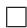

## 3.3 下界

我们证明 TurboQuant 在任意 bit-width 下均达到最优 distortion rate（差一个小常数因子），方法是证明任意压缩算法所能达到的最优失真的下界。我们的下界证明利用了 Yao's minimax principle。该原理允许我们将随机算法在 worst-case 确定性输入向量下的下界，与确定性算法在随机输入向量下的下界相关联。随后，我们利用第 2.1 节中介绍的 Shannon Lower Bound (SLB) 推导后者的可达 distortion rate 下界。形式上，我们证明以下定理：

**定理 3（最优压缩失真的下界）。** 对于任意 bit-width $b$ 的随机量化算法 $Q : \mathbb{S}^{d-1} \to \{0,1\}^{b \cdot d}$ 和任意 reconstruction map $Q^{-1} : \{0,1\}^{b \cdot d} \to \mathbb{R}^d$，存在一个困难输入实例 $\boldsymbol{x} \in \mathbb{S}^{d-1}$，使得：

$
\mathbb{E}\left[\|\boldsymbol{x} - Q^{-1}(Q(\boldsymbol{x}))\|_2^2\right] \geq 2^{-2b}
$

**证明。** 由 Yao's minimax principle，最优随机压缩算法在 worst-case 输入下的期望 MSE（$D_{\mathtt{mse}}$）等于最优确定性压缩算法应用于来自最困难随机分布的输入时的期望 MSE。根据定义，后一场景的 MSE 被在单位超球面上均匀分布的输入的最优可达 MSE 所下界。

bit-width 为 $b$、在球面 $\mathbb{S}^{d-1}$ 上均匀分布输入的压缩算法的最优可达 MSE，由引理 3 给出下界。因此，调用引理 3 我们得出 $D_{\mathtt{mse}} \geq \frac{1}{4^b}$。

此外，由 $D_{\mathtt{mse}} \geq \frac{1}{4^b}$ 以及 $D_{\mathtt{mse}}$ 的定义，我们得出：

$
\begin{aligned}
D_{\mathrm{mse}} &= \sum_{j=1}^{d} \mathbb{E}\left[\left|\boldsymbol{x}_j - \left[Q^{-1}(Q(\boldsymbol{x}))\right]_j\right|^2\right] \\
&= \sum_{j=1}^{d} \mathbb{E}\left[\left|\langle \boldsymbol{e}_j, \boldsymbol{x} \rangle - \langle \boldsymbol{e}_j, Q^{-1}(Q(\boldsymbol{x})) \rangle\right|^2\right] \\
&\geq \frac{1}{4^b}
\end{aligned}
$

由 pigeonhole principle，存在一个索引 $j \in [d]$，使得 $\mathbb{E}\left[\left|\langle \boldsymbol{e}_j, \boldsymbol{x} \rangle - \langle \boldsymbol{e}_j, Q^{-1}(Q(\boldsymbol{x})) \rangle\right|^2\right] \geq \frac{1}{d} \cdot \frac{1}{4^b}$，从而完成证明。□

我们注意到，VQ 中 worst-case 失真的类似下界可以使用 ball-packing argument 推导（实际上具有更大的常数，因为这是一个更难的问题）[26]。然而，定理 3 为我们的分析提供了更鲁棒且更相关的下界。这是因为它建立了期望失真的下界，而非 worst-case 误差，并与定理 1 和定理 2 中呈现的上界无缝对应。

**与 TurboQuant 的对比。** 如我们的下界所示，TurboQuant 的 MSE 失真可证明地在 information-theoretic lower bound 的 $\frac{\sqrt{3}\pi}{2} \approx 2.7$ 倍以内。值得注意的是，对于较小的 bit-width，这个因子显著降低。例如，在 bit-width $b = 1$ 时，TurboQuant 实现的失真仅比最优值差约 **1.45** 倍，这也被我们的实验结果所证实。

# 4 实验

所有实验均在单块 NVIDIA A100 GPU 上进行。实验部分分为两部分：一部分用于实证验证理论结果，另一部分用于评估我们方法在 downstream tasks（特别是 KV cache quantization 和 nearest neighbor vector search）上的性能。

## 4.1 distortion-rate function 验证

我们首先通过实验验证 TurboQuant 的理论失真界，将观测到的失真与我们建立的理论预测进行比较，证明 TurboQuant 的观测失真在各种真实数据集上与我们的预测紧密吻合，接近已建立的下界。

我们比较了两种方法：TurboQuant$_{\mathrm{prod}}$ 和 TurboQuant$_{\mathrm{mse}}$。TurboQuant$_{\mathrm{mse}}$ 针对 MSE 最小化进行优化，而 TurboQuant$_{\mathrm{prod}}$ 则针对估计量化向量与原始向量之间的内积进行无偏估计。

两种方法均应用于内积估计任务，通过量化训练集并分析不同 bit-width 下内积计算的失真。如图 1 所示，增加 bit-width 可以减少两种方法的方差。然而，当用于内积估计时，TurboQuant$_{\mathrm{mse}}$ 会引入偏差。这种偏差随 bit-width 增加而减小，最终收敛到零。

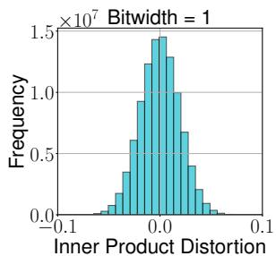
(a) TurboQuant$_{\mathrm{prod}}$

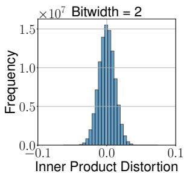

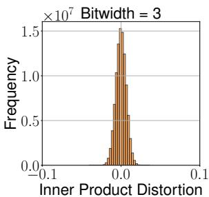

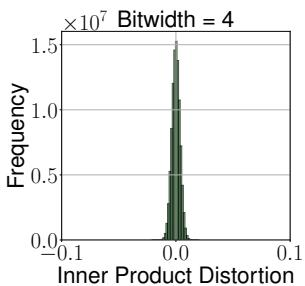

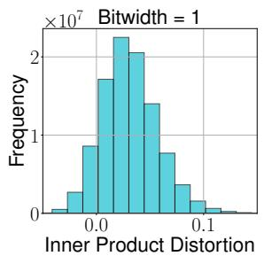
(b) TurboQuant$_{\mathrm{mse}}$

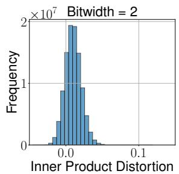

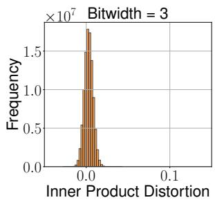

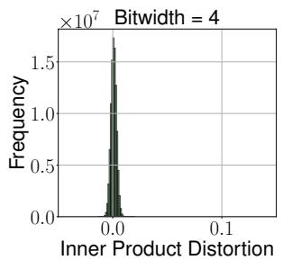

**图 1：TurboQuant$_{\mathrm{prod}}$ 和 TurboQuant$_{\mathrm{mse}}$ 用于内积估计的误差分布。**

实验结果（图 1）证实，TurboQuant$_{\mathrm{prod}}$ 在所有 bit-width 下对内积估计保持无偏，而 TurboQuant$_{\mathrm{mse}}$ 随 bit-width 增加逐渐改善。

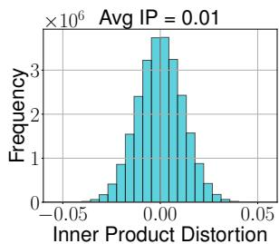
(a) TurboQuant$_{\mathrm{prod}}$

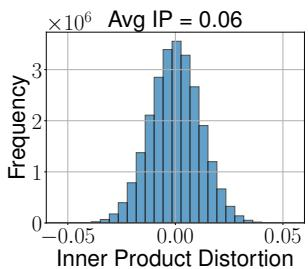

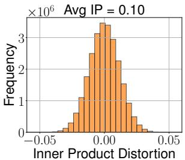

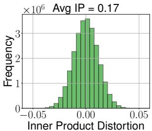

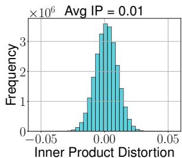
(b) TurboQuant$_{\mathrm{mse}}$

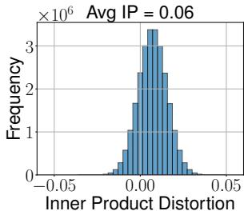

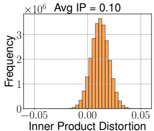

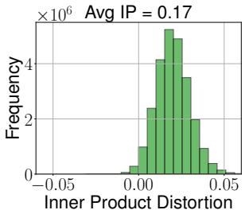

**图 2：TurboQuant$_{\mathrm{prod}}$ 的 inner product error 方差保持恒定，而 TurboQuant$_{\mathrm{mse}}$ 随平均内积增大而增大。bit-width $b = 2$。**

如图 2 所示，当量化到 2 bit 时，TurboQuant$_{\mathrm{prod}}$ 方法中方差保持恒定，与原始向量的内积无关。然而，同一图表表明，TurboQuant$_{\mathrm{mse}}$ 方法中的偏差依赖于平均内积。随着平均内积增加，偏差也随之增加。

除直方图外，我们还绘制了不同 bit-rate 下原始向量与量化向量之间的平均 inner product error 和 MSE，并与我们理论分析中建立的上下界一起展示。我们的观察证实结果与理论预测一致。具体而言，对于内积估计，TurboQuant$_{\mathrm{prod}}$ 在较低 bit-rate 下表现更好。然而，随着 bit 数增加，TurboQuant$_{\mathrm{mse}}$ 减少偏差并最终在内积估计中实现更优性能。

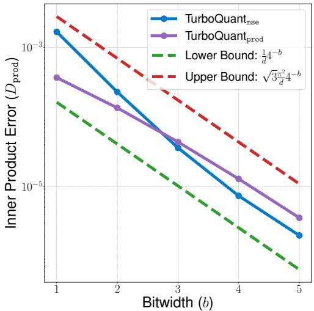
(a) inner product error

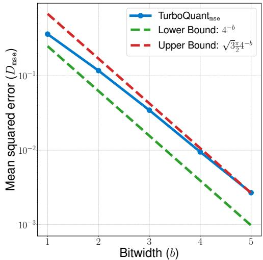
(b) MSE

**图 3：不同 bit-rate 下 inner product error 和 MSE 与理论界的比较。**

## 4.2 Needle-In-A-Haystack 测试

Needle-In-A-Haystack 测试 [32] 是一个旨在评估模型从长文档中检索特定信息能力的 benchmark。该测试将一个独特的句子（"needle"）放置在一个更大文本（"haystack"）的任意位置，并评估模型是否能够成功提取它。

遵循 Fu 等人 [21] 的实验设置，我们使用 Llama-3.1-8B-Instruct 模型进行评估。为了分析不同输入序列长度下的性能，我们将文档大小从 4k 变化到 104k 个 token。评估使用的主要指标是 recall 分数，衡量模型检索隐藏句子的准确程度。

为了比较，我们将我们的方法与多种最先进的内存高效方法进行 benchmark，包括 PolarQuant [28]、SnapKV [38]、PyramidKV [12] 和 KIVI [41]。每种方法在内存压缩比为 0.25 的条件下测试，即仅使用完整 KV cache 的 25%。

结果（图 4）表明，具有理论保证的量化方法（如 PolarQuant 和 TurboQuant）优于 token 级压缩技术（如 SnapKV 和 PyramidKV）以及缺乏正式理论保证的 scalar quantization 方法（如 KIVI）。值得注意的是，TurboQuant 即使在 4× 压缩下也实现了与 full-precision 模型相同的性能，使其成为 long-context 处理的鲁棒解决方案。

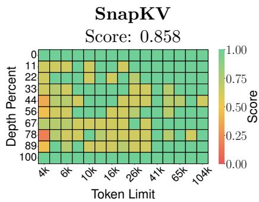

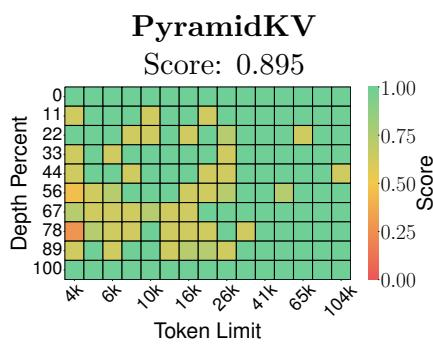

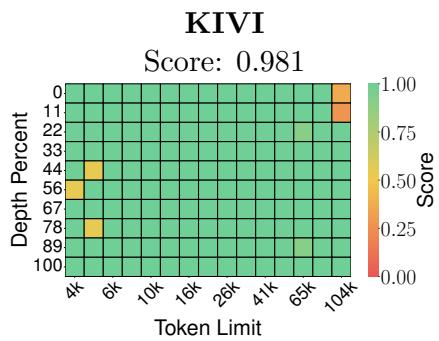

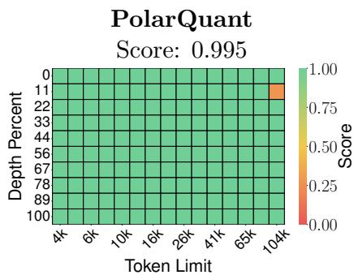

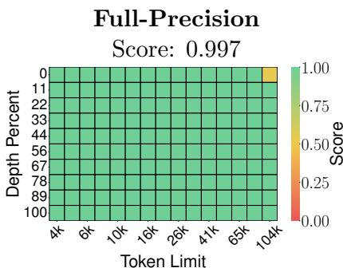

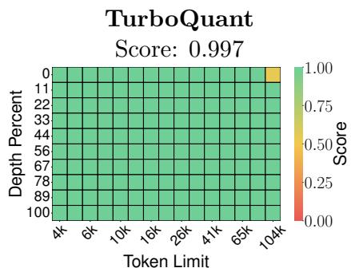

**图 4：Llama-3.1-8B-Instruct 在 Needle-In-A-Haystack 测试上的评估，模型需从 long-context 序列中检索隐藏句子。尽管部分方法在 recall 上存在困难，TurboQuant 在超过 4× 量化压缩的情况下仍实现了与未压缩基线完全相同的性能。**

## 4.3 LongBench 端到端生成

我们在 LongBench 数据集 [10] 上对各种 KV cache 压缩算法进行实验，该数据集涵盖广泛的长文本场景，包括单文档和多文档 QA、summarization、few-shot learning、synthetic tasks 和 code completion。为确保在不同 context length 下的 balanced evaluation，我们使用 LongBench-E，这是一个具有更 uniform length distribution 的子集。这使得能够公平评估每个模型在不同上下文大小下的性能，使其成为评估压缩技术更可靠的 benchmark。

我们将 TurboQuant 与第 4.2 节中介绍的 leading baseline methods 进行比较，使用 Llama-3.1-8B-Instruct 和 Ministral-7B-Instruct。与 KIVI 和 PolarQuant 等现有方法不同（它们不对生成的 token 进行量化），我们的方法甚至在 streaming generation 过程中也应用量化。

如表 1 所示，我们的方法在 Llama-3.1-8B-Instruct 和 Ministral-7B-Instruct 上均优于其他方法，实现了显著更高的平均分数。我们使用 2.5 bit 和 3.5 bit 量化评估我们的方法。这些非整数 bit 精度来自我们将通道分为 outlier channels 和非 outlier 集合，并对每个集合应用两个独立的 TurboQuant 实例，为 outlier channels 分配更高 bit 精度的策略。这种 outlier 处理策略与先前工作 [63, 51] 一致。例如，在我们的 2.5 bit 设置中，32 个 outlier channels 以 3 bit 量化，而其余 96 个通道使用 2 bit，导致有效 bit 精度为 $(32 \times 3 + 96 \times 2) / 128 = 2.5$。对于 3.5 bit 量化，outlier channels 和常规通道的不同比例导致更高的有效 bit 精度。尽管使用的 bit 数少于竞争技术，TurboQuant 保持了与未量化模型相当的性能。值得注意的是，我们在将量化向量压缩至少 4.5× 的同时实现了这一点。

**表 1：各种 KV cache 压缩方法在 Llama-3.1-8B-Instruct 上的 LongBench-V1 [10] 结果。**

| 方法 | KV 大小 | 单文档QA | 多文档QA | 摘要 | 少样本 | 合成 | 代码 | 平均 |
|------|---------|---------|---------|------|------|------|------|------|
| Full Cache | 16 | 45.29 | 45.16 | 26.55 | 68.38 | 59.54 | 46.28 | 50.06 |
| KIVI | 3 | 43.38 | 37.99 | 27.16 | 68.38 | 59.50 | 44.68 | 48.50 |
| KIVI | 5 | 45.04 | 45.70 | 26.47 | 68.57 | 59.55 | 46.41 | 50.16 |
| PolarQuant | 3.9 | 45.18 | 44.48 | 26.23 | 68.25 | 60.07 | 45.24 | 49.78 |
| **TURBOQUANT（本文）** | **2.5** | 44.16 | 44.96 | 24.80 | 68.01 | 59.65 | 45.76 | 49.44 |
| **TURBOQUANT（本文）** | **3.5** | 45.01 | 45.31 | 26.00 | 68.63 | 59.95 | 46.17 | **50.06** |
| *Ministral-7B-Instruct* | | | | | | | | |
| Full Cache | 16 | 47.53 | 49.06 | 26.09 | 66.83 | 53.50 | 47.90 | 49.89 |
| **TURBOQUANT（本文）** | **2.5** | 48.38 | 49.22 | 24.91 | 66.69 | 53.17 | 46.83 | 49.62 |

## 4.4 Nearest Neighbor Search 实验

在本节中，我们在 nearest neighbor search 场景中验证我们提出方法的优越性。我们使用 DBpedia [53] 实体数据集进行实验，该数据集已使用 OpenAI embeddings 编码到 1536 维和 3072 维空间中。此外，我们还在低维数据集上评估性能，使用标准 GloVe [45] embeddings。为构建实验设置，我们从数据集中随机采样 100,000 个数据点作为训练集，用于主要训练和评估。此外，我们提取 1,000 个不同条目作为 query set，用于没有明确提供 query set 的数据集。对于 GloVe 数据集，我们使用由 10,000 个点组成的预先存在的 query set。

我们将 TurboQuant 与两种 baseline 量化方法进行比较：PQ 和 RabitQ [22]。为确保公平比较，我们使用三种方法对训练集进行量化，并基于 top-k recall（记为 1@k）评估其性能。具体而言，该指标评估真实最高内积结果被每个算法返回的 top-k 近似结果捕获的频率。

**Product Quantization（PQ）。** PQ 依赖 k-means 算法构建 codebook，这些 codebook 需要单独存储。随着 bit 数增加，codebook 大小呈指数增长，导致额外的存储开销。在我们的实验中，我们仔细调整参数以匹配其他方法的 bit 分配。最高效的实现（专为快速查询设计）采用 AVX2 寄存器内 lookup table（LUT）。具体而言，它使用具有 16 个码字的 LUT16。然而，我们在此配置下观察到显著的质量下降。为在速度和精度之间取得平衡，我们选择了使用 LUT256（包含 256 个码字）的 PQ 版本。对于 2 bit 量化，每次查找分组 4 个坐标；对于 4 bit 量化，每次查找分组 2 个坐标。值得注意的是，由于我们在训练和评估中使用相同的数据集，PQ 在此设置中具有固有优势。

**RabitQ。** 与 PQ 不同，RabitQ 缺乏完全向量化的实现，使其无法利用 GPU 加速。因此，它在 CPU 上运行明显更慢。此外，该方法产生额外的计算开销，我们在 bit-rate 比较中没有明确计算这些开销。虽然 RabitQ 声称某个 bit-rate，但实际上由于这些低效性，它使用的 bit 数多于报告的数量。

尽管给予了 baseline 方法这些优势，TurboQuant 在所有实验中的 recall 上始终优于 PQ 和 RabitQ。这证明了我们方法的鲁棒性和效率，使其成为高维量化搜索任务的有力替代方案。

**表 2：不同方法在各种维度下使用 4 bit 量化的量化时间（秒）。**

| 方法 | d=200 | d=1536 | d=3072 |
|------|-------|--------|--------|
| PQ | 37.04 | 239.75 | 494.42 |
| RabitQ | 597.25 | 2267.59 | 3957.19 |
| **TURBOQUANT** | **0.0007** | **0.0013** | **0.0021** |

如表 2 所示，TurboQuant 的量化时间比 PQ 快约 5 个数量级，比 RabitQ 快约 6 个数量级，将 indexing time 降低至几乎为零。图 5 展示了在不同数据集和 embedding 维度下的 recall 比较，TurboQuant 在所有设置下均持续优于 baseline 方法。

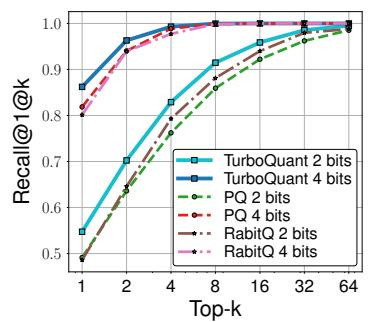
(a) GloVe - d=200

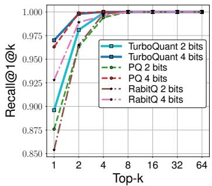
(b) OpenAI3 - d=1536

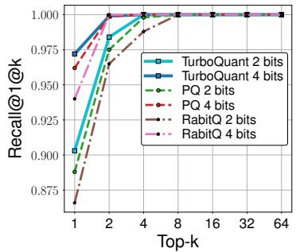
(c) OpenAI3 - d=3072

**图 5：在不同数据集和不同 embedding 维度下的 recall 比较。**

# 参考文献

[1] Elastic search., 2025. https://www.elastic.co/enterprise-search/vector-search.

[2] Qdrant vectore search., 2025. https://qdrant.tech/.

[3] Pgvector search., 2025. https://github.com/pgvector/pgvector/.

[4] Pinecone vectore database., 2025. https://www.pinecone.io/.

[5] Achiam, J., Adler, S., Agarwal, S., Ahmad, L., Akkaya, I., Aleman, F. L., Almeida, D., Altenschmidt, J., Altman, S., Anadkat, S., et al. Gpt-4 technical report. arXiv preprint arXiv:2303.08774, 2023.

[6] Ainslie, J., Lee-Thorp, J., de Jong, M., Zemlyanskiy, Y., Lebron, F., and Sanghai, S. Gqa: Training generalized multi-query transformer models from multi-head checkpoints. In Proceedings of the 2023 Conference on Empirical Methods in Natural Language Processing, pp. 4895–4901, 2023.

[7] Anthropic. Claude, 2024. https://www.anthropic.com/news/claude-3-family.

[8] Ashkboos, S., Mohtashami, A., Croci, M. L., Li, B., Cameron, P., Jaggi, M., Alistarh, D., Hoefler, T., and Hensman, J. Quarot: Outlier-free 4-bit inference in rotated llms. arXiv preprint arXiv:2404.00456, 2024.

[9] Babenko, A. and Lempitsky, V. Additive quantization for extreme vector compression. In Proceedings of the IEEE Conference on Computer Vision and Pattern Recognition, pp. 931–938, 2014.

[10] Bai, Y., Lv, X., Zhang, J., Lyu, H., Tang, J., Huang, Z., Du, Z., Liu, X., Zeng, A., Hou, L., Dong, Y., Tang, J., and Li, J. Longbench: A bilingual, multitask benchmark for long context understanding. arXiv preprint arXiv:2308.14508, 2023.

[11] Beltagy, I., Peters, M. E., and Cohan, A. Longformer: The long-document transformer. arXiv preprint arXiv:2004.05150, 2020.

[12] Cai, Z., Zhang, Y., Gao, B., Liu, Y., Liu, T., Lu, K., Xiong, W., Dong, Y., Chang, B., Hu, J., et al. Pyramidkv: Dynamic kv cache compression based on pyramidal information funneling. arXiv preprint arXiv:2406.02069, 2024.

[13] Chee, J., Cai, Y., Kuleshov, V., and De Sa, C. M. Quip: 2-bit quantization of large language models with guarantees. Advances in Neural Information Processing Systems, 36:4396–4429, 2023.

[14] Cover, T. M. Elements of information theory. John Wiley & Sons, 1999.

[15] Dai, D., Deng, C., Zhao, C., Xu, R., Gao, H., Chen, D., Li, J., Zeng, W., Yu, X., Wu, Y., et al. Deepseekmoe: Towards ultimate expert specialization in mixture-of-experts language models. arXiv preprint arXiv:2401.06066, 2024.

[16] Dettmers, T., Lewis, M., Belkada, Y., and Zettlemoyer, L. Gpt3.int8(): 8-bit matrix multiplication for transformers at scale. Advances in Neural Information Processing Systems, 35:30318–30332, 2022.

[17] Dong, S., Cheng, W., Qin, J., and Wang, W. Qaq: Quality adaptive quantization for llm kv cache. arXiv preprint arXiv:2403.04643, 2024.

[18] Dubey, A., Jauhri, A., Pandey, A., Kadian, A., Al-Dahle, A., Letman, A., Mathur, A., Schelten, A., Yang, A., Fan, A., et al. The llama 3 herd of models. arXiv preprint arXiv:2407.21783, 2024.

[19] Edge, D., Trinh, H., Cheng, N., Bradley, J., Chao, A., Mody, A., Truitt, S., and Larson, J. From local to global: A graph rag approach to query-focused summarization. arXiv preprint arXiv:2404.16130, 2024.

[20] Frantar, E., Ashkboos, S., Hoefler, T., and Alistarh, D. Gptq: Accurate post-training quantization for generative pre-trained transformers. arXiv preprint arXiv:2210.17323, 2022.

[21] Fu, Y., Panda, R., Niu, X., Yue, X., Hajishirzi, H., Kim, Y., and Peng, H. Data engineering for scaling language models to 128k context. arXiv preprint arXiv:2402.10171, 2024.

[22] Gao, J., Gou, Y., Xu, Y., Yang, Y., Long, C., and Wong, R. C.-W. Practical and asymptotically optimal quantization of high-dimensional vectors in euclidean space for approximate nearest neighbor search. arXiv preprint arXiv:2409.09913, 2024.

[23] Gao, Y., Xiong, Y., Gao, X., Jia, K., Pan, J., Bi, Y., Dai, Y., Sun, J., Wang, H., and Wang, H. Retrieval-augmented generation for large language models: A survey. arXiv preprint arXiv:2312.10997, 2, 2023.

[24] Ge, T., He, K., Ke, Q., and Sun, J. Optimized product quantization for approximate nearest neighbor search. In Proceedings of the IEEE conference on computer vision and pattern recognition, pp. 2946–2953, 2013.

[25] Gersho, A. Asymptotically optimal block quantization. IEEE Transactions on information theory, 25(4):373–380, 1979.

[26] Gersho, A. On the structure of vector quantizers. IEEE Transactions on Information Theory, 28(2):157–166, 1982.

[27] Guo, R., Sun, P., Lindgren, E., Geng, Q., Simcha, D., Chern, F., and Kumar, S. Accelerating large-scale inference with anisotropic vector quantization. In International Conference on Machine Learning, pp. 3887–3896. PMLR, 2020.

[28] Han, I., Kacham, P., Karbasi, A., Mirrokni, V., and Zandieh, A. Polarquant: Quantizing kv caches with polar transformation. arXiv preprint arXiv:2502.02617, 2025.

[29] Han, I., Kapralov, M., Kochetkova, E., Sheth, K., and Zandieh, A. Balancekv: Kv cache compression through discrepancy theory. arXiv preprint arXiv:2502.07861, 2025.

[30] Hooper, C., Kim, S., Mohammadzadeh, H., Mahoney, M. W., Shao, Y. S., Keutzer, K., and Gholami, A. Kvquant: Towards 10 million context length llm inference with kv cache quantization. arXiv preprint arXiv:2401.18079, 2024.

[31] Jegou, H., Douze, M., and Schmid, C. Product quantization for nearest neighbor search. IEEE transactions on pattern analysis and machine intelligence, 33(1):117–128, 2010.

[32] Kamradt, G. Needle in a haystack - pressure testing llms., 2023. https://github.com/gkamradt/LLMTest_NeedleInAHaystack.

[33] Kang, H., Zhang, Q., Kundu, S., Jeong, G., Liu, Z., Krishna, T., and Zhao, T. Gear: An efficient kv cache compression recipe for near-lossless generative inference of llm. arXiv preprint arXiv:2403.05527, 2024.

[34] Kaplan, J., McCandlish, S., Henighan, T., Brown, T. B., Chess, B., Child, R., Gray, S., Radford, A., Wu, J., and Amodei, D. Scaling laws for neural language models. arXiv preprint arXiv:2001.08361, 2020.

[35] Khattab, O. and Zaharia, M. Colbert: Efficient and effective passage search via contextualized late interaction over bert. In Proceedings of the 43rd International ACM SIGIR conference on research and development in Information Retrieval, pp. 39–48, 2020.

[36] Kim, J., Park, J., Cho, J., and Papailiopoulos, D. Lexico: Extreme kv cache compression via sparse coding over universal dictionaries. arXiv preprint arXiv:2412.08890, 2024.

[37] Kim, S., Hooper, C., Gholami, A., Dong, Z., Li, X., Shen, S., Mahoney, M. W., and Keutzer, K. Squeezellm: Dense-and-sparse quantization. arXiv preprint arXiv:2306.07629, 2023.

[38] Li, Y., Huang, Y., Yang, B., Venkitesh, B., Locatelli, A., Ye, H., Cai, T., Lewis, P., and Chen, D. Snapkv: Llm knows what you are looking for before generation. arXiv preprint arXiv:2404.14469, 2024.

[39] Lin, J., Tang, J., Tang, H., Yang, S., Chen, W.-M., Wang, W.-C., Xiao, G., Dang, X., Gan, C., and Han, S. Awq: Activation-aware weight quantization for on-device llm compression and acceleration. Proceedings of Machine Learning and Systems, 6:87–100, 2024.

[40] Liu, Z., Desai, A., Liao, F., Wang, W., Xie, V., Xu, Z., Kyrillidis, A., and Shrivastava, A. Scissorhands: Exploiting the persistence of importance hypothesis for llm kv cache compression at test time. Advances in Neural Information Processing Systems, 36, 2024.

[41] Liu, Z., Yuan, J., Jin, H., Zhong, S., Xu, Z., Braverman, V., Chen, B., and Hu, X. Kivi: A tuning-free asymmetric 2bit quantization for kv cache. arXiv preprint arXiv:2402.02750, 2024.

[42] Lloyd, S. Least squares quantization in pcm. IEEE transactions on information theory, 28(2):129–137, 1982.

[43] Max, J. Quantizing for minimum distortion. IRE Transactions on Information Theory, 6(1):7–12, 1960.

[44] Panter, P. and Dite, W. Quantization distortion in pulse-count modulation with nonuniform spacing of levels. Proceedings of the IRE, 39(1):44–48, 1951.

[45] Pennington, J., Socher, R., and Manning, C. GloVe: Global vectors for word representation. In Moschitti, A., Pang, B., and Daelemans, W. (eds.), Proceedings of the 2014 Conference on Empirical Methods in Natural Language Processing (EMNLP), pp. 1532–1543, Doha, Qatar, October 2014. Association for Computational Linguistics. doi: 10.3115/v1/D14-1162. URL https://aclanthology.org/D14-1162/.

[46] Santhanam, K., Khattab, O., Saad-Falcon, J., Potts, C., and Zaharia, M. Colbertv2: Effective and efficient retrieval via lightweight late interaction. arXiv preprint arXiv:2112.01488, 2021.

[47] Shah, J., Bikshandi, G., Zhang, Y., Thakkar, V., Ramani, P., and Dao, T. Flashattention-3: Fast and accurate attention with asynchrony and low-precision. arXiv preprint arXiv:2407.08608, 2024.

[48] Shannon, C. E. A mathematical theory of communication. The Bell system technical journal, 27(3):379–423, 1948.

[49] Shannon, C. E. et al. Coding theorems for a discrete source with a fidelity criterion. IRE Nat. Conv. Rec, 4(142-163):1, 1959.

[50] Shazeer, N. Fast transformer decoding: One write-head is all you need. arXiv preprint arXiv:1911.02150, 2019.

[51] Su, Z., Chen, Z., Shen, W., Wei, H., Li, L., Yu, H., and Yuan, K. Rotatekv: Accurate and robust 2-bit kv cache quantization for llms via outlier-aware adaptive rotations, 2025. URL https://arxiv.org/abs/2501.16383.

[52] Team, G., Georgiev, P., Lei, V. I., Burnell, R., Bai, L., Gulati, A., Tanzer, G., Vincent, D., Pan, Z., Wang, S., et al. Gemini 1.5: Unlocking multimodal understanding across millions of tokens of context. arXiv preprint arXiv:2403.05530, 2024.

[53] Thakur, N., Reimers, N., Rückle, A., Srivastava, A., and Gurevych, I. BEIR: A heterogeneous benchmark for zero-shot evaluation of information retrieval models. In Thirty-fifth Conference on Neural Information Processing Systems Datasets and Benchmarks Track (Round 2), 2021.

[54] Vaswani, A., Shazeer, N., Parmar, N., Uszkoreit, J., Jones, L., Gomez, A. N., Kaiser, L., and Polosukhin, I. Attention is all you need. NeurIPS, 2017.

[55] Vershynin, R. High-dimensional probability: An introduction with applications in data science, volume 47. Cambridge university press, 2018.

[56] Wang, J., Zhang, T., Sebe, N., Shen, H. T., et al. A survey on learning to hash. IEEE transactions on pattern analysis and machine intelligence, 40(4):769–790, 2017.

[57] Xiao, G., Lin, J., Seznec, M., Wu, H., Demouth, J., and Han, S. Smoothquant: Accurate and efficient post-training quantization for large language models. In International Conference on Machine Learning, pp. 38087–38099. PMLR, 2023.

[58] Xiao, G., Tian, Y., Chen, B., Han, S., and Lewis, M. Efficient streaming language models with attention sinks. arXiv preprint arXiv:2309.17453, 2023.

[59] Yang, J. Y., Kim, B., Bae, J., Kwon, B., Park, G., Yang, E., Kwon, S. J., and Lee, D. No token left behind: Reliable kv cache compression via importance-aware mixed precision quantization. arXiv preprint arXiv:2402.18096, 2024.

[60] Yue, Y., Yuan, Z., Duanmu, H., Zhou, S., Wu, J., and Nie, L. Wkvquant: Quantizing weight and key/value cache for large language models gains more. arXiv preprint arXiv:2402.12065, 2024.

[61] Zador, P. L. Development and evaluation of procedures for quantizing multivariate distributions. Stanford University, 1964.

[62] Zandieh, A., Daliri, M., and Han, I. Qjl: 1-bit quantized jl transform for kv cache quantization with zero overhead, 2024. URL https://arxiv.org/abs/2406.03482.

[63] Zandieh, A., Daliri, M., and Han, I. Qjl: 1-bit quantized jl transform for kv cache quantization with zero overhead. arXiv preprint arXiv:2406.03482, 2024.

[64] Zandieh, A., Han, I., Mirrokni, V., and Karbasi, A. Subgen: Token generation in sublinear time and memory. arXiv preprint arXiv:2402.06082, 2024.

[65] Zhang, T., Yi, J., Xu, Z., and Shrivastava, A. Kv cache is 1 bit per channel: Efficient large language model inference with coupled quantization. arXiv preprint arXiv:2405.03917, 2024.

[66] Zhang, Z., Sheng, Y., Zhou, T., Chen, T., Zheng, L., Cai, R., Song, Z., Tian, Y., Ré, C., Barrett, C., et al. H2o: Heavy-hitter oracle for efficient generative inference of large language models. Advances in Neural Information Processing Systems, 36, 2024.

