# ReplaySSM：缓存 SSM 的输入，而不是状态

> 来源：<https://tridao.me/blog/2026/replayssm/>
> 作者：Ze-Wei Liou、Tri Dao（2026-06-15）
> 本文是中文技术笔记：按原文章节顺序整理核心结论、公式与全部插图（图片已下载到 `images/`），图注为原文图注的中文翻译。完整论述请读原文。

---

## 目录

1. [State Space Models（SSM）](#1-state-space-modelsssm)
2. [SSM decode 的三个挑战](#2-ssm-decode-的三个挑战)
3. [核心思路：不存状态，缓存最近的输入](#3-核心思路不存状态缓存最近的输入)
4. [一个改动，三个答案](#4-一个改动三个答案)
5. [算法](#5-算法)
6. [评测](#6-评测)
7. [结论与未来](#7-结论与未来)
8. [附录](#8-附录)

---

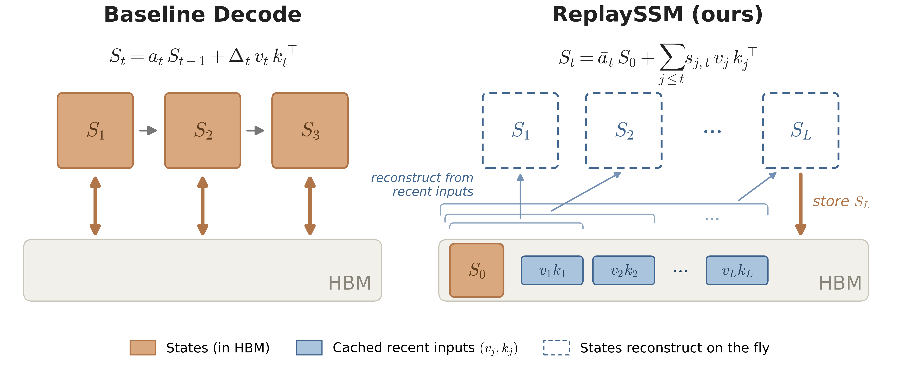

*图 1a：ReplaySSM 缓存最近的 SSM 输入，而不是每步存储循环状态；状态即时重建，只在 buffer 满时写回。*

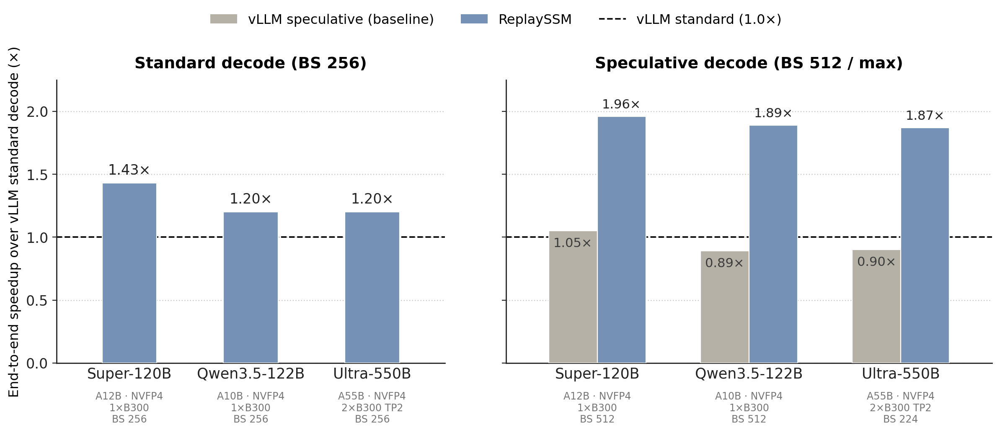

*图 1b：vLLM 中（开启 CUDA Graph）的端到端 decode 吞吐，按 serving batch size 归一到 vLLM 标准 decode。左：ReplaySSM 把标准 decode 最高提速 1.43×。右：vLLM 现有的投机解码在 serving batch size 下吞吐反而低于标准 decode。*

---

## 1. State Space Models（SSM）

SSM / 线性注意力族（Mamba-2、Gated DeltaNet 及其混合架构）把全部历史压缩进一个固定大小的循环状态，因此 decode 阶段没有随上下文增长的 KV cache。以单 head 的 Mamba-2 为例：

```text
S_t = a_t · S_{t-1} + Δ_t · (v_t k_tᵀ)      # 状态更新，S 形状 d × n
y_t = S_tᵀ q_t                              # 读出
```

状态是一个 `d × n` 矩阵（原文给出典型 `d, n ∈ {64, 128}`），每个 head、每条请求都要常驻显存。

## 2. SSM decode 的三个挑战

### 2.1 Memory-bound：全是 I/O，没有计算

每个 decode step 都要「读整个状态 + 写整个状态」，而算量只有一次外积和一次读出。原文按 head 估算主导流量约 `8dn` 字节，kernel 完全被显存带宽卡住。

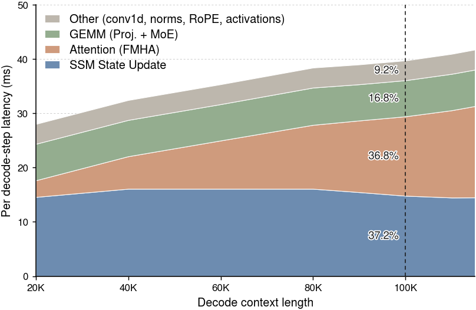

*图 2：Nemotron-3-Super-120B-A12B-NVFP4 在单卡 B300、batch size 256 下的延迟拆解。尽管 attention 随上下文长度增长，SSM kernel 的延迟基本与上下文长度无关，但直到 100K token 它仍是最大的一项。*

这张图是整篇文章的动机：在混合架构里大家习惯性优化 attention，但 SSM 那部分是**固定开销**，只有长上下文时才被 attention 追上，中短长度下它就是主要瓶颈。

### 2.2 摘要反噬：状态没有 undo

投机解码需要「猜错就回滚」。attention 只需把 KV cache 的写指针退回；而 SSM 已经把 draft 的输入不可逆地累加进状态，无法撤销，只能提前存快照或重算。

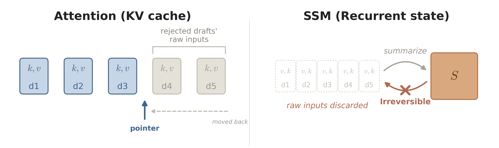

*图 3：attention 只要移动 KV-cache 指针就能回滚，而 SSM 已经把输入不可逆地摘要进状态，无法撤销。*

### 2.3 失去并行性：串行的状态依赖

验证 `T` 个 draft token 时，第 `i` 个 token 的状态依赖第 `i-1` 个，只能串行 scan，无法像 attention 那样把整个 draft 窗口做成一次 batched matmul。Gated DeltaNet 的 delta-rule 带擦除项，串行性更强。

## 3. 核心思路：不存状态，缓存最近的输入

把「每步压缩并落盘」换成：

- 保留一个**持久 checkpoint**（某时刻的状态快照）；
- 维护一个容量 `L` 的**滚动输入缓冲（ring buffer）**，每步只追加原始输入向量；
- 只在缓冲写满时触发一次 **flush**：把 checkpoint 与缓冲内容合并重算出新快照，缓冲清空。

状态永远可以从 checkpoint + 缓存输入「**重放**」出来，所以不必每步都物化它 —— 这就是 ReplaySSM 名字的来源。

### 3.1 每步缓存什么

| 架构 | 每步缓存 | 说明 |
|------|---------|------|
| Mamba-2 | `(v, k)`（连同衰减 `Δ` / `a`） | 直接缓存原始输入即可重放 |
| Gated DeltaNet | `(u, k, g)` | 缓存修正向量 `u` 而非原始 `v`，用于绕开 delta-rule 擦除语义带来的串行依赖 |

## 4. 一个改动，三个答案

### 4.1 显存流量减半

- **Baseline**：每步读状态 + 写状态，主导流量约 `8dn` 字节/head。
- **ReplaySSM**：只读 checkpoint、追加少量输入向量，主导流量约 `4dn` 字节/head。

代价是把「每步一次状态写」摊销成「每 `L` 步一次 flush」。

### 4.2 回滚变成 buffer 操作

draft 的原始输入就躺在 ring buffer 里，拒绝掉的 draft 只需把写指针退回，不需要任何状态写回或重算。

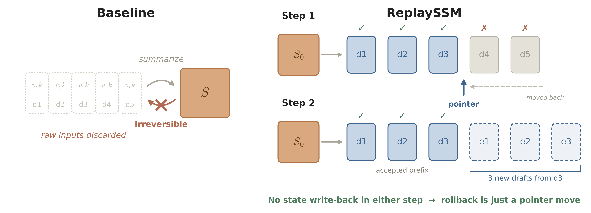

*图 4：ReplaySSM 缓存每个 draft 的原始输入，因此回滚被拒绝的 draft 只是一次指针移动，没有状态写回。*

### 4.3 放松要求，得到一条新的 decode 路径

关键观察：decode 真正需要的是 `y_t`，而不是 `S_t`。既然如此，就不必构造状态矩阵。

## 5. 算法

### 5.1 Output-only decode

同一个输出有两条计算路径：

```text
路径 A（state-and-output）：先构造 S = v kᵀ，再用 q 读出
路径 B（output-only）：      先算标量 kᵀ q，再去缩放 v，全程不物化状态
```

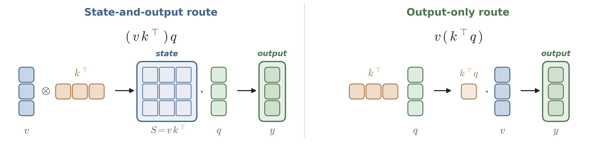

*图 5a：得到同一输出的两条路径。一条先构造完整状态 `S = v kᵀ` 再用 `q` 读出；另一条先算标量 `kᵀ q` 再缩放 `v`，从不物化状态。*

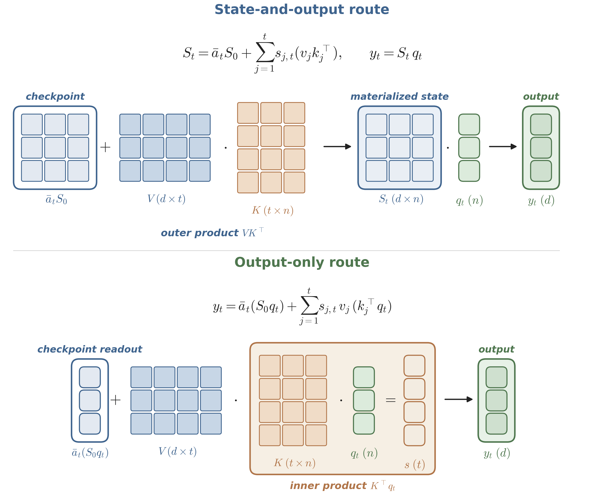

*图 5b：ReplaySSM 下的两条路径。state-and-output 路径先物化 `S_t` 再用 `q_t` 读出；output-only 路径先算 `Kᵀ q_t`，从不物化状态。*

推广到带 checkpoint + 缓冲的情形，输出可写成：

```text
y_t = (checkpoint 按衰减折算后的读出) + Σ_{i ∈ buffer} w_i · ⟨k_i, q_t⟩ · v_i
```

整条路径只有向量内积与加权求和，**不构造 `d × n` 矩阵**；而且多个 draft token 的 `Kᵀ q` 可以合成一次 batched matmul 并行算完。

### 5.2 Mamba-2：标准 decode

每步：追加 `(v, k, Δ)` 到 buffer → 用 output-only 路径直接算 `y_t` → 只在 buffer 满时 flush 重算 checkpoint。

### 5.3 投机解码

- **验证**：全部 draft token 共享同一个 checkpoint 与缓存历史，用内积形式一次性并行算出各自输出，不做串行状态更新。
- **回滚**：ring buffer 指针回退（见 4.2）。
- **GDN 的分块并行**：把 `T` 个 draft 的递推展开成线性系统，构造描述 draft 间依赖的严格下三角矩阵，做**一次 `T × T` 求逆**同时解出所有修正项，把串行 scan 变成若干 matmul。

> 三角求逆是这里的核心技巧：delta-rule 的串行性来自「后一个 token 的修正依赖前面已写入的内容」，写成矩阵形式后正好是单位下三角系统，可解析求逆而不必逐步迭代。

### 5.4 Kernel 设计

原文 5.4 节与附录给出 CUDA 实现细节（buffer 布局、flush 与 output-only 路径的融合、投机路径的 batched matmul 等），本笔记未展开。

## 6. 评测

配置：Nemotron-3、Qwen3.5 系列混合架构（4B ~ 550B），H100 / B300，基于 vLLM。

### 6.1 标准 decode

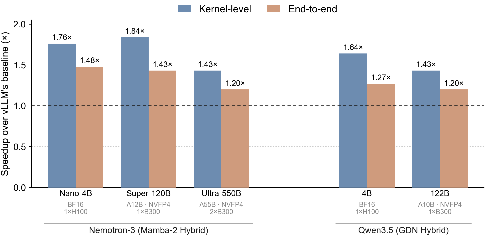

*图 6：在 Nemotron-3 与 Qwen3.5 系列上，相对 vLLM baseline 的 kernel 级与端到端 per-step 加速（batch size 256，1K 个 decode step）。*

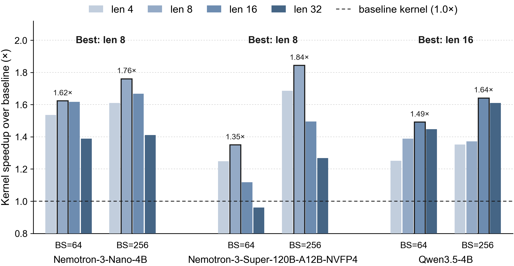

*图 7：buffer size 取 4、8、16、32 时，ReplaySSM 相对 baseline 的 kernel 加速（batch size 64 与 256）。*

**buffer size 的取舍**：`L` 越大 flush 越少、IO 越省，但每步内积计算量随 `L` 线性增长，过大就从 memory-bound 翻转成 compute-bound。原文给出的较优取值：Nemotron 用 8，Qwen 用 16。

### 6.2 投机解码

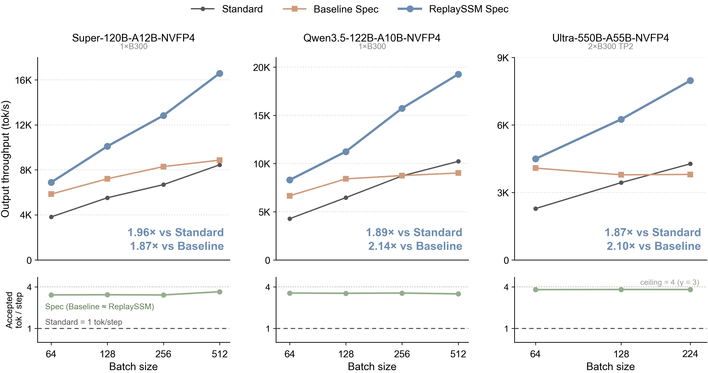

*图 8：GSM8K prompt 上端到端 decode 吞吐 vs. batch size（投机窗口 4，temperature 0，MTP drafter）。下方：baseline 与 ReplaySSM 每步接受的 token 数完全一致。*

> 「接受 token 数一致」很重要：说明这是纯粹的系统侧优化，不改变输出分布，不是靠牺牲接受率换速度。

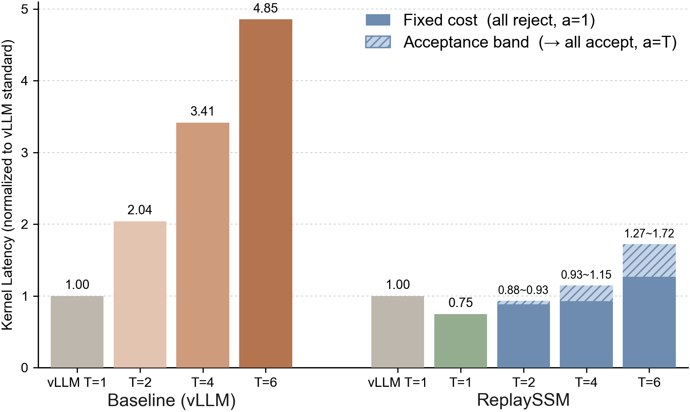

*图 9：Qwen3.5-122B-A10B-NVFP4 上投机解码的 kernel 延迟，归一到 vLLM 标准 decode（batch size 128、buffer size 16、1×B300）。阴影带覆盖从全拒绝到全接受的区间。*

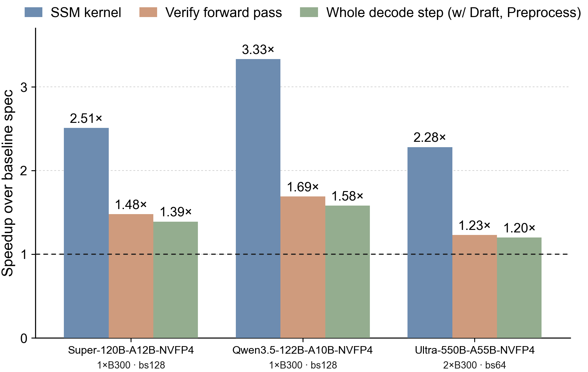

*图 10：相对 vLLM 投机解码 baseline，在 kernel、verify forward pass、完整 decode step 三个层级上的加速（投机窗口 4）。*

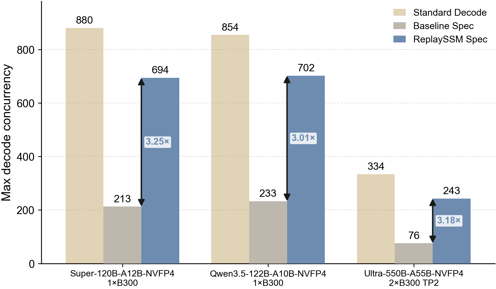

*图 11：固定 HBM 预算下的最大 decode 并发（投机窗口 4）。ReplaySSM 支持的并发请求数比 baseline 投机路径高 3.0–3.3×。*

### 结果汇总

| 指标 | 原文数据 |
|------|---------|
| 标准 decode 端到端加速 | 最高 1.43×（图 1b）；per-step / kernel 级最高约 1.48×（图 6） |
| 投机解码吞吐提升 | 1.87× ~ 1.96×（相对标准 decode baseline） |
| 同 HBM 预算下最大并发 | 3.0× ~ 3.3× |
| 较优 buffer size | Nemotron 8，Qwen 16 |
| 输出等价性 | 每步接受 token 数与 baseline 一致 |

## 7. 结论与未来

- 「保留最近输入」而不是「持久化状态」，同时解决了 SSM 推理的显存 IO、并发与并行化三个问题；
- 方法对 Mamba 族与 delta-rule 族都适用，可直接落进现有 serving 框架（原文以 vLLM 为例）；
- 后续方向：扩展到 Mamba-3 与 GDN2；探索超出「加速 decode」的应用（条件式状态摘要等）。

## 8. 附录

- **A.1 标准 decode**：Mamba-2 与 Gated DeltaNet 的 baseline / ReplaySSM 算法对照（原文共 8 个算法）。
- **A.2 投机解码**：GDN 用三角矩阵求逆做分块并行验证的推导，以及 CUDA 集成细节。

---

## 对推理工程的启示

1. **决策点从「算什么」变成「什么时候物化」**：SSM 的状态是「已压缩的结果」，把压缩推迟到必须做时（flush），就把每步固定 IO 换成摊销 IO。与 FlashAttention「不物化中间 attention 矩阵」属同一类思路。
2. **可回滚性与可并行验证应当是设计目标**：ring buffer 指针回滚、内积形式的并行验证都是设计出来的性质，不是事后补的。
3. **`L` 必须在目标硬件上实测**：不同 head 维度、不同 GPU 的 memory/compute 比不同，最优 `L` 会变，移植时要重扫。
4. **与现有 paged cache 管理天然契合**：输入缓冲是 per-request 的小块 ring buffer，适合按 page 分配，可复用混合架构里已有的 KV page 管理逻辑。

## 待核实事项

- flush 时的数值稳定性处理（衰减累乘的下溢/上溢、精度选择）；
- `y_t` output-only 公式中各权重项的精确形式；
- GDN 分块并行版本的 chunk 大小与 `T × T` 求逆的实际 kernel 实现（原文附录）；
- 评测中 baseline 的具体配置（是否已开启 vLLM 现有的 mamba cache 优化）及各模型/硬件组合的分项数据。
